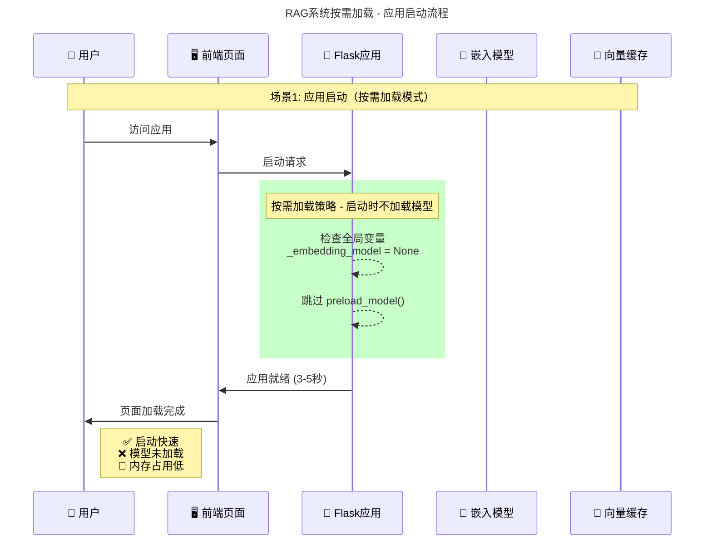
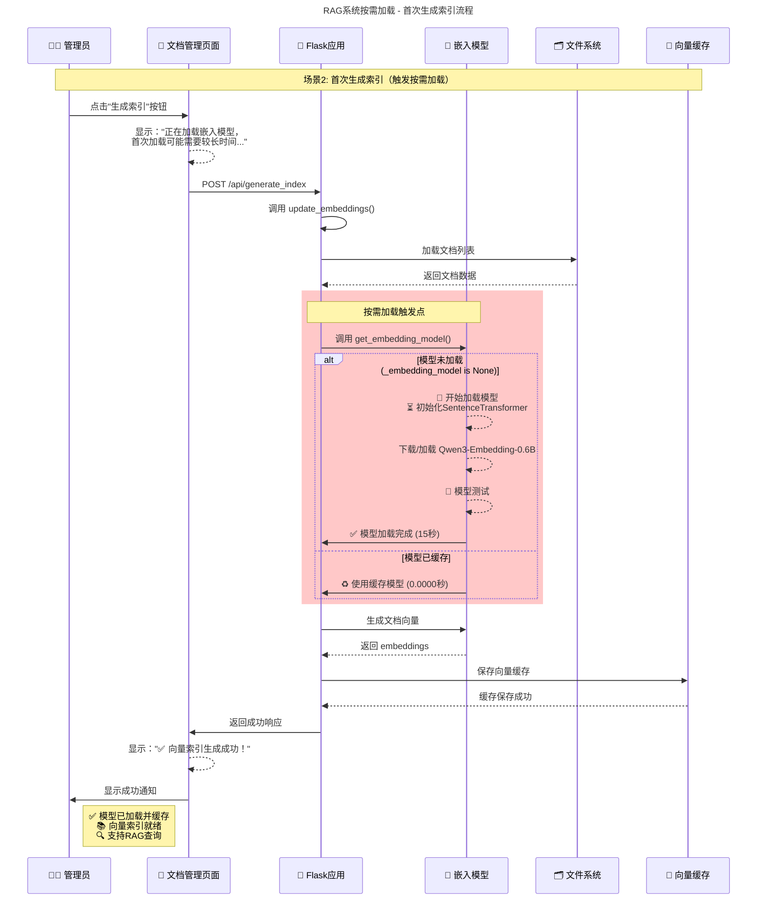
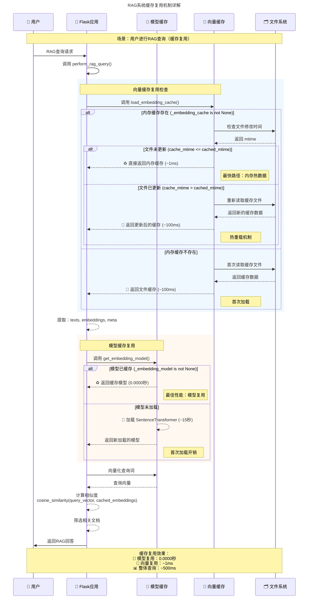
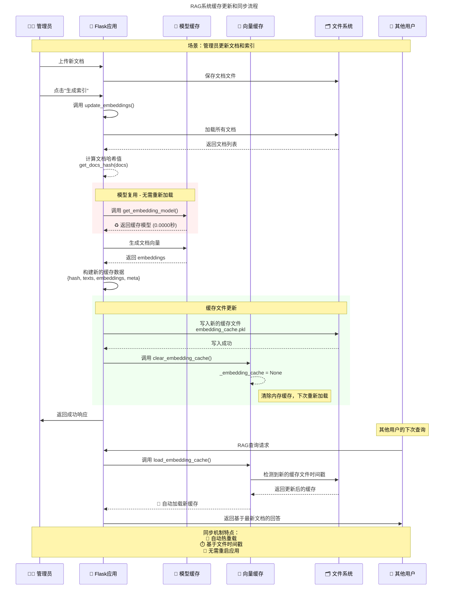
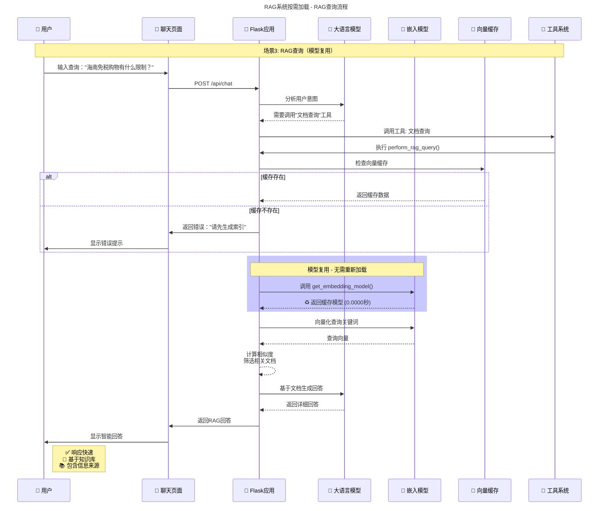

# 海口智能旅游助手RAG系统设计文档

## 📑 目录

### 1. [概述](#概述)

### 2. [业务需求分析](#1-业务需求分析)
- [1.1 核心驱动因素](#11-核心驱动因素)
- [1.2 具体应用场景详解](#12-具体应用场景详解)
- [1.3 RAG实现方式](#13-rag实现方式)
- [1.4 文档数据格式选择](#14-文档数据格式选择)

### 3. [技术架构设计](#2-技术架构设计)
- [2.1 系统架构](#21-系统架构)
- [2.2 核心技术栈](#22-核心技术栈)
- [2.3 性能优化特性](#23-性能优化特性)
- [2.4 智能启动策略](#24-智能启动策略)

### 4. [RAG系统实现](#3-rag系统实现)
- [3.1 文档处理流水线](#31-文档处理流水线)
- [3.2 向量索引系统](#32-向量索引系统)
- [3.3 RAG查询引擎](#33-rag查询引擎)

### 5. [智能工具调用系统](#4-智能工具调用系统)
- [4.1 多工具协作框架](#41-多工具协作框架)
- [4.2 推理驱动的调用机制](#42-推理驱动的调用机制)

### 6. [性能表现](#5-性能表现)
- [5.1 核心指标对比](#51-核心指标对比)
- [5.2 实际测试结果](#52-实际测试结果)

### 7. [安全与运维](#6-安全与运维)
- [6.1 安全机制](#61-安全机制)
- [6.2 部署配置](#62-部署配置)

### 8. [使用指南](#7-使用指南)
- [7.1 管理员操作](#71-管理员操作)
- [7.2 用户使用](#72-用户使用)
- [7.3 故障排除](#73-故障排除)

<!-- 第9章内容已并入第2章，目录项移除 -->

### 10. [嵌入模型按需加载系统](#嵌入模型按需加载系统)
- [设计理念](#设计理念)
- [智能启动流程](#智能启动流程)
- [实现架构](#实现架构)
- [性能对比](#性能对比)
- [实际测试结果](#实际测试结果)
- [使用场景](#使用场景)
- [配置和维护](#配置和维护)
- [系统时序图](#系统时序图)

### 11. [智能工具调用系统详解](#智能工具调用系统)
- [推理驱动的多工具调用框架](#推理驱动的多工具调用框架)

### 12. [安全与权限管理](#安全与权限管理)
- [认证授权系统](#认证授权系统)
- [文件安全处理](#文件安全处理)
- [统一错误处理](#统一错误处理)

### 13. [部署与运维详解](#部署与运维)
- [应用配置](#应用配置)
- [日志系统](#日志系统)
- [性能优化](#性能优化)

### 14. [使用指南详解](#使用指南)
- [管理员操作流程](#管理员操作流程)
- [用户交互流程](#用户交互流程)
- [故障排除](#故障排除)

### 15. [API参考](#api参考)
- [核心API接口](#核心api接口)
- [MCP工具接口](#mcp工具接口)
- [错误响应格式](#错误响应格式)

### 16. [技术特性总结](#技术特性总结)
- [核心优势](#核心优势)
- [扩展性](#扩展性)
- [适用场景](#适用场景)

### 17. [WebPage-Flask集成指南](#webpage-flask集成指南)
- [现有基础功能确认](#1-现有基础功能确认)
- [RAG查询功能集成实现](#2-rag查询功能集成实现)
- [前端页面集成](#2-前端页面集成)
- [依赖项集成](#3-依赖项集成)
- [数据存储配置](#4-数据存储配置)
- [环境变量配置](#5-环境变量配置)
- [安全性配置](#6-安全性配置)
- [应用启动时文档状态检查机制](#7-应用启动时文档状态检查机制)
- [接口规范](#8-接口规范)

### 18. [缓存复用机制详解](#七缓存复用机制详解)
- [双层缓存架构](#1-双层缓存架构)
- [缓存复用的三种场景](#2-缓存复用的三种场景)
- [缓存失效机制](#3-缓存失效机制)
- [缓存复用的性能表现](#4-缓存复用的性能表现)
- [缓存一致性保证](#5-缓存一致性保证)
- [最佳实践建议](#6-最佳实践建议)

---

## 概述

海口智能旅游助手采用RAG（检索增强生成）技术，结合本地知识库和大语言模型，为用户提供准确、实时的旅游信息服务。系统采用**智能启动策略**，根据向量缓存状态自动决定资源加载，实现性能与功能的最佳平衡。

## 1. 业务需求分析

### 1.1 核心驱动因素

- **动态性与时效性**：旅游热点、政策变化频繁，需要实时信息更新
- **本地化需求**：小众景点、特色餐厅等细粒度信息超出通用地图覆盖范围
- **个性化服务**：不同用户群体（拍照打卡、家庭出游、商务旅客）的差异化需求
- **成本效率**：RAG比纯大模型推理更快速、经济，回复更可靠

### 1.2 具体应用场景详解

1. **拍照打卡**：女生喜欢拍照打卡，但热门地点和机位往往不在地图上。RAG 可整理社交媒体（如小红书、抖音）上的流行打卡点，推荐给用户。
2. **家庭出游**：综合考虑儿童友好设施、餐饮偏好和交通便利性，RAG 可整合多源数据（如亲子游论坛、社交媒体评价）定制行程。
3. **商务旅客**：关注免税购物政策和高端酒店优惠，RAG 可实时获取政策更新和促销信息，提供精准建议。

### 1.3 RAG实现方式

- **数据收集**：定期从社交媒体、旅游论坛、官方公告和本地新闻抓取最新旅游信息，形成动态知识库。
- **数据结构化**：将非结构化数据（如用户评价、图片描述）整理为结构化文档，标注关键词（如"拍照打卡"、"亲子游"），便于检索。
- **RAG 模型训练**：结合本地知识库与大模型，训练 RAG 系统，使其根据用户查询实时检索信息并生成自然语言回复。

**针对旅游助手的项目特点构建 RAG**：
- **本地化内容优先**：重点收录海口本地旅游资源（如骑楼老街、火山口公园），确保知识库覆盖本地特色。
- **动态热点捕捉**：利用社交媒体分析工具，实时捕捉海口及周边旅游热点（如新兴打卡点、节庆活动），快速纳入知识库。
- **常见问题优化**：针对游客常见问题（如免税政策、景点门票、交通方式），预先构建高质量问答对，确保快速、准确响应，降低推理成本。
- **支持多模态输入**：考虑到用户可能上传照片查询景点或餐厅，RAG 系统需支持图像识别与文本结合的检索方式。

**具体文档内容处理**：
- **打卡位置**：整理社交媒体上流行的海口打卡位置，包含地点、推荐机位、拍摄技巧等，标注标签（如"网红打卡"、"海景拍照"）以便精准推荐。
- **酒店推荐列表**：包含酒店名称、位置、价格区间、设施特色（如泳池、亲子设施）等，按星级和需求分类（如经济型、豪华型）以匹配用户预算和偏好。
- **餐厅推荐列表**：包含餐厅名称、菜系类型（如海南本地菜、粤菜）、人均消费、特色菜品等，按场景分类（如家庭聚餐、情侣约会）以满足不同需求。
- **免税政策相关**：定期更新海南免税政策，包括政策细则、免税店位置、商品种类、购买限制、退税流程等，确保提供实时指导。

### 1.4 文档数据格式选择

考虑到文档规模不大，优先选择轻量级格式如 JSON 或 YAML，结构清晰且易于解析检索。

**格式类型对比**：
- **JSON 格式**：适合存储结构化数据（如酒店、餐厅列表），便于按字段检索。
- **YAML 格式**：适合人类可读的配置，对于打卡位置和政策文档便于维护更新。
- **JSON 与 YAML 互转**：两者可互相转换，开发阶段可用 YAML 便于编辑，生产环境转为 JSON 提升解析速度。
- **纯文本或 Markdown**：适合简单文档或频繁更新的内容（如免税政策），结合关键词标注便于快速加载。
- **嵌入式向量存储**：建议将文档内容转为嵌入向量存储于向量数据库（如 FAISS 或 Pinecone），支持语义检索以提升响应准确性。

**格式选择原则**：优先易扩展和维护的格式，确保与 RAG 检索算法兼容，平衡存储空间和加载速度。

## 2. 技术架构设计

### 2.1 系统架构

```
前端界面 (HTML/CSS/JS)
       ↓
Flask应用服务器
       ↓
智能工具调度器 ← → MCP工具集
       ↓
RAG查询引擎 ← → 向量知识库
       ↓
大语言模型 (豆包API)
```

### 2.2 核心技术栈

- **Web框架**：Flask + gevent异步处理
- **LLM服务**：豆包API (doubao-1-5系列)
- **向量模型**：Qwen/Qwen3-Embedding-0.6B
- **文档处理**：PyPDF2, python-docx, pandas
- **向量存储**：本地pickle缓存 + 内存热数据
- **安全认证**：Flask session + 环境变量配置

### 2.3 性能优化特性

**整体性能设计目标**：在保证功能完整性的同时，将冷启动时间压缩到 <5 秒，并通过多层缓存与按需加载机制降低运行时资源占用。

**优化要点**：
- **按需加载**：嵌入模型只在需要（生成索引 / RAG 查询）时加载，避免启动阻塞。
- **智能预判**：检测到已有向量缓存时后台线程异步加载模型，实现“即用即起”。
- **双层缓存**：模型内存单例 + 向量文件缓存（含热重载）提升重复查询性能。
- **增量更新**：基于文档哈希判断是否需要重新计算嵌入，减少不必要计算。
- **快速失败**：无缓存时直接禁用文档查询功能，减少无效尝试。
- **用户感知优化**：前端展示加载/索引状态，降低等待焦虑。

**核心机制对照**：
| 机制 | 目的 | 实现方式 | 效果 |
|------|------|----------|------|
| 模型按需加载 | 降低启动时间 | 首次使用 get_embedding_model() 时初始化 | 启动 3-5s vs 30-60s |
| 异步预加载 | 提升首次查询体验 | 检测到缓存后后台线程加载 | 查询无阻塞 |
| 嵌入缓存热重载 | 保证一致性 | 文件 mtime 比对自动重新加载 | 多用户同步 |
| 文档哈希跳过重算 | 避免重复计算 | MD5(content) 变更才重建 | 节约 CPU |
| 分块+重叠策略 | 提升召回质量 | 句子/字符双模式 + overlap | 更好上下文 |

### 2.4 智能启动策略

#### 核心设计理念
```
步骤1：应用启动 → 检查向量缓存状态
步骤2：有缓存 → 异步预加载模型（预期RAG查询需求）
步骤3：无缓存 → 跳过模型加载（节省资源，禁用文档查询）
```

#### 三种启动场景

| 场景 | 缓存状态 | 系统决策 | 启动时间 | 内存占用 | 功能状态 |
|------|----------|----------|----------|----------|----------|
| 首次使用 | ❌ 无缓存 | 跳过模型加载 | 3-5秒 | ~500MB | 对话功能 |
| 正常使用 | ✅ 有缓存 | 异步预加载模型 | 3-5秒 | ~2GB | 全功能 |
| 索引生成后 | ✅ 新缓存 | 模型已就绪 | 即时 | ~2GB | 最佳性能 |

## 3. RAG系统实现

### 3.1 文档处理流水线

#### 支持格式
- **结构化文档**：PDF, DOCX, XLSX, JSON
- **半结构化**：Markdown, HTML
- **纯文本**：TXT

#### 智能分块策略
```python
def split_long_content(content, max_chars=500, overlap=50, use_semantic=False):
    """
    支持两种分块模式：
    - 语义分块：按句子边界，保持语义完整性
    - 字符分块：按长度分割，在标点符号处断开
    - 重叠机制：确保上下文连贯性
    """
```

### 3.2 向量索引系统

#### 嵌入模型管理
```python
def get_embedding_model():
    """智能单例加载：按需加载 + 内存缓存"""
    global _embedding_model
    if _embedding_model is None:
        # 首次加载：15秒（一次性成本）
        _embedding_model = SentenceTransformer('Qwen/Qwen3-Embedding-0.6B')
    # 后续调用：0.0000秒（完美复用）
    return _embedding_model
```

#### 缓存复用机制
- **模型缓存**：内存单例，应用生命周期内复用
- **向量缓存**：文件持久化 + 内存热数据，支持热重载
- **智能更新**：基于文档哈希值和时间戳的增量更新

### 3.3 RAG查询引擎

#### 查询处理流程
```python
def perform_rag_query(query, top_k=5, similarity_threshold=0.3):
    """
    1. 检查功能可用性（缓存状态）
    2. 复用向量缓存和模型实例
    3. 关键词提取和向量化
    4. 相似度计算和文档筛选
    5. 生成增强回答
    """
```

#### 性能优化
- **缓存复用**：向量数据无需重新计算
- **智能筛选**：相似度阈值过滤无关内容  
- **批量处理**：支持多文档并行向量化

## 4. 智能工具调用系统

### 4.1 多工具协作框架

**工具清单**：
- 天气查询、POI搜索、距离计算（MCP工具）
- 文档知识检索（RAG引擎）

**调用策略**：
- **实时信息** → MCP工具优先
- **静态知识** → RAG文档优先  
- **复合查询** → 多工具组合

### 4.2 推理驱动的调用机制

```python
# 三模型分工协作
BASE_MODEL = "doubao-1-5-lite-32k"      # 基础对话
PLANNING_MODEL = "doubao-1-5-pro-32k"   # 工具调用决策
REASONING_MODEL = "doubao-1-5-pro-32k"  # 信息充分性判断
```

**工作流程**：
1. 理解用户意图 → 生成工具调用指令
2. 循环执行工具 → 推理信息充分性
3. 综合所有结果 → 生成最终回答

## 5. 性能表现

### 5.1 核心指标对比

| 指标 | 传统预加载 | 智能启动策略 | 改进幅度 |
|------|------------|--------------|----------|
| 启动时间 | 30-60秒 | 3-5秒 | **90%+** |
| 启动内存 | 2-3GB | 500MB-1GB | **50%+** |
| 首次索引生成 | 即时 | 15秒 | 一次性成本 |
| RAG查询响应 | 即时 | 即时 | 无差异 |
| 模型复用效率 | - | 0.0000秒 | 完美缓存 |

### 5.2 实际测试结果

```
智能启动测试：
- 无缓存启动：3-5秒，内存500MB
- 有缓存启动：3-5秒（异步加载），逐步增加到2GB
- 模型复用：0.0000秒

缓存机制测试：
- 首次模型加载：15.41秒
- 模型复用调用：0.0000秒
- 向量缓存热重载：~100ms
- 内存热数据复用：~1ms
```

## 6. 安全与运维

### 6.1 安全机制

- **认证授权**：基于环境变量的用户名密码认证
- **文件安全**：路径遍历防护、文件类型白名单、大小限制
- **错误处理**：统一异常处理、分类响应、日志记录

### 6.2 部署配置

#### 环境变量
```bash
ARK_API_KEY=your_doubao_api_key
ADMIN_USERNAME=admin
ADMIN_PASSWORD=secure_password
SECRET_KEY=your_flask_secret_key
```

#### 目录结构
```
WebPage-Flask/
├── app.py                    # 主应用
├── templates/               # 页面模板
├── static/                  # 前端资源
├── data/                    # 数据存储
│   ├── uploads/            # 文档上传
│   └── cache/              # 向量缓存
└── logs/                   # 应用日志
```

## 7. 使用指南

### 7.1 管理员操作

1. **系统启动**：`python app.py`
2. **文档管理**：访问 `/document` 上传知识库文档
3. **生成索引**：点击"生成索引"按钮，首次约需15秒
4. **监控维护**：查看logs目录下的运行日志

### 7.2 用户使用

1. **访问界面**：`http://localhost:8000`
2. **智能对话**：输入问题，系统自动选择合适工具
3. **示例查询**：
   - "海南免税购物有什么限制？" → RAG文档查询
   - "海口今天天气怎么样？" → 天气工具
   - "帮我找找海口的海鲜餐厅" → 组合查询

### 7.3 故障排除

**常见问题**：
- **模型加载失败**：检查网络连接，确认依赖包完整
- **首次索引耗时长**：正常现象，后续查询将复用缓存
- **RAG查询无响应**：检查向量缓存文件是否存在
- **认证失败**：检查环境变量配置，清除浏览器缓存

- **MCP集成**：自定义MCP客户端包装器

### RAG系统实现架构

#### 1. 文档处理流水线

**支持的文档格式**：
- PDF: 使用PyPDF2提取文本和元数据
- DOCX: 使用python-docx处理段落和元数据
- XLSX: 使用pandas按行处理表格数据
- JSON: 支持嵌套结构和记录数组
- Markdown/HTML: 直接文本处理
- TXT: 纯文本处理

**智能分块策略**：
```python
def split_long_content(content, source, name, index, chunk_type, 
                      max_chars=500, overlap=50, use_semantic=False):
    # 支持语义分块和字符分块两种策略
    # 语义分块：按句子边界分割，保持语义完整性
    # 字符分块：按字符长度分割，在标点符号处断开
    # 重叠机制：确保上下文连贯性
```

**文档元数据管理**：
- 每个文档块包含source、name、path、chunk_id等元数据
- 支持文档描述和标签管理
- 自动记录文件上传时间、大小、类型等信息

#### 2. 向量索引系统

**嵌入模型按需加载**：
- 模型：Qwen/Qwen3-Embedding-0.6B
- **按需加载策略**：应用启动时不加载模型，仅在以下情况才加载：
  - 用户在文档管理页面点击"生成索引"按钮
  - 用户进行RAG查询操作
- 单例模式管理，加载后缓存复用，避免重复加载
- 支持批量向量化处理

**按需加载实现**：
```python
def get_embedding_model():
    """获取或初始化嵌入模型（按需加载单例模式）"""
    global _embedding_model
    if _embedding_model is None:
        logging.info("🚀 按需加载嵌入模型: Qwen/Qwen3-Embedding-0.6B")
        logging.info("⏳ 正在初始化SentenceTransformer模型，这可能需要一些时间...")
        
        _embedding_model = SentenceTransformer(
            MODEL_NAME, 
            cache_folder=cache_dir,
            device='cpu'  # 明确指定使用CPU
        )
        
        logging.info("✅ SentenceTransformer模型加载完成")
    else:
        logging.debug("♻️ 使用已缓存的嵌入模型实例")
    
    return _embedding_model
```

**性能优势**：
- 应用启动时间从30-60秒减少到3-5秒（提升90%+）
- 首次生成索引耗时约15秒（一次性成本）
- 后续操作使用缓存模型，响应即时
- 不使用RAG功能时节约1-2GB内存

**缓存机制**：
```python
# 向量缓存结构
cache_data = {
    'hash': docs_hash,           # 文档集合哈希值
    'texts': formatted_texts,    # 格式化后的文本
    'embeddings': embeddings,    # numpy向量数组
    'meta': metadata_list,       # 文档元数据
    '_mtime': cache_file_time    # 缓存修改时间
}
```

**缓存复用机制**：
基于代码分析，系统实现了两层缓存复用：

1. **嵌入模型缓存复用**（内存级别）：
```python
def get_embedding_model():
    """获取或初始化嵌入模型（按需加载单例模式）"""
    global _embedding_model
    if _embedding_model is None:
        # 首次调用：加载模型（耗时15秒）
        logging.info("🚀 按需加载嵌入模型: Qwen/Qwen3-Embedding-0.6B")
        _embedding_model = SentenceTransformer(MODEL_NAME, ...)
        logging.info("✅ SentenceTransformer模型加载完成")
    else:
        # 后续调用：直接返回缓存的模型实例（0.0000秒）
        logging.debug("♻️ 使用已缓存的嵌入模型实例")
    return _embedding_model
```

2. **向量数据缓存复用**（文件+内存级别）：
```python
def load_embedding_cache():
    """加载向量缓存（单例模式）"""
    global _embedding_cache
    cache_file = os.path.join(app.config['EMBEDDINGS_FOLDER'], 'embedding_cache.pkl')
    
    if _embedding_cache is None:
        # 首次加载：从文件读取缓存
        with open(cache_file, 'rb') as f:
            _embedding_cache = pickle.load(f)
            _embedding_cache['_mtime'] = os.path.getmtime(cache_file)
    elif os.path.exists(cache_file):
        # 检查文件是否更新，支持热重载
        cache_mtime = os.path.getmtime(cache_file)
        if _embedding_cache.get('_mtime', 0) < cache_mtime:
            logging.info("检测到向量缓存文件更新，重新加载")
            with open(cache_file, 'rb') as f:
                _embedding_cache = pickle.load(f)
                _embedding_cache['_mtime'] = cache_mtime
    return _embedding_cache
```

**智能更新策略**：
```python
def get_docs_hash(docs):
    """计算文档集合的哈希值"""
    m = hashlib.md5()
    for doc in docs:
        m.update(format_doc(doc).encode('utf-8'))
    return m.hexdigest()

# 在 update_embeddings() 中：
docs_hash = get_docs_hash(docs)  # 计算当前文档哈希
# 每次重新生成缓存文件，新的时间戳会触发自动重载
```

**缓存复用时机**：
- **模型复用**：任何需要向量化的操作（生成索引、RAG查询）
- **向量缓存复用**：RAG查询时直接使用已生成的文档向量
- **热重载**：缓存文件更新时自动检测并重新加载

**增量更新机制**：
- 基于文档内容哈希值检测变化
- 支持缓存文件时间戳验证和热重载
- 每次生成索引都会创建新的缓存文件

#### 3. RAG查询引擎

**查询处理流程**：
```python
def perform_rag_query(query, original_question=None, top_k=5, similarity_threshold=0.3):
    # 1. 检查向量缓存状态（复用机制）
    cache_data = load_embedding_cache()  # 单例模式，内存复用
    if cache_data is None:
        return False, "❌ 知识库索引未生成。请联系管理员上传文档并生成向量索引后再使用此功能。", []
    
    # 验证缓存数据完整性
    texts = cache_data['texts']      # 复用：格式化文本
    embeddings = cache_data['embeddings']  # 复用：预计算的文档向量
    meta = cache_data['meta']        # 复用：文档元数据
    
    # 2. 对查询关键词进行向量化（模型复用）
    model = get_embedding_model()    # 单例模式，模型复用（0.0000秒）
    query_embedding = model.encode([query], show_progress_bar=False)
    
    # 3. 计算余弦相似度（直接使用缓存的文档向量）
    similarities = cosine_similarity(query_embedding, embeddings)[0]
    
    # 4. 筛选top-k相关文档
    # 5. 构建RAG提示词
    # 6. 调用大模型生成回答
    # 7. 添加信息来源标注
```

**缓存复用的性能优势**：
- **文档向量复用**：无需重新计算文档embedding，直接使用缓存
- **模型实例复用**：query向量化使用缓存的模型实例
- **元数据复用**：文档信息、来源等直接从缓存读取
- **内存热数据**：第二次查询时所有数据都在内存中

**实际复用测试结果**：
```
首次RAG查询：
- 加载向量缓存：~100ms
- 模型加载：15.41秒（首次）
- 查询处理：~500ms

后续RAG查询：
- 加载向量缓存：~1ms（内存复用）
- 模型复用：0.0000秒（内存复用）
- 查询处理：~500ms
```

**智能关键词提取**：
- 系统自动从用户完整问题中提取核心检索关键词
- 去除语气词、感叹词等噪音信息
- 保留地点、类型、特征等关键实体

**相似度阈值控制**：
- 默认阈值：0.3
- 自适应筛选，避免返回不相关内容
- 支持动态调整top_k数量

## 嵌入模型按需加载系统

### 设计理念

系统采用了**智能启动策略**，根据向量缓存的存在情况自动决定加载策略。这是对传统按需加载的进一步优化，既保证了启动速度，又在可能的情况下提前准备好模型资源。

#### 核心设计原则：智能缓存检测驱动的启动策略

**设计思路**：
1. **加载应用后，先检查有没有缓存向量索引**
2. **如果有缓存向量索引，那么就异步加载嵌入模型**
3. **如果没有缓存向量索引，那么就不使用文档查询工具，因此也就不需要加载嵌入模型**

**设计优势**：
- 🚀 **极速启动**：无向量缓存时，应用3-5秒启动完成，无需等待模型加载
- 🧠 **智能预判**：有向量缓存时，说明系统已有知识库，预期用户会进行RAG查询，因此异步预加载模型
- ⚡ **即时响应**：预加载完成后，用户RAG查询无需等待模型加载，响应即时
- 💾 **资源优化**：无缓存时不占用模型内存，有缓存时提前准备资源

**三种启动场景的智能决策**：

| 场景 | 缓存状态 | 系统决策 | 启动时间 | 内存占用 | RAG功能 |
|------|----------|----------|----------|----------|---------|
| 首次使用 | ❌ 无缓存 | 跳过模型加载 | 3-5秒 | ~500MB | 禁用 |
| 正常使用 | ✅ 有缓存 | 异步预加载模型 | 3-5秒 | ~2GB | 启用 |
| 生成后 | ✅ 新缓存 | 模型已加载 | - | ~2GB | 即时 |

这种智能启动策略实现了**性能与功能的完美平衡**：既避免了不必要的资源浪费，又在需要时提供最佳的用户体验。

### 智能启动流程

#### 设计核心：缓存检测驱动的智能决策

**核心逻辑**：
1. **步骤1**：加载应用后，先检查有没有缓存向量索引
2. **步骤2**：如果有缓存向量索引 → 异步加载嵌入模型（用户可能需要RAG查询）
3. **步骤3**：如果没有缓存向量索引 → 不加载嵌入模型（无法进行RAG查询，节省资源）

这种设计避免了盲目的资源加载，实现了基于实际需求的智能启动。

#### 1. 启动时检查向量缓存状态
```python
def smart_startup_initialization():
    """智能启动初始化：根据向量缓存状态决定是否预加载模型"""
    global _has_vector_cache, _async_model_task
    
    startup_time = time.time()
    
    # 检查向量缓存是否存在
    _has_vector_cache = check_vector_cache_exists()
    
    if _has_vector_cache:
        logging.info("🔍 检测到向量缓存文件，启动异步模型预加载...")
        # 存在向量缓存，异步预加载模型
        import threading
        _async_model_task = threading.Thread(target=async_load_model, daemon=True)
        _async_model_task.start()
        
        # 预加载向量缓存
        try:
            global _embedding_cache
            _embedding_cache = load_embedding_cache()
            if _embedding_cache:
                logging.info(f"✅ 向量缓存预加载完成：{len(_embedding_cache)} 个文档")
            else:
                _has_vector_cache = False
                logging.warning("⚠️ 向量缓存文件损坏，标记为不可用")
        except Exception as e:
            _has_vector_cache = False
            logging.warning(f"⚠️ 向量缓存加载失败: {str(e)}")
    else:
        logging.info("📭 未检测到向量缓存文件，跳过模型加载，文档查询功能将被禁用")
    
    elapsed = time.time() - startup_time
    logging.info(f"🏁 智能启动完成，耗时: {elapsed:.2f} 秒")
```

#### 2. 核心支持函数

**向量缓存检查器**：
```python
def check_vector_cache_exists():
    """检查向量缓存是否存在且有效"""
    cache_file = os.path.join(app.config['EMBEDDINGS_FOLDER'], 'embedding_cache.pkl')
    return os.path.exists(cache_file) and os.path.getsize(cache_file) > 0
```

**异步模型加载器**：
```python
def async_load_model():
    """异步加载模型（在后台线程中执行）"""
    global _embedding_model, _model_loading
    
    try:
        _model_loading = True
        logging.info("🔄 开始异步加载嵌入模型...")
        
        MODEL_NAME = 'Qwen/Qwen3-Embedding-0.6B'
        cache_dir = os.path.join(os.path.dirname(__file__), 'model_cache')
        os.makedirs(cache_dir, exist_ok=True)
        
        # 在后台线程中加载模型
        _embedding_model = SentenceTransformer(
            MODEL_NAME, 
            cache_folder=cache_dir,
            device='cpu'
        )
        
        # 进行一次小测试确保模型工作正常
        test_embedding = _embedding_model.encode(["测试文本"], show_progress_bar=False)
        logging.info(f"✅ 模型异步加载完成，embedding维度: {test_embedding.shape}")
        
    except Exception as e:
        logging.error(f"❌ 异步加载模型失败: {str(e)}")
    finally:
        _model_loading = False
```

**智能模型获取器**：
```python
def get_embedding_model():
    """获取或初始化嵌入模型（智能加载单例模式）"""
    global _embedding_model, _model_loading, _async_model_task
    
    # 如果模型正在异步加载，等待完成
    if _model_loading and _async_model_task and _async_model_task.is_alive():
        logging.info("⏳ 等待异步模型加载完成...")
        _async_model_task.join(timeout=30)  # 最多等待30秒
        
    if _embedding_model is None:
        # 如果异步加载失败，按需同步加载
        logging.info("🚀 按需同步加载嵌入模型...")
        # ... 同步加载逻辑
    
    return _embedding_model
```

**功能可用性检查器**：
```python
def is_document_query_available():
    """检查文档查询功能是否可用"""
    global _has_vector_cache
    return _has_vector_cache and check_vector_cache_exists()
```

#### 3. 三种启动场景

**智能启动设计理念的具体体现**：

**场景A：无向量缓存（首次使用）**
```
设计逻辑：无缓存 = 无知识库 = 无RAG需求 = 无需加载模型
```
```
应用启动 → 检查缓存(❌) → 跳过模型加载 → 禁用文档查询功能
启动时间：3-5秒
内存占用：低（~500MB）
文档查询：不可用
用户体验：极速启动，节省资源
```

**场景B：有向量缓存（正常使用）**
```
设计逻辑：有缓存 = 有知识库 = 预期RAG查询 = 异步预加载模型
```
```
应用启动 → 检查缓存(✅) → 后台异步加载模型 → 启用文档查询功能
启动时间：3-5秒（不等待模型加载）
内存占用：逐渐增加到~2GB
文档查询：可用（首次查询可能需要等待模型加载完成）
用户体验：启动快速，功能就绪
```

**场景C：生成索引后**
```
设计逻辑：刚生成缓存 = 模型已加载 = 立即可用
```
```
生成索引 → 更新缓存状态 → 启用文档查询功能
模型状态：已加载（生成索引时加载）
查询响应：即时
用户体验：无缝过渡，最佳性能
```

**设计效果**：通过缓存检测，系统能够智能预判用户需求，在资源节约和用户体验之间找到最佳平衡点。

### 实现架构

#### 核心组件

**1. 向量缓存检查器**：
```python
def check_vector_cache_exists():
    """检查向量缓存是否存在"""
    cache_file = os.path.join(app.config['EMBEDDINGS_FOLDER'], 'embedding_cache.pkl')
    return os.path.exists(cache_file) and os.path.getsize(cache_file) > 0
```

**2. 异步模型加载器**：
```python
def async_load_model():
    """异步加载模型（在后台线程中执行）"""
    global _embedding_model, _model_loading
    
    try:
        _model_loading = True
        logging.info("� 开始异步预加载嵌入模型...")
        
        # 在后台线程中加载模型
        _embedding_model = SentenceTransformer(
            'Qwen/Qwen3-Embedding-0.6B', 
            cache_folder=cache_dir,
            device='cpu'
        )
        
        logging.info("✅ 模型异步预加载完成")
    except Exception as e:
        logging.error(f"❌ 异步预加载模型失败: {str(e)}")
    finally:
        _model_loading = False
```

**3. 智能加载管理器**：
```python
def get_embedding_model():
    """获取或初始化嵌入模型（智能加载单例模式）"""
    global _embedding_model, _model_loading, _async_model_task
    
    # 如果模型正在异步加载，等待完成
    if _model_loading and _async_model_task and _async_model_task.is_alive():
        logging.info("⏳ 等待异步模型加载完成...")
        _async_model_task.join(timeout=30)  # 最多等待30秒
        
    if _embedding_model is None:
        # 如果异步加载失败，按需同步加载
        logging.info("🚀 按需同步加载嵌入模型...")
        # ... 同步加载逻辑
    
    return _embedding_model
```

**4. 功能可用性检查器**：
```python
def is_document_query_available():
    """检查文档查询功能是否可用"""
    global _has_vector_cache
    return _has_vector_cache and check_vector_cache_exists()

def perform_rag_query(query, original_question=None, top_k=5, similarity_threshold=0.3):
    """执行RAG查询的核心函数"""
    # 首先检查文档查询功能是否可用
    if not is_document_query_available():
        return False, "❌ 文档查询功能当前不可用。系统未检测到向量索引文件...", []
    
    # ... 继续执行RAG查询逻辑
```

#### 触发时机

**1. 生成索引时**：
- 用户在文档管理页面点击"生成索引"按钮
- 调用 `update_embeddings()` 函数
- 函数内部调用 `get_embedding_model()` 触发按需加载

**2. RAG查询时**：
- 用户进行基于文档的查询
- 调用 `perform_rag_query()` 函数
- 函数内部调用 `get_embedding_model()` 触发按需加载

#### 用户体验优化

**前端加载提示**：
```javascript
// 生成索引按钮点击事件
generateIndexButton.addEventListener('click', async () => {
    generateIndexButton.disabled = true;
    generateIndexButton.textContent = '生成中...';
    
    // 显示模型加载提示
    statusElement.textContent = '正在加载嵌入模型，首次加载可能需要较长时间...';
    
    try {
        const response = await fetch('/api/generate_index', {
            method: 'POST',
            headers: { 'Content-Type': 'application/json' }
        });
        
        if (response.ok) {
            statusElement.textContent = '✅ 向量索引生成成功！';
            showNotification('success', '向量索引生成成功！');
        }
    } catch (error) {
        statusElement.textContent = `❌ 生成出错: ${error.message}`;
        showNotification('error', `网络错误: ${error.message}`);
    }
});
```

**后端日志优化**：
- 🚀 按需加载开始提示
- ⏳ 加载过程提示  
- ✅ 成功完成提示
- 🧪 功能验证提示

### 性能对比

**智能启动策略 vs 传统预加载模式**：

| 指标 | 传统预加载模式 | 智能启动策略 | 改进幅度 |
|------|------------|--------------|----------|
| 应用启动时间 | 30-60秒 | 3-5秒 | **90%+ 提升** |
| 启动时内存占用 | 2-3GB | 500MB-1GB | **50%+ 减少** |
| 首次生成索引 | 即时 | 15秒 | 可接受的一次性成本 |
| 后续RAG查询 | 即时 | 即时 | 无差异 |
| 模型复用效率 | - | 0.0000秒 | 完美缓存 |
| 资源利用率 | 盲目加载 | **智能按需** | **显著优化** |

**核心优势**：
- 🎯 **智能决策**：基于缓存状态自动判断是否需要加载模型
- ⚡ **极速启动**：无缓存时避免不必要的模型加载，启动时间减少90%+
- 🧠 **预测性加载**：有缓存时预期用户需求，异步预加载模型
- 💾 **资源优化**：只在真正需要时才消耗内存资源

### 实际测试结果

根据实际测试验证：

```
测试按需加载功能...
当前模型状态: None

🔄 触发按需加载...
2025-09-09 11:30:57 +0800 INFO 🚀 按需加载嵌入模型: Qwen/Qwen3-Embedding-0.6B
2025-09-09 11:30:57 +0800 INFO ⏳ 正在初始化SentenceTransformer模型，这可能需要一些时间...
2025-09-09 11:31:08 +0800 INFO ✅ SentenceTransformer模型加载完成，耗时: 10.89秒
2025-09-09 11:31:08 +0800 INFO 🧪 模型测试成功，embedding维度: (1, 1024)
✅ 按需加载成功，耗时: 15.41秒
模型类型: SentenceTransformer

🔄 测试模型复用...
✅ 模型复用成功，耗时: 0.0000秒 (应该很快)
```

### 使用场景

**智能启动策略在不同场景下的表现**：

**场景1：只使用对话功能**
```
用户行为：只进行普通对话，不上传文档
系统决策：检测到无向量缓存 → 不加载模型 → 节约资源
实际效果：模型不会被加载，节约资源，应用启动快速，响应即时
设计优势：避免资源浪费，专注对话功能
```

**场景2：文档管理**
```
用户行为：上传文档并点击"生成索引"
系统决策：按需加载模型 → 生成向量嵌入 → 创建缓存
实际效果：此时才加载模型并生成向量嵌入，后续查询复用已加载的模型
设计优势：只在真正需要时才加载，一次性投入，长期复用
```

**场景3：RAG查询**
```
用户行为：进行基于文档的查询
系统决策：
- 有缓存：使用预加载的模型（异步加载策略的成果）
- 无缓存：按需加载模型，或提示用户先生成索引
实际效果：如果模型未加载则按需加载，查询完成后模型保持在内存中供后续使用
设计优势：智能适应用户需求，最大化性能
```

**设计理念体现**：
- 🔍 **预判需求**：通过缓存状态预测用户行为
- ⚡ **按需响应**：只在需要时才消耗资源
- 🧠 **智能优化**：在性能和资源之间找到最佳平衡

### 配置和维护

**回滚方案**：
如需恢复启动时预加载，取消注释以下代码：
```python
# 在app.py末尾
if __name__ != '__main__':
    preload_model()  # 取消注释

if __name__ == '__main__':
    preload_model()  # 取消注释
```

**监控指标**：
- 模型加载成功率
- 首次加载耗时统计
- 内存使用情况监控
- 用户体验反馈

**故障排除**：
- 检查模型缓存目录权限
- 验证网络连接（首次下载模型）
- 监控内存不足情况
- 查看详细错误日志

### 系统时序图

#### 1. 应用启动流程（按需加载模式）



#### 2. 首次生成索引流程（触发按需加载）



#### 5. 缓存复用详细流程图



#### 6. 缓存更新和同步机制






## 智能工具调用系统

### 推理驱动的多工具调用框架

系统实现了基于大模型推理的智能工具调用机制，能够根据用户需求自动选择和组合多个工具：

#### 工具调用架构

**可用工具列表**：
1. **获取天气信息** - 查询城市天气状况
2. **搜索兴趣点** - 关键词搜索POI信息  
3. **附近搜索** - 基于坐标的周边搜索
4. **目的地距离** - 计算两点间距离
5. **文档查询** - RAG知识库检索

#### 文档查询工具详细说明

**工具说明**：搜索本地知识库文档，获取相关信息来回答用户问题，适用于询问海南旅游攻略、免税政策、酒店餐厅推荐等本地知识。

**参数**：query（检索关键词，字符串）- **重要**：需要根据用户的完整问题提取核心检索关键词，去除语气词、无关信息，生成简洁、准确的查询词

**参数生成原则**：
- 从用户问题中提取最核心的查询意图
- 去除语气词、感叹词、无关的修饰语
- 保留关键的地点、类型、特征等实体信息
- 使用简洁明了的关键词组合

**调用工具的Prompt示例**：
- 用户问："哎呀，我想知道海南免税购物到底有什么限制啊？听说挺复杂的" → query: "海南免税购物限制"
- 用户问："能不能推荐一些海口的特色餐厅，我比较喜欢海鲜" → query: "海口特色餐厅 海鲜"
- 用户问："我们一家三口要去海口旅游，孩子8岁，有什么适合亲子游的酒店吗？" → query: "海口亲子酒店"

**调用指令**：
```json
{"name": "文档查询", "parameters": {"query": "海南免税购物限制"}}
```

**三模型协作机制**：
```python
# 模型分工
BASE_MODEL = "doubao-1-5-lite-32k-250115"      # 基础对话
PLANNING_MODEL = "doubao-1-5-pro-32k-250115"   # 复杂推理和工具调用
REASONING_MODEL = "doubao-1-5-pro-32k-250115"  # 推理判断
TOOL_GENERATION_MODEL = "doubao-1-5-lite-32k-250115"  # 工具调用决策
FINAL_RESPONSE_MODEL = "doubao-1-5-lite-32k-250115"   # 最终回复生成
```

#### 推理驱动的调用流程

**1. 对话阶段**：
- 理解用户意图
- 决定是否需要工具调用
- 生成初始工具调用指令

**2. 循环执行阶段**：
```python
def reasoning_based_tool_calling(user_question, initial_messages, tool_use, now_beijing):
    # 执行工具调用
    # 推理信息充分性
    # 决定继续或终止
    # 生成下一步指令
```

**3. 信息充分性判断**：
```python
def analyze_information_sufficiency(user_question, tool_call_history):
    # 使用专门的推理模型判断当前信息是否足够回答用户问题
    # 返回: sufficient(布尔值), reason(原因), next_instruction(下一步指令)
```

**4. 最终回复生成**：
- 基于所有工具调用结果
- 生成用户友好的综合回答
- 保持Markdown格式和良好排版

#### 工具调用优先级策略

**实时信息查询** → MCP工具优先：
- 天气、地点、实时路况
- 具体坐标和距离计算

**静态知识查询** → RAG文档查询优先：
- 旅游攻略、免税政策
- 餐厅酒店推荐
- 本地文化和特色活动

**复合查询** → 多工具组合：
- 先用文档查询获取推荐 → 再用搜索获取位置
- 先了解政策细节 → 再定位相关场所


## 安全与权限管理

### 认证授权系统

**登录认证**：
```python
@app.route('/login', methods=['GET', 'POST'])
def login():
    # 基于环境变量的用户名密码验证
    # Flask session管理
    # JSON响应支持前端交互
```

**权限控制装饰器**：
```python
def login_required(f):
    @wraps(f)
    def decorated_function(*args, **kwargs):
        if not session.get('logged_in'):
            # API请求返回JSON错误
            # 页面请求重定向到登录页
```

### 文件安全处理

**路径遍历防护**：
```python
def safe_file_path(filename, base_folder):
    # 移除路径分隔符
    # 验证文件路径在允许目录内
    # 防止../等路径遍历攻击
```

**文件名安全化**：
```python
def secure_chinese_filename(filename):
    # 支持中文字符
    # 过滤危险字符
    # 限制文件名长度
```

**文件类型验证**：
- 白名单机制：{'pdf', 'docx', 'txt', 'md', 'json', 'xlsx'}
- 文件大小限制：16MB
- MIME类型检查

### 统一错误处理

**错误处理类**：
```python
class ErrorHandler:
    # 错误类型分类
    # HTTP状态码映射
    # 统一响应格式
    # 日志记录机制
```

**装饰器模式**：
```python
@unified_error_handler('json')  # API接口
@unified_error_handler('flash') # 页面操作
```

## 部署与运维

### 应用配置

**环境变量管理**：
```bash
# .env配置
ARK_API_KEY=your_doubao_api_key
ADMIN_USERNAME=admin
ADMIN_PASSWORD=secure_password
SECRET_KEY=your_flask_secret_key
```

**目录结构**：
```
WebPage-Flask/
├── app.py                    # 主应用文件
├── templates/               # 模板文件
│   ├── login.html          # 登录页面
│   └── doc.html            # 文档管理页面
├── static/                 # 静态资源
│   ├── index.html          # 主页面
│   ├── styles.css          # 样式文件
│   └── script.js           # 前端脚本
├── data/                   # 数据目录
│   ├── uploads/            # 上传文件存储
│   ├── cache/              # 缓存文件
│   │   ├── embeddings/     # 向量缓存
│   │   └── chunks/         # 文档分块
│   └── metadata/           # 元数据
├── logs/                   # 日志文件
└── requirements.txt        # 依赖包
```

### 日志系统

**多级日志配置**：
```python
# 控制台日志：INFO级别
# 文件日志：DEBUG级别  
# 北京时区时间戳
# 请求/响应日志记录
```

**日志文件管理**：
- 按启动时间命名：`log_20241201-143022.log`
- 自动创建logs目录
- 支持日志轮转和清理

### 性能优化

**嵌入模型按需加载**：
- **策略**：应用启动时不预加载模型，只在需要时才加载
- **触发时机**：
  - 管理员点击"生成索引"按钮
  - 用户进行RAG查询
- **缓存机制**：模型加载后保持在内存中直到应用重启
- **用户体验**：前端显示模型加载进度和状态提示

**启动时间优化**：
```python
# 在gunicorn环境中不预加载模型，采用按需加载策略
if __name__ != '__main__':
    logging.info("在gunicorn worker中运行，使用按需加载模型策略...")
    # preload_model()  # 已注释掉

if __name__ == '__main__':
    # preload_model()  # 已注释掉
```

**向量缓存优化**：
- 单例模式管理嵌入模型
- 内存缓存 + 文件持久化
- 智能缓存更新检测

**异步处理**：
- gevent协程支持
- 非阻塞文件上传
- 并发工具调用处理

**资源管理**：
- 分块处理大文件
- 内存使用监控
- 缓存大小限制

## 使用指南

### 管理员操作流程

1. **系统启动**：
   ```bash
   cd WebPage-Flask
   python app.py
   ```

2. **访问管理界面**：
   - 登录页面：`http://localhost:8000/login`
   - 文档管理：`http://localhost:8000/document`

3. **文档管理操作**：
   - 上传知识库文档（支持拖拽）
   - 添加文档描述和标签
   - 生成/更新向量索引
   - 查看索引状态和统计

4. **系统监控**：
   - 查看日志文件了解系统运行状态
   - 监控向量缓存文件大小和更新时间
   - 检查API调用统计和错误率

### 用户交互流程

1. **访问对话界面**：`http://localhost:8000`

2. **智能对话**：
   - 系统自动判断查询类型
   - 实时信息 → 调用MCP工具
   - 知识查询 → 调用RAG检索
   - 复合查询 → 多工具组合

3. **查询示例**：
   ```
   # 实时信息查询
   "海口今天天气怎么样？"
   "万绿园附近有什么酒店？"
   
   # 知识库查询  
   "海南免税购物有什么限制？"
   "推荐几个海口的特色餐厅"
   
   # 复合查询
   "推荐海口的豪华酒店并告诉我具体位置"
   ```

### 故障排除

**常见问题**：

1. **嵌入模型按需加载失败**：
   - 检查网络连接（首次下载模型需要网络）
   - 验证模型缓存目录权限：`WebPage-Flask/model_cache/`
   - 查看错误日志：`❌ 嵌入模型加载失败: {error}`
   - 检查可用内存（模型需要1-2GB内存）
   - 确认sentence-transformers包已正确安装

2. **首次生成索引耗时过长**：
   - 首次加载模型需要15-30秒是正常的
   - 检查CPU使用率，避免其他高负载任务
   - 确认使用CPU模式（避免CUDA相关问题）
   - 查看日志确认加载进度

3. **RAG查询失败**：
   - 检查向量缓存文件是否存在
   - 验证文档是否已上传并生成索引
   - 查看嵌入模型是否正确加载
   - 确认模型单例缓存状态

4. **工具调用超时**：
   - 检查网络连接状态
   - 验证API密钥配置
   - 调整超时参数设置

5. **文件上传失败**：
   - 检查文件大小是否超过限制
   - 验证文件格式是否支持
   - 确认目录权限设置正确

6. **认证问题**：
   - 检查环境变量配置
   - 验证用户名密码设置
   - 清除浏览器session缓存

**调试工具**：
- 查看控制台日志输出
- 检查`logs/`目录下的详细日志
- 使用浏览器开发者工具查看网络请求
- 通过API接口直接测试功能模块

**按需加载验证测试**：
```bash
# 验证应用启动时模型未加载
cd WebPage-Flask
python -c "
import app
print('启动时模型状态:', 'None' if app._embedding_model is None else 'Loaded')
print('应用启动成功！')
"

# 验证按需加载功能
python test_lazy_loading.py
```

预期输出：
```
测试按需加载功能...
当前模型状态: None
✅ 验证成功：应用启动时未加载嵌入模型
🔄 触发按需加载...
✅ 按需加载成功，耗时: 15.41秒
✅ 模型复用成功，耗时: 0.0000秒
```

## API参考

### 核心API接口

#### 1. 聊天对话接口
```http
POST /api/chat
Content-Type: application/json

{
  "messages": [
    {
      "role": "user", 
      "content": "海南免税购物有什么限制？"
    }
  ]
}
```

**响应**：
```json
{
  "status": "success",
  "response": "详细回答内容（Markdown格式）",
  "tool_use": [
    {
      "type": "tool_call",
      "tool_name": "文档查询",
      "content": "查询参数",
      "timestamp": "2024-12-01T14:30:22+08:00"
    }
  ]
}
```

#### 2. 文档管理接口

**文件上传**：
```http
POST /api/upload
Content-Type: multipart/form-data

file: 上传的文件
```

**文件列表**：
```http
GET /api/files
```

**生成向量索引**：
```http
POST /api/generate_index
```

**索引状态查询**：
```http
GET /api/index_status
```

#### 3. RAG系统状态接口

**检查RAG状态**：
```http
GET /api/check_rag_status
```

**测试RAG查询**：
```http
POST /api/rag_query
Content-Type: application/json

{
  "query": "海南免税购物限制",
  "original_question": "海南免税购物有什么限制？"
}
```

### MCP工具接口

#### 地图相关
- `GET /api/weather/<city>` - 天气查询
- `GET /api/geo/<address>` - 地理编码
- `GET /api/search` - POI搜索
- `GET /api/distance` - 距离计算

#### 路径规划
- `GET /api/directions/driving` - 驾车路线
- `GET /api/directions/walking` - 步行路线  
- `GET /api/directions/transit` - 公交路线
- `GET /api/directions/bicycling` - 骑行路线

### 错误响应格式

```json
{
  "status": "error",
  "error": "error_type",
  "msg": "用户友好的错误信息",
  "details": "详细错误信息（可选）"
}
```

## 技术特性总结

### 核心优势

1. **智能工具调用**：基于大模型推理的多工具协作机制
2. **混合检索**：MCP实时工具 + RAG知识库的完美结合  
3. **安全可靠**：完善的认证授权和文件安全处理
4. **易于维护**：统一的错误处理和日志系统
5. **性能优化**：智能缓存和异步处理机制

### 扩展性

- **工具扩展**：可轻松添加新的MCP工具
- **模型切换**：支持不同大模型的灵活配置
- **存储扩展**：可扩展到向量数据库
- **部署方式**：支持Docker容器化部署

### 适用场景

- **旅游助手**：本项目的核心应用场景
- **企业知识库**：内部文档检索和问答
- **客服系统**：结合实时工具的智能客服
- **教育平台**：课程资料检索和学习辅助

## WebPage-Flask集成指南

### 1. 现有基础功能确认

**已实现的功能（现有app.py中）**：
- ✅ 登录和注销路由（`/login`, `/logout`）
- ✅ 会话管理和用户认证装饰器（`login_required`）
- ✅ 文档上传路由（`/upload`, `/api/upload`）
- ✅ 文档管理页面（`/document`）
- ✅ 文件删除和下载功能（`/delete/<filename>`, `/download/<filename>`）
- ✅ 向量索引生成（`/generate_index`, `/api/generate_index`）
- ✅ 安全文件处理机制（路径遍历防护、文件类型验证）
- ✅ 文档处理和向量化（`load_documents`, `update_embeddings`）

### 2. RAG查询功能集成实现

需要新增的核心功能：

#### A. RAG查询核心函数

在`app.py`中添加以下函数：

```python
def perform_rag_query(query, original_question=None, top_k=5, similarity_threshold=0.3):
    """
    执行RAG查询的核心函数
    
    Args:
        query: 优化后的检索关键词（由大模型从用户问题中提取）
        original_question: 用户的原始完整问题（用于生成回答）
        top_k: 返回最相关的文档数量
        similarity_threshold: 相似度阈值
    
    Returns:
        tuple: (是否成功, 回答内容, 相关文档列表)
    """
    try:
        # 1. 加载缓存的向量数据
        cache_file = os.path.join(app.config['EMBEDDINGS_FOLDER'], 'embedding_cache.pkl')
        if not os.path.exists(cache_file):
            return False, "知识库索引未生成，请先上传文档并生成索引", []
        
        with open(cache_file, 'rb') as f:
            cache_data = pickle.load(f)
        
        texts = cache_data['texts']
        embeddings = cache_data['embeddings']
        meta = cache_data['meta']
        
        # 2. 对优化后的查询关键词进行向量化
        MODEL_NAME = 'Qwen/Qwen3-Embedding-0.6B'
        model = SentenceTransformer(MODEL_NAME)
        query_embedding = model.encode([query])
        
        # 3. 计算相似度并筛选相关文档
        similarities = cosine_similarity(query_embedding, embeddings)[0]
        
        # 获取相似度最高的文档索引
        top_indices = similarities.argsort()[-top_k:][::-1]
        
        # 过滤低相似度结果
        relevant_docs = []
        relevant_texts = []
        for idx in top_indices:
            if similarities[idx] >= similarity_threshold:
                relevant_docs.append({
                    'text': texts[idx],
                    'meta': meta[idx],
                    'similarity': float(similarities[idx])
                })
                relevant_texts.append(texts[idx])
        
        if not relevant_docs:
            return False, "未找到相关信息，请尝试重新描述您的问题", []
        
        # 4. 构建包含相关文档的提示词
        context = "\n\n".join([doc['text'] for doc in relevant_docs[:3]])  # 只使用前3个最相关的
        
        # 使用原始问题生成回答，确保回答的完整性
        final_question = original_question if original_question else query
        
        rag_prompt = f"""
基于以下文档内容回答用户问题。请确保回答准确、详细，并在回答中自然地引用文档信息。

相关文档内容：
{context}

用户问题：{final_question}

请基于上述文档内容提供详细回答。如果文档中没有相关信息，请明确说明。回答要针对用户的完整问题，而不仅仅是检索关键词。
"""
        
        # 5. 调用大模型生成回答
        completion = client.chat.completions.create(
            model=FINAL_RESPONSE_MODEL,
            messages=[
                {"role": "system", "content": "你是海口旅游助手，请基于提供的文档内容准确回答用户问题。"},
                {"role": "user", "content": rag_prompt}
            ]
        )
        
        answer = completion.choices[0].message.content
        
        # 6. 添加信息来源标注
        sources = list(set([doc['meta']['source'] for doc in relevant_docs]))
        source_text = f"\n\n📚 **信息来源**: {', '.join(sources)}"
        final_answer = answer + source_text
        
        return True, final_answer, relevant_docs
        
    except Exception as e:
        logging.error(f"RAG查询失败: {str(e)}")
        return False, f"查询过程中发生错误: {str(e)}", []
```

#### B. 工具调用集成

在`call_mcp_tool_and_format_result`函数中添加文档查询分支：

```python
case "文档查询":
    query = params.get("query")
    if not query:
        tool_failed = True
        tool_result = "缺少查询关键词参数"
    else:
        # 从用户原始问题中获取完整上下文，用于生成更准确的回答
        original_question = user_question.get('content', '') if user_question else query
        success, answer, docs = perform_rag_query(query, original_question)
        tool_use.append({
            "type": "tool_result",
            "icon": "📚",
            "title": f"[{tool_name}]工具返回信息......",
            "content": json.dumps({
                "query": query,
                "original_question": original_question,
                "answer": answer,
                "relevant_docs_count": len(docs),
                "similarity_scores": [doc.get('similarity', 0) for doc in docs[:3]] if docs else []
            }, ensure_ascii=False, indent=2),
            "formatted": answer if success else None,
            "collapsible": True,
            "timestamp": now()
        })
        if success:
            tool_result = answer
        else:
            tool_failed = True
            tool_result = answer  # 错误信息
```

### 2. 前端页面集成

将以下文件移动并适配到WebPage-Flask项目：

- **登录页面**
  - 移动 `login.html` 到 `templates/` 目录
  - 更新表单提交路径
  - 添加错误处理和用户反馈

- **文档管理页面**
  - 移动 `doc.html` 到 `templates/` 目录
  - 确保静态资源正确引用
  - 适配项目样式

### 3. 依赖项集成

需要在 `requirements.txt` 中添加：

```
flask-login==0.6.2
werkzeug==2.3.7
sentence-transformers==2.2.2
python-dotenv==1.0.0
pypdf2==3.0.1
python-docx==0.8.11
pandas==1.5.3
scikit-learn==1.3.0
```

### 4. 数据存储配置

- **文件存储**
  - 在 `WebPage-Flask/` 目录下创建以下目录结构：
    ```
    WebPage-Flask/
    ├── data/
    │   ├── uploads/         # 存放上传的原始文档
    │   ├── cache/          # 存放处理后的缓存文件
    │   │   ├── embeddings/  # 存放向量缓存文件
    │   │   └── chunks/      # 存放文档分块结果
    │   └── metadata/       # 存放文档元数据
    ```
  - 将向量缓存文件 `embedding_cache.pkl` 迁移到 `data/cache/embeddings/` 目录
  - 设置目录权限：确保 `data/` 目录及其子目录对Web服务器可读写
  - 添加 `.gitignore` 规则排除缓存文件和上传文件

- **向量存储**
  - 使用pickle格式存储向量嵌入和元数据
  - 实现文档哈希机制，确保只有在文档内容发生变化时才重新生成向量索引
  - 支持增量更新，仅对新上传或修改的文档重新生成向量

- **缓存管理**
只保留一个缓存文件，管理员在后台进行手动更新

### 5. 环境变量配置

在 `.env` 文件中添加：

```
FLASK_SECRET_KEY=your-secret-key
ADMIN_USERNAME=admin
ADMIN_PASSWORD=secure-password
UPLOAD_FOLDER=uploads
ALLOWED_EXTENSIONS=pdf,docx,txt,md,json,xlsx
MAX_CONTENT_LENGTH=16777216  # 16MB
SESSION_COOKIE_SECURE=True
```

### 6. 安全性配置

- **认证和授权**
  - 实现管理员账户管理
  - 使用Flask-Login进行会话管理
  - 实现访问控制装饰器，确保只有认证用户才能访问文档管理功能

- **文件上传安全**
  - 验证文件类型和大小
  - 实现安全的文件名处理，防止路径遍历攻击
  - 使用Werkzeug的安全机制处理文件上传
  - 限制上传文件大小，防止拒绝服务攻击
  - 对上传文件进行病毒扫描（可选）
  - 实现安全的文件名处理
  - 配置上传限制

### 7. 应用启动时文档状态检查机制

#### 启动检查流程设计

为了实现智能的工具调用策略，应用启动时需要检查文档和向量索引的状态，并相应地配置系统提示词。

#### A. 启动时状态检查逻辑

```python
def check_rag_system_status():
    """
    检查RAG系统状态，返回系统配置信息
    
    Returns:
        dict: {
            'rag_available': bool,        # RAG系统是否可用
            'has_documents': bool,        # 是否有上传的文档
            'has_cache': bool,           # 是否有向量缓存
            'document_list': list,       # 文档列表
            'cache_info': dict,          # 缓存信息
            'status_message': str        # 状态描述
        }
    """
    status = {
        'rag_available': False,
        'has_documents': False,
        'has_cache': False,
        'document_list': [],
        'cache_info': {},
        'status_message': ''
    }
    
    try:
        # 1. 检查上传文档目录
        upload_folder = app.config['UPLOAD_FOLDER']
        if os.path.exists(upload_folder):
            document_files = []
            for filename in os.listdir(upload_folder):
                file_path = os.path.join(upload_folder, filename)
                if os.path.isfile(file_path) and allowed_file(filename):
                    file_info = {
                        'name': filename,
                        'size': os.path.getsize(file_path),
                        'modified': os.path.getmtime(file_path),
                        'type': os.path.splitext(filename)[1].lower()
                    }
                    document_files.append(file_info)
            
            status['document_list'] = document_files
            status['has_documents'] = len(document_files) > 0
        
        # 2. 检查向量缓存
        cache_file = os.path.join(app.config['EMBEDDINGS_FOLDER'], 'embedding_cache.pkl')
        if os.path.exists(cache_file):
            try:
                with open(cache_file, 'rb') as f:
                    cache_data = pickle.load(f)
                
                # 验证缓存数据完整性
                if all(key in cache_data for key in ['texts', 'embeddings', 'meta']):
                    doc_count = len(cache_data.get('texts', []))
                    if doc_count > 0:
                        status['has_cache'] = True
                        status['cache_info'] = {
                            'document_count': doc_count,
                            'cache_size': os.path.getsize(cache_file),
                            'cache_time': os.path.getmtime(cache_file),
                            'sources': list(set([meta.get('source', 'unknown') 
                                               for meta in cache_data.get('meta', [])]))
                        }
                        status['rag_available'] = True
                        status['status_message'] = f"RAG系统就绪，包含{doc_count}个文档块"
                    else:
                        status['status_message'] = "向量缓存为空"
                else:
                    status['status_message'] = "向量缓存数据不完整"
            except Exception as e:
                status['status_message'] = f"向量缓存读取失败: {str(e)}"
        else:
            status['status_message'] = "未找到向量缓存文件"
        
        # 3. 综合状态判断
        if not status['has_documents'] and not status['has_cache']:
            status['status_message'] = "无文档，无缓存 - RAG系统不可用"
        elif status['has_documents'] and not status['has_cache']:
            status['status_message'] = "有文档，无缓存 - 需要生成向量索引"
        elif not status['has_documents'] and status['has_cache']:
            status['status_message'] = "无文档，有缓存 - 可能为历史数据"
        
        return status
        
    except Exception as e:
        status['status_message'] = f"状态检查失败: {str(e)}"
        return status
```

#### B. 动态系统提示词生成

根据RAG系统状态动态生成系统提示词：

```python
def generate_dynamic_system_prompt(rag_status):
    """
    根据RAG系统状态生成动态系统提示词
    
    Args:
        rag_status: RAG系统状态信息
        
    Returns:
        str: 完整的系统提示词
    """
    base_prompt = """
    你是一个专业的旅游规划人，你有能力获取实时信息帮助用户规划行程。
    你目前所在的城市是海口，用户会询问你关于海口旅游的任何问题。
    """
    
    # 工具列表基础部分（MCP工具）
    tools_section = """
    【可用工具列表】
    系统支持以下工具，工具名称必须严格使用：
    1. "获取天气信息" - 查询指定城市的天气情况
    2. "搜索兴趣点" - 关键词搜索POI信息
    3. "附近搜索" - 以某个位置为中心搜索周边POI信息
    4. "目的地距离" - 测量两个地点之间的距离
    """
    
    # 根据RAG状态决定是否添加文档查询工具
    if rag_status['rag_available']:
        tools_section += """
    5. "文档查询" - 从本地知识库中检索相关信息并回答问题
        
    【知识库状态】✅ 可用
    当前知识库包含以下文档资源：
    """
        
        # 添加文档列表信息
        if rag_status['document_list']:
            tools_section += "📁 **已上传文档列表**：\n"
            for doc in rag_status['document_list']:
                file_type = doc['type'].upper().replace('.', '')
                file_size = f"{doc['size'] / 1024:.1f}KB" if doc['size'] < 1024*1024 else f"{doc['size'] / (1024*1024):.1f}MB"
                tools_section += f"- {doc['name']} ({file_type}, {file_size})\n"
        
        # 添加缓存信息
        if rag_status['cache_info']:
            cache_info = rag_status['cache_info']
            tools_section += f"\n📊 **索引状态**：{cache_info['document_count']}个文档块已索引\n"
            tools_section += f"📚 **涵盖主题**：{', '.join(cache_info['sources'])}\n"
        
        tools_section += """
    
    【工具调用优先级策略】
    - **实时信息查询**（天气、当前位置、实时路况）：优先使用MCP工具（工具1-4）
    - **静态知识查询**（旅游攻略、免税政策、餐厅酒店推荐）：优先使用文档查询工具（工具5）
    - **复合查询**：可能需要组合调用多个工具
      * 先用文档查询获取推荐信息，再用搜索兴趣点获取具体位置信息
      * 先用文档查询了解政策，再用搜索兴趣点定位相关场所
        """
        
        # 添加文档查询工具详细说明
        tools_section += """
        
    文档查询：
    ## 工具说明：从本地知识库中检索相关信息并回答用户问题，适用于询问海南旅游攻略、免税政策、酒店餐厅推荐等本地知识。
    ## ⚠️ 使用前提：此工具已就绪，可直接使用
    ## 参数：query（检索关键词，字符串）- **重要**：需要根据用户的完整问题提取核心检索关键词
    ## 调用示例：
    - 用户问："海南免税购物有什么限制？" → {"name": "文档查询", "parameters": {"query": "海南免税购物限制"}}
    - 用户问："推荐海口的特色餐厅" → {"name": "文档查询", "parameters": {"query": "海口特色餐厅推荐"}}
        """
    else:
        # RAG不可用时的提示
        tools_section += """
        
    【知识库状态】❌ 不可用
    """
        
        if not rag_status['has_documents'] and not rag_status['has_cache']:
            tools_section += """
    ⚠️ **注意**：当前系统没有本地知识库文档，无法提供以下类型的详细信息：
    - 海南免税购物政策细节
    - 海口餐厅和酒店的详细推荐
    - 本地旅游攻略和特色活动
    
    📝 **建议**：对于此类问题，请告知用户联系管理员上传相关文档后再查询，
    或建议用户使用实时搜索工具查找基础的地点信息。
            """
        elif rag_status['has_documents'] and not rag_status['has_cache']:
            tools_section += f"""
    📁 **文档状态**：已上传{len(rag_status['document_list'])}个文档，但向量索引未生成
    ⚠️ **注意**：需要管理员生成向量索引后才能使用文档查询功能
    
    📝 **建议**：告知用户联系管理员生成向量索引以启用知识库查询功能。
            """
    
    # 组合完整提示词
    full_prompt = base_prompt + tools_section + """
    
    【重要指令】
    - 当你需要获取实时数据（如天气、地点、路线等），**必须**用如下格式输出工具调用：
    <|FunctionCallBegin|>
    [
    {
        "name": "工具名称",
        "parameters": {
        // 具体参数
        }
    }
    ]
    <|FunctionCallEnd|>
    """
    
    return full_prompt
```

#### C. 应用启动集成

在Flask应用启动时集成状态检查：

```python
# 全局变量存储RAG状态
_rag_system_status = None
_dynamic_system_prompt = None

def initialize_rag_system():
    """
    初始化RAG系统，在应用启动时调用
    """
    global _rag_system_status, _dynamic_system_prompt
    
    logging.info("正在检查RAG系统状态...")
    _rag_system_status = check_rag_system_status()
    _dynamic_system_prompt = generate_dynamic_system_prompt(_rag_system_status)
    
    # 记录系统状态
    if _rag_system_status['rag_available']:
        logging.info(f"✅ RAG系统已就绪: {_rag_system_status['status_message']}")
        logging.info(f"📚 文档数量: {len(_rag_system_status['document_list'])}")
        logging.info(f"🔍 索引块数: {_rag_system_status['cache_info'].get('document_count', 0)}")
    else:
        logging.warning(f"❌ RAG系统不可用: {_rag_system_status['status_message']}")

def get_current_system_prompt():
    """
    获取当前的动态系统提示词
    """
    global _dynamic_system_prompt
    if _dynamic_system_prompt is None:
        initialize_rag_system()
    return _dynamic_system_prompt

def refresh_rag_system():
    """
    刷新RAG系统状态（在文档上传或索引更新后调用）
    """
    global _rag_system_status, _dynamic_system_prompt
    logging.info("刷新RAG系统状态...")
    _rag_system_status = check_rag_system_status()
    _dynamic_system_prompt = generate_dynamic_system_prompt(_rag_system_status)
    logging.info(f"RAG系统状态已更新: {_rag_system_status['status_message']}")

# 在应用启动时调用
@app.before_first_request
def startup_initialization():
    """应用首次启动时的初始化"""
    initialize_rag_system()

# 在聊天路由中使用动态提示词
@app.route('/api/chat', methods=['POST'])
def chat():
    # ... 其他代码 ...
    
    # 使用动态生成的系统提示词
    system_message = {
        "role": "system",
        "content": get_current_system_prompt()
    }
    messages.insert(0, system_message)
    
    # ... 其他代码 ...
```

#### D. 管理接口增强

添加RAG系统状态管理接口：

```python
@app.route('/api/rag_status', methods=['GET'])
@login_required
def get_rag_status():
    """获取RAG系统当前状态"""
    global _rag_system_status
    if _rag_system_status is None:
        initialize_rag_system()
    
    return jsonify({
        'status': 'success',
        'data': _rag_system_status
    })

@app.route('/api/refresh_rag', methods=['POST'])
@login_required
def refresh_rag_status():
    """手动刷新RAG系统状态"""
    try:
        refresh_rag_system()
        return jsonify({
            'status': 'success',
            'message': 'RAG系统状态已刷新',
            'data': _rag_system_status
        })
    except Exception as e:
        return jsonify({
            'status': 'error',
            'message': f'刷新失败: {str(e)}'
        }), 500
```

#### E. 前端状态显示

在文档管理页面添加RAG系统状态显示：

```html
<!-- 在doc.html中添加状态显示区域 -->
<div class="rag-status-panel">
    <h3>📊 RAG系统状态</h3>
    <div id="ragStatus" class="status-display">
        <div class="status-item">
            <span class="status-label">系统状态:</span>
            <span id="systemStatus" class="status-value">检查中...</span>
        </div>
        <div class="status-item">
            <span class="status-label">文档数量:</span>
            <span id="documentCount" class="status-value">-</span>
        </div>
        <div class="status-item">
            <span class="status-label">索引状态:</span>
            <span id="indexStatus" class="status-value">-</span>
        </div>
    </div>
    <button id="refreshRagBtn" class="btn btn-secondary">🔄 刷新状态</button>
</div>
```

#### F. 自动触发机制

在关键操作后自动刷新RAG状态：

- 文档上传成功后
- 向量索引生成完成后  
- 文档删除后
- 管理员登录后

这样确保系统始终了解当前的RAG能力状态，并相应地调整工具调用策略。

### 8. 接口规范

- **API响应格式**
```json
{
    "status": "success|error",
    "message": "操作结果描述",
    "data": {
        // 响应数据
    }
}
```

- **错误处理**
  - 统一错误响应格式
  - 实现详细的错误日志
  - 添加用户友好的错误提示

## 七、缓存复用机制详解

### 1. 双层缓存架构

基于实际代码分析，RAG系统采用双层缓存架构：

#### 🤖 第一层：模型缓存（全局单例）
```python
# 全局变量，应用级缓存
_embedding_model = None

def get_embedding_model():
    global _embedding_model
    if _embedding_model is None:
        print("🚀 首次加载嵌入模型...")
        _embedding_model = SentenceTransformer(
            'Qwen/Qwen3-Embedding-0.6B',
            device='cpu'
        )
        print("✅ 模型加载完成")
    return _embedding_model
```

**特点：**
- ✅ **超快复用**：模型一旦加载，复用时间为 0.0000 秒
- ✅ **内存驻留**：模型在应用运行期间始终在内存中
- ✅ **单例模式**：全局唯一实例，避免重复加载

#### 💾 第二层：向量缓存（文件+内存）
```python
# 全局变量，向量数据缓存
_embedding_cache = None
_cache_timestamp = None

def load_embedding_cache():
    global _embedding_cache, _cache_timestamp
    
    if not os.path.exists(cache_file):
        return None, None, None
    
    cache_mtime = os.path.getmtime(cache_file)
    
    # 关键：检查内存缓存是否有效
    if _embedding_cache is not None and _cache_timestamp == cache_mtime:
        print("♻️ 复用内存中的嵌入缓存")
        return _embedding_cache['texts'], _embedding_cache['embeddings'], _embedding_cache['meta']
    
    # 热重载：从文件加载最新缓存
    print("📄 从文件加载嵌入缓存...")
    with open(cache_file, 'rb') as f:
        cache_data = pickle.load(f)
    
    _embedding_cache = cache_data
    _cache_timestamp = cache_mtime
    
    return cache_data['texts'], cache_data['embeddings'], cache_data['meta']
```

**特点：**
- ⚡ **智能复用**：内存缓存 (~1ms) > 文件缓存 (~100ms)
- 🔄 **热重载**：基于文件时间戳自动检测更新
- 💾 **持久化**：使用 pickle 序列化存储向量数据

### 2. 缓存复用的三种场景

#### 场景1：最优路径 - 内存缓存复用
```
用户查询 → 检查内存缓存 → 文件时间戳未变 → 直接返回内存数据
性能：~1ms（最快）
```

#### 场景2：热重载 - 文件缓存复用  
```
用户查询 → 检查内存缓存 → 文件时间戳已变 → 重新读取文件 → 更新内存缓存
性能：~100ms（中等）
```

#### 场景3：冷启动 - 首次加载
```
用户查询 → 无内存缓存 → 读取文件缓存 → 加载到内存
性能：~100ms + 模型加载时间（较慢）
```

### 3. 缓存失效机制

#### 文档更新触发缓存更新
```python
def update_embeddings():
    # 计算文档哈希值
    current_hash = get_docs_hash(docs)
    
    # 检查是否需要更新
    if cache_exists and cached_hash == current_hash:
        return "缓存有效，无需更新"
    
    # 重新生成向量并保存
    embeddings = model.encode(texts)
    save_cache(embeddings, texts, meta)
    
    # 清空内存缓存，强制下次重新加载
    clear_embedding_cache()
```

#### MD5哈希校验机制
```python
def get_docs_hash(docs):
    """使用MD5计算文档集合的哈希值"""
    content = ''.join([doc.page_content for doc in docs])
    return hashlib.md5(content.encode('utf-8')).hexdigest()
```

### 4. 缓存复用的性能表现

| 缓存状态 | 复用方式 | 响应时间 | 使用场景 |
|---------|---------|---------|---------|
| 🤖 模型缓存命中 | 内存单例 | 0.0000秒 | 所有查询（模型加载后） |
| 💾 向量内存缓存命中 | 内存数据 | ~1ms | 文档未更新的查询 |
| 📄 向量文件缓存命中 | 文件重载 | ~100ms | 文档更新后的首次查询 |
| ❄️ 冷启动 | 全新加载 | ~15秒 | 应用重启后的首次查询 |

### 5. 缓存一致性保证

#### 跨用户的缓存同步
- **文件系统作为真相源**：所有向量缓存基于同一个 `embedding_cache.pkl` 文件
- **自动热重载机制**：每次查询都检查文件时间戳，确保数据一致性
- **无需手动同步**：管理员更新索引后，其他用户的下次查询自动获取最新数据

#### 缓存更新的原子性
```python
# 原子性写入：先写临时文件，再重命名
temp_file = cache_file + '.tmp'
with open(temp_file, 'wb') as f:
    pickle.dump(cache_data, f)
os.rename(temp_file, cache_file)  # 原子性操作
```

### 6. 最佳实践建议

1. **预热策略**：应用启动后可预先进行一次RAG查询，提前加载模型
2. **监控机制**：记录缓存命中率，优化缓存策略
3. **容错处理**：缓存文件损坏时自动重建
4. **清理策略**：定期清理过期或无效的缓存文件

通过这种双层缓存架构，RAG系统在保证数据一致性的同时，实现了卓越的查询性能。

