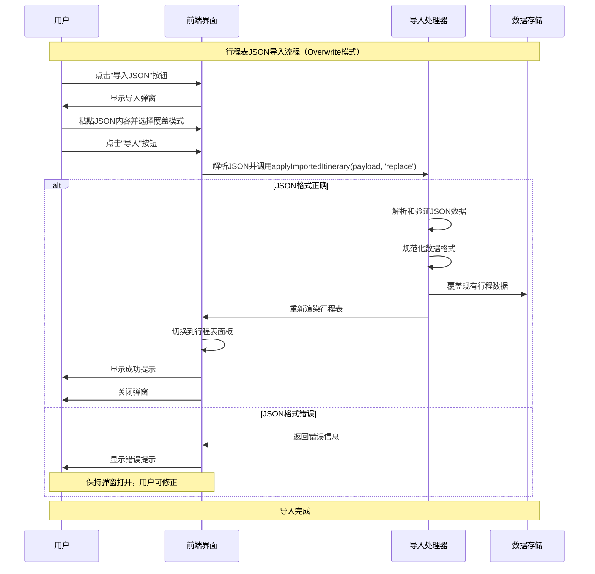
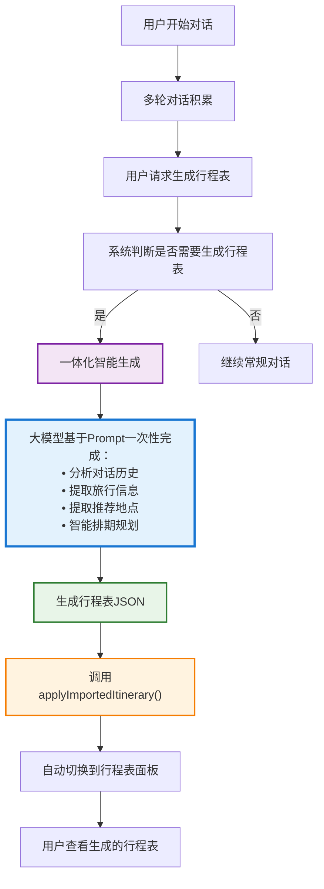
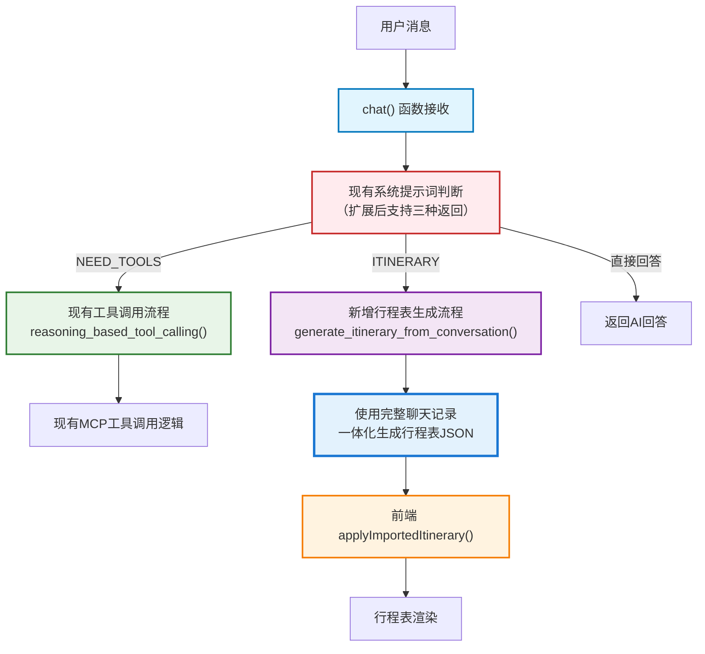
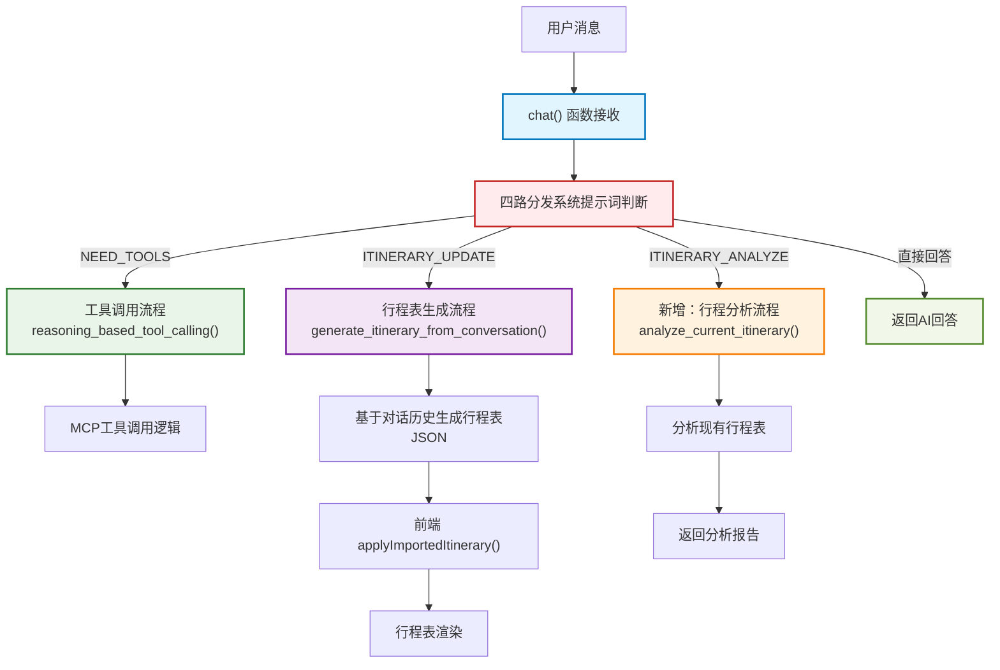

# 海口旅游智能助手 - 行程表功能设计

## 目录

- [海口旅游智能助手 - 行程表功能设计](#海口旅游智能助手---行程表功能设计)
  - [目录](#目录)
  - [1. 功能概述](#1-功能概述)
  - [2. 需求分析](#2-需求分析)
    - [2.1 用户需求](#21-用户需求)
    - [2.2 功能需求](#22-功能需求)
      - [2.2.1 核心功能（已实现）](#221-核心功能已实现)
      - [2.2.2 已实现的高级功能](#222-已实现的高级功能)
      - [2.2.3 待实现功能](#223-待实现功能)
      - [2.2.3 扩展功能（暂不实现）](#223-扩展功能暂不实现)
    - [2.2.4 左侧面板切换设计（已实现）](#224-左侧面板切换设计已实现)
      - [面板状态管理](#面板状态管理)
      - [交互设计（实际实现）](#交互设计实际实现)
      - [状态同步机制（实际实现）](#状态同步机制实际实现)
    - [2.3 数据结构（实际实现）](#23-数据结构实际实现)
      - [2.3.1 行程表数据结构（代码实际实现）](#231-行程表数据结构代码实际实现)
        - [A. 标准数据格式（统一格式）](#a-标准数据格式统一格式)
        - [D. visit\_order 与时间关系（当前策略）](#d-visit_order-与时间关系当前策略)
      - [2.3.2 地点类型分类说明](#232-地点类型分类说明)
    - [2.4 固定行程设计](#24-固定行程设计)
      - [2.4.1 固定行程概念](#241-固定行程概念)
      - [2.4.2 固定行程特征](#242-固定行程特征)
      - [2.4.3 智能约束机制](#243-智能约束机制)
    - [3. 技术实现（实际情况）](#3-技术实现实际情况)
    - [3.1 架构设计](#31-架构设计)
      - [3.1.1 前后端分离架构（已实现）](#311-前后端分离架构已实现)
      - [3.1.2 核心JavaScript实现](#312-核心javascript实现)
      - [3.1.3 拖拽功能实现](#313-拖拽功能实现)
      - [3.1.4 浮动按钮功能](#314-浮动按钮功能)
    - [3.2 样式设计（实际实现）](#32-样式设计实际实现)
    - [3.3 后端实现状态](#33-后端实现状态)
      - [3.3.1 Flask后端架构](#331-flask后端架构)
      - [3.3.2 MCP工具集成](#332-mcp工具集成)
  - [4. 时间冲突检测算法](#4-时间冲突检测算法)
    - [4.1 算法核心原理](#41-算法核心原理)
    - [4.2 具体示例](#42-具体示例)
      - [✅ 正确排序（无警告）](#-正确排序无警告)
      - [❌ 错误排序（有警告）](#-错误排序有警告)
    - [4.3 算法数学描述](#43-算法数学描述)
    - [4.4 算法实现逻辑（✅ 已完全实现）](#44-算法实现逻辑-已完全实现)
    - [4.5 算法性能特征](#45-算法性能特征)
    - [4.6 算法优势](#46-算法优势)
    - [4.7 用户操作指导](#47-用户操作指导)
  - [5. 行程表的JSON导入](#5-行程表的json导入)
    - [5.1 功能概述](#51-功能概述)
    - [5.2 支持格式](#52-支持格式)
    - [5.3 导入模式](#53-导入模式)
    - [5.4 字段容错与补齐](#54-字段容错与补齐)
    - [5.5 实现说明](#55-实现说明)
  - [6. 大模型生成行程表](#6-大模型生成行程表)
    - [6.1 功能概述（✅ 已完全实现）](#61-功能概述-已完全实现)
    - [6.2 核心设计思路](#62-核心设计思路)
      - [6.2.1 业务流程设计](#621-业务流程设计)
      - [6.2.2 系统架构集成](#622-系统架构集成)
    - [6.3 技术实现策略](#63-技术实现策略)
      - [6.3.1 三路分发架构设计](#631-三路分发架构设计)
      - [6.3.2 在chat()函数中实现三路分发](#632-在chat函数中实现三路分发)
      - [6.3.3 行程表生成函数实现](#633-行程表生成函数实现)
    - [6.4 用户体验设计](#64-用户体验设计)
      - [6.4.1 交互流程](#641-交互流程)
    - [6.5 简化实现策略](#65-简化实现策略)
      - [6.5.1 最小化验证](#651-最小化验证)
      - [6.5.2 核心错误处理](#652-核心错误处理)
    - [6.6 与现有系统的集成点](#66-与现有系统的集成点)
      - [6.6.1 前端集成](#661-前端集成)
  - [7. 短期记忆功能实现：当前行程表支持](#7-短期记忆功能实现当前行程表支持)
    - [7.1 功能目标](#71-功能目标)
    - [7.2 实现架构](#72-实现架构)
    - [7.3 实际实现方案（✅ 已完成）](#73-实际实现方案-已完成)
      - [7.3.1 前端数据获取（简化方案）](#731-前端数据获取简化方案)
      - [7.3.2 后端函数增强](#732-后端函数增强)
      - [7.3.3 后端路由修改](#733-后端路由修改)
    - [7.4 用户场景（✅ 已验证）](#74-用户场景-已验证)
    - [7.5 实现效果（✅ 生产环境验证）](#75-实现效果-生产环境验证)
  - [8. 大模型分析行程功能（✅ 已完成）](#8-大模型分析行程功能-已完成)
    - [8.1 功能概述](#81-功能概述)
    - [8.2 四路分发架构设计](#82-四路分发架构设计)
    - [8.3 架构流程图](#83-架构流程图)
    - [8.4 前端数据获取实现](#84-前端数据获取实现)
    - [8.5 后端路由扩展](#85-后端路由扩展)
    - [8.6 核心分析函数（✅ 已完成）](#86-核心分析函数-已完成)
    - [8.7 前端响应处理（✅ 已完成）](#87-前端响应处理-已完成)
    - [3. 🎯 活动搭配分析](#3--活动搭配分析)
    - [4. 🍽️ 用餐和住宿分析](#4-️-用餐和住宿分析)
    - [5. 💡 实用建议](#5--实用建议)
  - [输出要求：](#输出要求)
    - [8.8 用户使用场景（✅ 已测试验证）](#88-用户使用场景-已测试验证)
    - [8.9 简化实现的技术优势](#89-简化实现的技术优势)
      - [步骤3：后端智能路由判断](#步骤3后端智能路由判断)
      - [步骤4：行程分析处理](#步骤4行程分析处理)
      - [步骤5：前端展示分析结果](#步骤5前端展示分析结果)
      - [步骤6：AI分析报告生成](#步骤6ai分析报告生成)
  - [总结](#总结)

---

## 1. 功能概述

行程表是海口旅游智能助手的核心成果输出功能，将AI规划的旅游建议转化为结构化、可分享的行程安排。用户可以将生成的行程表发送给同行伙伴，确保所有人对行程安排有统一的了解。

## 2. 需求分析

### 2.1 用户需求
- **主要用户**：前往海口旅游的游客
- **使用场景**：
  - 与家人朋友分享旅游计划
  - 打印或保存作为旅行指南
  - 在旅行过程中查看当日安排
  - 根据实际情况调整行程

### 2.2 功能需求

#### 2.2.1 核心功能（已实现）
1. **左侧面板双标签切换**：旅程信息表单和行程表在左侧面板中相互切换
   - 标签式面板设计，支持点击切换
   - 自动状态保持（localStorage）
   - 平滑滚动和过渡动画
2. **手动添加地点**：用户可以手动添加地点到行程表
   - **弹窗式添加界面**：Modal弹窗表单
   - **日期选择**：支持选择旅行期间的任意日期
   - **时间设置**：可选的时间输入（默认为"未设置"）
   - **备注信息**：支持添加个性化备注
   - **固定标志**：可设置为固定行程

3. **行程表编辑**：允许用户对生成的行程进行微调
   - **地点编辑**：支持编辑地址、时间、备注、固定状态
   - **地点删除**：可以删除不需要的地点（有确认提示）
   - **固定行程管理**：支持固定/解除固定特定行程项目
     - 固定行程显示📌图标，不可拖拽
     - 提供切换固定状态的按钮
   - **拖拽排序**：基础拖拽功能已实现（包含同天内和跨天拖拽）
4. **空状态管理**：行程表为空时的友好界面和操作引导
    - 空状态展示页面，包含引导文案和操作按钮
    - 智能推荐按钮（引导用户填写旅程信息）
    - 添加地点按钮
5. **浮动操作按钮**：滚动时显示的快捷添加按钮
   - 监听滚动状态，智能显示/隐藏
   - 仅在行程表面板且有内容时显示
6. **实时数据同步**：旅程信息与行程表数据保持同步
   - 监听日期变化，自动更新行程天数
   - 智能重新分配现有地点到新的天数结构

#### 2.2.2 已实现的高级功能
1. **AI智能生成行程**：✅ **已完全实现**
   - 基于完整对话历史自动生成结构化行程表
   - 三路分发架构：工具调用、行程表生成、直接回答
   - 支持智能识别用户意图并自动切换到行程表面板
   - 使用专业的行程规划prompt和豆包1.5-pro模型

2. **智能时间冲突检测**：✅ **已完全实现**
   - 基于时间顺序检查算法，实时检测时间与位置不匹配
   - 红色警告标识⚠️，鼠标悬停显示详细冲突信息
   - 算法原理：检查时间排序序列是否与位置排序序列一致

#### 2.2.3 待实现功能
1. **地点搜索建议**：支持地点名称搜索和自动补全
   - 输入地点名称时的智能提示功能
   - 基于高德地图API的地点搜索
2. **行程表导出**：✅ **设计已完成**，支持多种格式导出
   - 🥇 **PDF导出**（首选）：通用性强，专业美观，支持打印
   - 🥈 **图片导出**（PNG）：社交分享便捷，移动友好
   - 🥉 **分享链接**：实时同步，无需文件传输
   - 📄 **JSON导出**：数据备份，技术人员友好
3. **地点分类展示**：不同类型地点使用不同图标标识
4. **高级约束机制**：拖拽时的智能约束功能
   - 地理位置合理性验证
   - 固定行程时间段保护

#### 2.2.3 扩展功能（暂不实现）
1. **行程表模板**：提供多种风格模板选择
2. **离线查看**：支持离线保存到本地
3. **行程提醒**：集成日程提醒功能
4. **费用汇总**：自动计算并展示预算分配

### 2.2.4 左侧面板切换设计（已实现）
#### 面板状态管理
- **默认状态**：显示旅程信息表单，用户填写旅行需求
- **切换状态**：显示行程表，用户查看和编辑生成的行程
- **切换触发**：
  - 手动触发：用户点击标签页进行切换
  - 状态保持：使用localStorage记住当前视图状态
  - 自动滚动：切换时平滑滚动到顶部

#### 交互设计（实际实现）
```html
<!-- 左侧面板头部标签 -->
<div class="left-panel-tabs">
    <button class="tab-btn active" data-tab="travel-info">
        <i class="fas fa-user-edit"></i> 旅程信息
    </button>
    <button class="tab-btn" data-tab="itinerary">
        <i class="fas fa-route"></i> 行程表
    </button>
</div>

<!-- 面板内容区域 -->
<div class="tab-content">
    <div class="tab-pane active" id="travel-info-pane">
        <!-- 旅程信息表单内容 -->
    </div>
    <div class="tab-pane" id="itinerary-pane">
        <!-- 行程表内容 -->
        <div id="itinerary-container">
            <!-- 空状态展示 -->
            <div id="empty-itinerary" class="empty-state">
                <div class="empty-icon">
                    <i class="fas fa-route"></i>
                </div>
                <h3>开始制定您的行程</h3>
                <p>您还没有添加任何行程安排</p>
                <div class="empty-actions">
                    <button class="btn-primary" id="ai-generate-btn">
                        <i class="fas fa-magic"></i> 智能推荐
                    </button>
                    <button class="btn-secondary" id="manual-add-btn">
                        <i class="fas fa-plus"></i> 添加地点
                    </button>
                </div>
            </div>
            
            <!-- 有内容时的行程展示 -->
            <div id="itinerary-content" style="display: none;">
                <div id="itinerary-days">
                    <!-- 动态生成的行程内容 -->
                </div>
            </div>
        </div>
    </div>
</div>

<!-- 浮动添加地点按钮 -->
<button class="floating-add-btn" id="floating-add-btn" title="添加新地点">
    <i class="fas fa-plus"></i>
</button>
```

#### 状态同步机制（实际实现）
- **数据同步**：监听旅行日期变化，自动更新行程表天数结构
- **智能重分配**：日期变化时自动重新分配现有地点到新的天数结构
- **本地存储**：使用localStorage保存当前面板状态


### 2.3 数据结构（实际实现）

#### 2.3.1 行程表数据结构（代码实际实现）

行程数据在前端有两个视角：
1. 最小导入/导出（对外契约）格式：仅要求 days 数组。
2. 运行期扩展（内部管理）格式：在首次添加地点或导入覆盖模式时自动补充元数据字段。

##### A. 标准数据格式（统一格式）
```json
{
    "days": [
        {
            "date": "2025-09-01",
            "day_number": 1,
            "locations": [
                { "address": "海口骑楼老街", "time": "09:00", "notes": "建议穿舒适的鞋子，可以拍照留念", "fixed": false, "visit_order": 1 },
                { "address": "老爸茶(骑楼店)", "time": "12:00", "notes": "推荐海南粉、清补凉", "fixed": false, "visit_order": 2 },
                { "address": "海口五源河体育场演唱会", "time": "18:30", "notes": "19:30开场，建议提前1小时到达。已购买门票", "fixed": true, "visit_order": 3 }
            ]
        }
    ]
}
```
允许的缺省字段：
- `time` 可缺省 ⇒ 补齐为 `""`
- `fixed` 可缺省 ⇒ 补齐为 `false`
- `notes` 可缺省 ⇒ 补齐为 `""`
- `visit_order` 可缺省 ⇒ 导入时按现有顺序线性补齐（1..n）
- `day_number` 可缺省 ⇒ 以数组顺序 1..n 补齐
- `date` 缺失 ⇒ 按当前旅行日期区间推断；否则用“今天 + 偏移”生成


> 说明：目前地点（location）对象没有独立 `id` 字段，所有操作（编辑/删除/拖拽）依赖数组索引 + 日期定位。这在拖拽与跨日移动时已足够，但对于未来的稳定引用（例如：批量冲突标记、增量同步、与后端对齐）会是一个潜在改进方向。


##### D. visit_order 与时间关系（当前策略）
当前版本不再“自动按时间排序”。逻辑为：
1. 手动添加：直接在数组尾部，随后按出现顺序重新编号 visit_order。
2. 拖拽（同日/跨日）：目标日与源日分别从 1 开始重新编号。
3. 合并导入：同日期下追加的新地点按追加顺序排在末尾，然后整体重新线性编号。
4. 覆盖导入：直接采用导入的 days，若缺失 visit_order 则按出现顺序补齐。

时间冲突检查（单独算法）只标出“时间字段与当前顺序不一致”的项目，不会自动调整顺序。


> 本节与旧版本的区别：去除了“自动按时间排序”描述，明确实际实现是“保持用户显式排序 + 冲突提示”。


#### 2.3.2 地点类型分类说明
- **✈️ 机场**：美兰机场、凤凰机场等 - 交通枢纽，标注航班号/时间
- **🚄 高铁站**：海口东站、三亚站等 - 标注车次、到发时间
- **🏞️ 景点**：骑楼老街、假日海滩、火山口公园等 - 标注游览时长、门票信息
- **🍽️ 餐厅**：老爸茶、海鲜大排档、特色小吃店等 - 标注菜系、推荐菜品
- **🎵 娱乐**：KTV、酒吧、演出场所等 - 标注演出时间、票务信息
- **🛒 商场**：免税店、购物中心、特产店等 - 标注营业时间、特色店铺
- **🎉 娱乐**：KTV、酒吧、演出场所等 - 标注演出时间、票务信息
- **📍 其他**：其他类型地点


### 2.4 固定行程设计

#### 2.4.1 固定行程概念
固定行程是指时间和地点都不可随意调整的行程项目，通常包括：
- **✈️ 航班**：到达和离开的固定时间
- **🚄 高铁/火车**：预订的车次时间
- **🎵 演出活动**：演唱会、音乐节、体育赛事等
- **🍽️ 预订餐厅**：已预订的特定时间用餐
- **🎫 门票预约**：需要预约时段的景点
- **📅 商务安排**：会议、洽谈等商务活动

#### 2.4.2 固定行程特征
1. **视觉标识**：
   - 显示📌图标表示固定状态
   - 背景色或边框样式与普通行程区分
   - 固定原因提示（如"已购买门票"）

2. **交互限制**：
   - 禁止拖拽操作，鼠标悬停显示🚫cursor
   - 禁止删除操作（或需要特殊确认）
   - 时间不可直接编辑

3. **解除固定**：
   - 点击📌图标可解除固定状态
   - 右键菜单提供"取消固定"选项
   - 解除后立即变为可编辑状态

#### 2.4.3 智能约束机制
1. **拖拽约束**：
   - 其他行程拖拽时，固定行程时间段显示为"禁止区域"
   - 系统自动调整相邻行程的时间避免冲突
   - 提供时间冲突的警告和解决指导（基于时间顺序算法）

2. **AI生成约束**：
   - AI在生成行程时优先考虑固定行程
   - 围绕固定行程合理安排其他活动
   - 确保地理位置的合理性和时间的可行性

### 3. 技术实现（实际情况）

### 3.1 架构设计

#### 3.1.1 前后端分离架构（已实现）
- **前端**：原生HTML5 + CSS3 + JavaScript（无框架依赖）
- **后端**：Flask + Python
- **AI服务**：豆包大模型API (Function Calling)
- **地图服务**：高德地图MCP工具
- **数据存储**：浏览器localStorage + 内存管理

#### 3.1.2 核心JavaScript实现

```javascript
// 全局变量
let currentPanel = 'travel-info'; // 默认显示旅程信息
let itineraryData = null; // 存储行程数据
let editingLocationIndex = null; // 当前编辑的地点索引
let editingDay = null; // 当前编辑的日期

// 面板切换函数（核心实现）
function switchPanel(panelType) {
    const tabs = document.querySelectorAll('.tab-btn');
    const panes = document.querySelectorAll('.tab-pane');
    const leftColumn = document.getElementById('left-column');
    
    // 更新标签状态
    tabs.forEach(tab => {
        tab.classList.remove('active');
        if (tab.dataset.tab === panelType) {
            tab.classList.add('active');
        }
    });
    
    // 更新面板显示
    panes.forEach(pane => {
        pane.classList.remove('active');
        if (pane.id === panelType + '-pane') {
            pane.classList.add('active');
        }
    });
    
    // 平滑滚动到顶部
    if (leftColumn) {
        leftColumn.scrollTo({
            top: 0,
            behavior: 'smooth'
        });
    }
    
    currentPanel = panelType;
    localStorage.setItem('currentPanel', panelType);
    
    if (panelType === 'itinerary') {
        checkAndShowEmptyState();
        setTimeout(() => {
            updateFloatingButtonState();
        }, 400);
    } else {
        // 隐藏浮动按钮
        const floatingBtn = document.getElementById('floating-add-btn');
        if (floatingBtn) {
            floatingBtn.classList.remove('show');
        }
    }
}

// 计算旅行天数并生成日期数组
function calculateTravelDays() {
    const startDate = document.getElementById('travel-start-date').value;
    const endDate = document.getElementById('travel-end-date').value;
    
    if (!startDate || !endDate) {
        return [];
    }
    
    const start = new Date(startDate);
    const end = new Date(endDate);
    const days = [];
    
    // 生成每一天的日期
    for (let date = new Date(start); date <= end; date.setDate(date.getDate() + 1)) {
        days.push({
            date: date.toISOString().split('T')[0], // YYYY-MM-DD格式
            day_number: days.length + 1,
            locations: []
        });
    }
    
    return days;
}

// 渲染行程表
function renderItinerary() {
    const emptyState = document.getElementById('empty-itinerary');
    const contentState = document.getElementById('itinerary-content');
    const daysContainer = document.getElementById('itinerary-days');
    
    // 检查是否有行程数据
    const hasContent = itineraryData && itineraryData.days && 
        itineraryData.days.some(day => day.locations && day.locations.length > 0);
    
    if (!hasContent) {
        // 显示空状态
        emptyState.style.display = 'block';
        contentState.style.display = 'none';
        const floatingBtn = document.getElementById('floating-add-btn');
        if (floatingBtn) {
            floatingBtn.classList.remove('show');
        }
        return;
    }
    
    // 显示内容状态
    emptyState.style.display = 'none';
    contentState.style.display = 'block';
    
    // 渲染具体内容
    daysContainer.innerHTML = itineraryData.days
        .map(day => renderDaySchedule(day))
        .join('');
        
    // 更新浮动按钮状态
    updateFloatingButtonState();
}

// 添加地点到行程数据
function addLocationToItinerary(date, location) {
    // 确保有行程数据结构
    if (!itineraryData) {
        itineraryData = {
            days: calculateTravelDays()
        };
    }
    
    // 找到对应日期的数据
    let targetDay = itineraryData.days.find(day => day.date === date);
    if (!targetDay) {
        // 如果没找到，创建新的一天
        targetDay = {
            date: date,
            day_number: itineraryData.days.length + 1,
            locations: []
        };
        itineraryData.days.push(targetDay);
    }
    
    // 添加地点
    targetDay.locations.push(location);
    
    // 按时间排序并重新分配 visit_order
    targetDay.locations.sort((a, b) => {
        // 将"未设置"时间的地点排到最后
        if (a.time === '未设置' && b.time !== '未设置') return 1;
        if (a.time !== '未设置' && b.time === '未设置') return -1;
        if (a.time === '未设置' && b.time === '未设置') return 0;
        return a.time.localeCompare(b.time);
    });
    targetDay.locations.forEach((loc, index) => {
        loc.visit_order = index + 1;
    });
}
```

#### 3.1.3 拖拽功能实现

```javascript
// 拖拽功能实现
let draggedElement = null;
let draggedData = null;

function handleDragStart(event) {
    const item = event.target.closest('.location-item');
    if (!item || item.classList.contains('fixed')) {
        event.preventDefault();
        return;
    }

    draggedElement = item;
    draggedData = {
        date: item.dataset.date,
        index: parseInt(item.dataset.index)
    };

    item.classList.add('dragging');
    event.dataTransfer.effectAllowed = 'move';
    event.dataTransfer.setData('text/html', item.outerHTML);
}

function handleDrop(event) {
    event.preventDefault();
    
    const targetItem = event.target.closest('.location-item');
    if (!targetItem || targetItem === draggedElement) return;

    const targetData = {
        date: targetItem.dataset.date,
        index: parseInt(targetItem.dataset.index)
    };

    // 执行拖拽重排序
    reorderLocations(draggedData, targetData);

    // 清理拖拽状态
    cleanupDragState();
}

function reorderLocations(sourceData, targetData) {
    if (!itineraryData || !itineraryData.days) return;

    // 找到源天和目标天
    const sourceDay = itineraryData.days.find(day => day.date === sourceData.date);
    const targetDay = itineraryData.days.find(day => day.date === targetData.date);

    if (!sourceDay || !targetDay) return;

    // 获取被拖拽的地点
    const draggedLocation = sourceDay.locations[sourceData.index];
    if (!draggedLocation || draggedLocation.fixed) return;

    // 从源位置移除
    sourceDay.locations.splice(sourceData.index, 1);

    // 如果是同一天内的重排序
    if (sourceData.date === targetData.date) {
        // 调整目标索引（因为已经从源位置移除了一个元素）
        let adjustedTargetIndex = targetData.index;
        if (sourceData.index < targetData.index) {
            adjustedTargetIndex--;
        }
        
        // 插入到新位置
        targetDay.locations.splice(adjustedTargetIndex, 0, draggedLocation);
    } else {
        // 跨天移动，插入到目标天的指定位置
        targetDay.locations.splice(targetData.index, 0, draggedLocation);
    }

    // 重新计算访问顺序
    [sourceDay, targetDay].forEach(day => {
        if (day.locations) {
            day.locations.forEach((loc, index) => {
                loc.visit_order = index + 1;
            });
        }
    });

    // 重新渲染行程表
    renderItinerary();
}
```

#### 3.1.4 浮动按钮功能

```javascript
// 浮动添加按钮功能
function updateFloatingButtonState() {
    const floatingBtn = document.getElementById('floating-add-btn');
    const leftColumn = document.getElementById('left-column');
    const itineraryTab = document.querySelector('[data-tab="itinerary"]');
    
    if (!floatingBtn || !leftColumn || !itineraryTab) return;
    
    const isItineraryActive = itineraryTab.classList.contains('active');
    const hasItineraryContent = itineraryData && itineraryData.days && 
        itineraryData.days.some(day => day.locations && day.locations.length > 0);
    const scrollTop = leftColumn.scrollTop;
    
    // 显示条件：在行程表面板 + 有内容 + 滚动超过一定距离
    if (isItineraryActive && hasItineraryContent && scrollTop > 100) {
        floatingBtn.classList.add('show');
    } else {
        floatingBtn.classList.remove('show');
    }
}
```

### 3.2 样式设计（实际实现）

```css
/* 左侧面板标签样式 */
.left-panel-tabs {
    display: flex;
    border-bottom: 1px solid #e0e0e0;
    margin-bottom: 15px;
}

.tab-btn {
    flex: 1;
    padding: 10px 15px;
    border: none;
    background: #f5f5f5;
    cursor: pointer;
    transition: all 0.3s ease;
    position: relative;
    font-size: 14px;
}

.tab-btn.active {
    background: #007bff;
    color: white;
}

/* 行程表内容样式 */
.itinerary-day {
    margin-bottom: 20px;
    border: 1px solid #e0e0e0;
    border-radius: 8px;
    overflow: hidden;
}

.day-header {
    background: linear-gradient(135deg, #667eea 0%, #764ba2 100%);
    color: white;
    padding: 12px 15px;
    font-weight: bold;
    display: flex;
    justify-content: space-between;
    align-items: center;
}

.location-item {
    padding: 12px 15px;
    border-bottom: 1px solid #f0f0f0;
    display: flex;
    align-items: center;
    transition: background-color 0.2s ease;
}

.location-item:hover {
    background-color: #f8f9fa;
}

.location-item.fixed {
    background-color: #fff3cd;
    border-left: 4px solid #ffc107;
}

/* 空状态样式 */
.empty-state {
    text-align: center;
    padding: 60px 20px;
    color: #666;
}

.empty-icon {
    font-size: 64px;
    color: #ddd;
    margin-bottom: 20px;
}

/* 浮动添加按钮 */
.floating-add-btn {
    position: fixed;
    bottom: 30px;
    right: 30px;
    width: 56px;
    height: 56px;
    border-radius: 50%;
    background: #007bff;
    color: white;
    border: none;
    cursor: pointer;
    box-shadow: 0 4px 12px rgba(0, 0, 0, 0.2);
    transform: translateY(100px);
    opacity: 0;
    transition: all 0.3s ease;
    z-index: 1000;
}

.floating-add-btn.show {
    transform: translateY(0);
    opacity: 1;
    animation: fadeInUp 0.3s ease-out;
}

/* 弹窗样式 */
.modal {
    position: fixed;
    top: 0;
    left: 0;
    width: 100%;
    height: 100%;
    background: rgba(0, 0, 0, 0.5);
    z-index: 1000;
    display: flex;
    align-items: center;
    justify-content: center;
}

.modal-content {
    background: white;
    border-radius: 8px;
    width: 90%;
    max-width: 500px;
    max-height: 80vh;
    overflow-y: auto;
}
```

### 3.3 后端实现状态

#### 3.3.1 Flask后端架构
- **聊天接口**: `/api/chat` 处理用户消息和AI对话
- **工具调用**: 通过MCPClientWrapper调用高德地图MCP工具
- **Function Calling**: 支持豆包大模型的工具调用功能
- **日志记录**: 完整的请求和响应日志

#### 3.3.2 MCP工具集成
- **搜索兴趣点**: `search_poi` 工具
- **获取天气信息**: `get_weather` 工具
- **工具调用流程**: LLM → Function Calling → MCP工具 → 格式化结果


## 4. 时间冲突检测算法

### 4.1 算法核心原理

**核心逻辑：到访顺序应该按照时间顺序，否则就是时间冲突**

时间冲突检测采用**时间顺序检查算法**，通过比较地点的实际排列顺序与时间先后顺序来检测冲突。

### 4.2 具体示例

**假设场景：ABCD四个地点，到达时间依次为6点、7点、8点、9点**

#### ✅ 正确排序（无警告）
```
第1个地点: A (06:00) ← 最早时间在第1位 ✓
第2个地点: B (07:00) ← 第2早时间在第2位 ✓  
第3个地点: C (08:00) ← 第3早时间在第3位 ✓
第4个地点: D (09:00) ← 最晚时间在第4位 ✓
```
**结果：** 排序为ABCD时不会有任何警告

#### ❌ 错误排序（有警告）
```
第1个地点: A (06:00) ← 最早时间在第1位 ✓
第2个地点: C (08:00) ← 第3早时间在第2位 ❌ 警告！
第3个地点: B (07:00) ← 第2早时间在第3位 ❌ 警告！  
第4个地点: D (09:00) ← 最晚时间在第4位 ✓
```
**结果：** B和C标红，提示用户需要交换位置

### 4.3 算法数学描述

**定义：**
- 设有 n 个地点：L = {l₁, l₂, ..., lₙ}
- 每个地点 lᵢ 有到达时间 tᵢ 和实际位置 pᵢ
- 定义时间排序函数 σ(L)，将地点按时间升序排列
- 定义位置映射函数 π(lᵢ) = pᵢ，表示地点 lᵢ 在行程中的实际位置

**算法核心：**
对于地点集合 L 中任意地点 lᵢ，设：
- rank_t(lᵢ) = 地点 lᵢ 在时间排序 σ(L) 中的位置
- rank_p(lᵢ) = 地点 lᵢ 在实际行程中的位置 π(lᵢ)

**冲突检测条件：**
```
∃ lᵢ ∈ L : rank_t(lᵢ) ≠ rank_p(lᵢ) ⟹ 时间冲突
```

**数学表达式：**
```
TimeConflict(lᵢ) = {
    True,  if rank_t(lᵢ) ≠ rank_p(lᵢ)
    False, if rank_t(lᵢ) = rank_p(lᵢ)
}
```

**理想状态：**
当且仅当 ∀ lᵢ ∈ L : rank_t(lᵢ) = rank_p(lᵢ) 时，行程时间安排无冲突。

即：**时间排序序列 ≡ 位置排序序列**

**具体示例：**
```
地点集合: L = {A, B, C, D}
时间集合: T = {6:00, 7:00, 8:00, 9:00}
映射关系: A→6:00, B→7:00, C→8:00, D→9:00

时间排序: σ(L) = [A, B, C, D]  (按时间升序)
位置排序: π(L) = [A, C, B, D]  (实际行程顺序)

冲突检测:
- rank_t(A) = 1, rank_p(A) = 1 ⟹ 无冲突 ✓
- rank_t(B) = 2, rank_p(B) = 3 ⟹ 有冲突 ❌  
- rank_t(C) = 3, rank_p(C) = 2 ⟹ 有冲突 ❌
- rank_t(D) = 4, rank_p(D) = 4 ⟹ 无冲突 ✓
```

### 4.4 算法实现逻辑（✅ 已完全实现）

**实际在线运行的JavaScript代码：**
```javascript
// 检查时间冲突 - 按时间顺序检查算法
function checkTimeConflict(currentLocation, index, dayLocations) {
    // 如果当前地点没有时间信息，不检查冲突
    if (!currentLocation.time || currentLocation.time === '') {
        return { hasConflict: false, type: null };
    }
    
    // 获取所有有时间的地点，并按时间排序
    const locationsWithTime = dayLocations
        .map((loc, idx) => ({ ...loc, originalIndex: idx }))
        .filter(loc => loc.time && loc.time !== '');
    
    // 按时间排序
    const sortedByTime = [...locationsWithTime].sort((a, b) => a.time.localeCompare(b.time));
    
    // 找到当前地点在时间排序中的位置
    const currentInSorted = sortedByTime.findIndex(loc => loc.originalIndex === index);
    if (currentInSorted === -1) return { hasConflict: false, type: null };
    
    // 检查当前地点的实际位置是否符合时间顺序
    const currentTimePosition = currentInSorted; // 在时间序列中的位置
    
    // 计算所有有时间地点在实际列表中的位置
    const actualPositions = locationsWithTime.map(loc => loc.originalIndex).sort((a, b) => a - b);
    const currentPositionInActualSequence = actualPositions.indexOf(index);
    
    // 如果时间顺序位置与实际位置不匹配，则有冲突
    if (currentTimePosition !== currentPositionInActualSequence) {
        return { 
            hasConflict: true, 
            type: 'order',
            message: `时间顺序冲突：按时间排序应该是第${currentTimePosition + 1}个，但实际是第${currentPositionInActualSequence + 1}个`
        };
    }
    
    return { hasConflict: false, type: null };
}
```

**核心概念：**
- **时间顺序**：按到达时间从早到晚排列（06:00 → 07:00 → 08:00 → 09:00）
- **实际顺序**：地点在行程表中的当前位置（第1个 → 第2个 → 第3个 → 第4个）
- **冲突判断**：时间顺序与实际顺序不匹配时标红警告⚠️并显示详细提示信息

### 4.5 算法性能特征

- **时间复杂度**：O(n log n) - 主要消耗在排序操作
- **空间复杂度**：O(n) - 需要创建排序后的副本
- **实际性能**：对于旅游行程的规模（通常<20个地点），性能影响可忽略
- **扩展性**：算法逻辑清晰，易于后续优化和扩展

### 4.6 算法优势

- ✅ **直观理解**：符合人的自然逻辑思维
- ✅ **精确定位**：准确指出哪些地点位置错误
- ✅ **简单修复**：拖拽交换位置即可解决
- ✅ **全局检查**：一次性发现所有时间顺序问题
- ✅ **用户友好**：红色警告⚠️直观易懂

### 4.7 用户操作指导

当用户看到红色警告时：
1. **识别问题**：红色⚠️标记的地点时间顺序有误
2. **理解原因**：该地点的时间与其位置不匹配
3. **解决方法**：拖拽调整地点位置，使时间顺序与实际顺序一致
4. **验证结果**：调整后红色警告自动消失

## 5. 行程表的JSON导入

### 5.1 功能概述

使用场景：用户可在任意大模型中生成符合本系统数据契约的行程 JSON，将结果复制或作为文件导入本应用，立即生成行程表。

### 5.2 支持格式

- `{ "days": [ ... ] }` - 简化格式

### 5.3 导入模式

- **覆盖模式**（`'replace'`）：用导入的数据替换当前行程
- **合并模式**（`'merge'`）：按日期将新地点追加到现有行程，自动去重（address + time）并重排 visit_order




### 5.4 字段容错与补齐

- `time` 为空 → 归一为"未设置"
- `fixed` 缺省 → 默认 false
- `notes` 缺省 → 空字符串
- 缺失 `date`/`day_number` → 按当前日期区间或顺序补齐

### 5.5 实现说明

**入口位置：**
- 行程表空状态页的"导入JSON"按钮
- 行程表有内容时，底部操作区"导入JSON"按钮

**处理流程：**
1. 用户粘贴JSON内容到弹窗文本框
2. 点击"导入"按钮，前端先进行JSON解析验证
3. 调用`applyImportedItinerary(payload, mode)`函数
4. 执行数据规范化和基本字段补齐
5. 按选择的模式（覆盖/合并）导入数据
6. 自动渲染行程表并切换到"行程表"面板

**核心函数实现：**

```javascript
// 1. JSON导入主函数
function applyImportedItinerary(payload, mode = 'replace') {
    const normalized = normalizeItineraryPayload(payload);
    if (!normalized || !Array.isArray(normalized.days)) {
        alert('JSON格式不正确：仅支持 {days:[...]} 格式');
        return;
    }
    
    // 基本字段校验与补齐
    normalized.days.forEach((day, idx) => {
        if (!day.date) {
            // 若缺少date，尝试从当前日期区间推断；否则用今天+idx
            const daysArr = calculateTravelDays();
            day.date = (daysArr[idx] && daysArr[idx].date) || new Date(Date.now()+idx*86400000).toISOString().split('T')[0];
        }
        if (typeof day.day_number !== 'number') day.day_number = idx + 1;
        if (!Array.isArray(day.locations)) day.locations = [];
    });
    ensureVisitOrders(normalized.days);

    if (mode === 'merge' && itineraryData && Array.isArray(itineraryData.days) && itineraryData.days.length > 0) {
        // 合并：按日期合并地点，避免重复（key=address+time）
        const daysMap = new Map();
        itineraryData.days.forEach(d => daysMap.set(d.date, d));
        normalized.days.forEach(srcDay => {
            const targetDay = daysMap.get(srcDay.date);
            if (targetDay) {
                const seen = new Set((targetDay.locations || []).map(loc => `${loc.address}@@${loc.time || '未设置'}`));
                srcDay.locations.forEach(loc => {
                    const key = `${loc.address}@@${loc.time || '未设置'}`;
                    if (!seen.has(key)) {
                        targetDay.locations.push({ ...loc });
                        seen.add(key);
                    }
                });
                targetDay.locations.forEach((loc, i) => { loc.visit_order = i + 1; });
            } else {
                const newDay = {
                    date: srcDay.date,
                    day_number: itineraryData.days.length + 1,
                    locations: (srcDay.locations || []).map(l => ({ ...l }))
                };
                newDay.locations.forEach((loc, i) => { loc.visit_order = i + 1; });
                itineraryData.days.push(newDay);
                daysMap.set(newDay.date, newDay);
            }
        });
        itineraryData.updated_at = new Date().toISOString();
    } else {
        // 覆盖：替换为导入数据
        itineraryData = {
            id: generateId(),
            title: '导入的海口行程',
            created_at: new Date().toISOString(),
            updated_at: new Date().toISOString(),
            days: normalized.days
        };
    }
    
    renderItinerary();
    switchPanel('itinerary');
    closeImportJsonModal();
}

// 2. 数据验证和规范化函数
function normalizeItineraryPayload(payload) {
    // 仅支持新格式：{days:[]}
    if (!payload || typeof payload !== 'object') return null;
    
    // 检查是否包含 days 数组
    if (Array.isArray(payload.days)) {
        return { days: payload.days };
    }
    
    return null;
}

// 3. 确保访问顺序正确性
function ensureVisitOrders(days) {
    days.forEach(day => {
        if (!Array.isArray(day.locations)) day.locations = [];
        // visit_order 优先保持输入；否则按现有顺序补齐
        day.locations.forEach((loc, idx) => {
            if (typeof loc.visit_order !== 'number') loc.visit_order = idx + 1;
            if (!loc.time) loc.time = '未设置';
            if (typeof loc.fixed !== 'boolean') loc.fixed = false;
            if (!('notes' in loc)) loc.notes = '';
        });
    });
}

// 4. 导入按钮事件绑定
document.getElementById('confirm-import-json').addEventListener('click', () => {
    let text = document.getElementById('import-json-text')?.value || '';
    if (!text.trim()) {
        alert('请粘贴JSON后再导入');
        return;
    }
    try {
        const obj = JSON.parse(text);
        // 简化为覆盖模式（默认重建行程表）
        applyImportedItinerary(obj, 'replace');
    } catch (e) {
        alert('JSON解析失败：' + e.message);
    }
});
```

**事件绑定示例：**

```javascript
// 绑定导入按钮事件
document.getElementById('import-json-btn').addEventListener('click', function() {
    // 打开导入弹窗
    document.getElementById('import-json-modal').style.display = 'flex';
});

// 绑定确认导入按钮事件
document.getElementById('confirm-import-json').addEventListener('click', function() {
    const jsonText = document.getElementById('import-json-text').value;
    if (!jsonText.trim()) {
        alert('请粘贴JSON内容');
        return;
    }
    try {
        const itineraryObject = JSON.parse(jsonText);
        applyImportedItinerary(itineraryObject, 'replace');
    } catch (error) {
        alert('JSON解析失败：' + error.message);
    }
});

// 绑定取消按钮事件
document.getElementById('close-import-json').addEventListener('click', function() {
    document.getElementById('import-json-modal').style.display = 'none';
});
```

## 6. 大模型生成行程表

### 6.1 功能概述（✅ 已完全实现）

大模型能够根据用户的多轮对话历史，智能生成完整的行程表JSON结构，并直接导入到系统的行程表模块中。这是一个从**对话到行程表**的智能转换功能。

**当前实现状态**：✅ 完全实现并已在生产环境中验证
- 三路分发架构：NEED_TOOLS / ITINERARY / 直接回答
- 完整的对话历史分析和行程表生成
- 自动JSON格式化和前端集成
- 智能意图识别和路由

### 6.2 核心设计思路

#### 6.2.1 业务流程设计



#### 6.2.2 系统架构集成

**基于现有chat()函数的三路分发架构：**



### 6.3 技术实现策略

#### 6.3.1 三路分发架构设计

**核心设计：修复原有架构缺陷，实现完整的三路分发**

原有系统存在问题：所有请求都进入 `reasoning_based_tool_calling()` 函数，缺少直接回答分支。新架构实现三路分发：

1. **NEED_TOOLS** → 工具调用流程
2. **ITINERARY** → 行程表生成流程  
3. **直接回答** → 基于常识回复

```python
# 修改后的 system_message，支持三路分发判断
system_message = {
    "role": "system", 
    "content": f"""你是一个专业的海口旅游规划助手。

【核心任务】分析用户需求，判断是否需要调用工具或生成行程表。

【可用工具类型】
- 天气信息查询
- 景点/酒店/餐厅搜索
- 附近地点搜索  
- 距离测量
- 本地知识库查询{"（当前可用）" if cache_status['doc_query_available'] else "（当前不可用）"}

【判断原则】
- 需要实时数据（天气、具体位置、营业信息、路线距离等）→ 回复"NEED_TOOLS"
- 需要具体的景点/酒店/餐厅推荐 → 回复"NEED_TOOLS"  
- 需要制定详细行程规划 → 回复"NEED_TOOLS"
- 用户明确要求生成、制定、安排行程表/日程 → 回复"ITINERARY"
- 用户询问如何整理之前的推荐成具体行程 → 回复"ITINERARY"
- 对话中已有充分信息，用户希望整合成可执行计划 → 回复"ITINERARY"
- 可以基于常识直接回答的一般性问题 → 直接回答

【回复要求】
- 需要工具时：只回复"NEED_TOOLS"
- 需要生成行程表时：只回复"ITINERARY"
- 不需要工具时：提供完整、专业的回答，使用Markdown格式，适当使用emoji

⚠️ **重要**：不要生成任何工具调用指令，只做判断。"""
}
```

#### 6.3.2 在chat()函数中实现三路分发

**修复原有架构问题，实现完整的意图处理**

```python
@app.route('/api/chat', methods=['POST'])
def chat():
    logging.info("进入 /api/chat 路由")
    try:
        data = request.json
        messages = data.get('messages', [])
        tool_use = []
        now_beijing = lambda: datetime.datetime.now(beijing_tz).isoformat()
        
        # 1. 检查缓存和文档状态
        cache_status = check_cache_and_docs_status()
        
        # 2. 构建系统提示词，支持三路分发判断
        system_message = {
            "role": "system",
            "content": f"""..."""  # 上述提示词内容
        }
        
        # 将系统消息插入到消息列表开头
        messages_with_system = [system_message] + messages
        user_question = messages[-1] if messages and messages[-1].get('role') == 'user' else {"role": "user", "content": ""}
        
        # 3. 调用LLM进行意图判断
        completion = client.chat.completions.create(
            model=TOOL_GENERATION_MODEL,
            messages=messages_with_system,
        )
        llm_reply = completion.choices[0].message.content
        logging.info(f"[CHAT_REPLY] {llm_reply}")
        
        # 4. 三路分发逻辑（修复原有架构缺陷）
        if "NEED_TOOLS" in llm_reply:
            # 工具调用流程
            logging.info("[CHAT_DECISION] 需要工具调用")
            final_reply, tool_call_history, call_failed = reasoning_based_tool_calling(
                user_question, messages_with_system, tool_use, now_beijing, cache_status['doc_query_available']
            )
            
            if call_failed:
                return jsonify({"status": "error", "message": final_reply}), 500
            else:
                return jsonify({"status": "success", "response": final_reply, "tool_use": tool_use})
        
        elif "ITINERARY" in llm_reply:
            # 行程表生成流程
            logging.info("[CHAT_DECISION] 需要生成行程表")
            return generate_itinerary_from_conversation(messages)
        
        else:
            # 直接回答流程（新增分支，修复原有缺陷）
            logging.info("[CHAT_DECISION] 提供直接回答")
            return jsonify({"status": "success", "response": llm_reply, "tool_use": tool_use})
    
    except Exception as e:
        logging.error("/api/chat 路由发生异常", exc_info=True)
        return jsonify({"status": "error", "message": str(e)}), 500


        # 现有的工具调用流程保持不变
        logging.info("[CHAT_DECISION] 对话模型判断需要工具调用")
        final_reply, tool_call_history, call_failed = reasoning_based_tool_calling(
            user_question, messages, tool_use, now_beijing, cache_status['doc_query_available']
        )
        
        if call_failed:
            return jsonify({"status": "error", "message": final_reply}), 500
        else:
            return jsonify({
                "status": "success",
                "response": final_reply,
                "tool_use": tool_use
            })
    
    elif "ITINERARY" in llm_reply:
        # 新增：行程表生成流程
        logging.info("[CHAT_DECISION] 对话模型判断需要生成行程表")
        return generate_itinerary_from_conversation(messages)
    
    else:
        # 现有的直接回答逻辑保持不变
        logging.info("[CHAT_DECISION] 对话模型提供直接回答")
        return jsonify({
            "status": "success",
            "response": llm_reply
        })
```

#### 6.3.3 行程表生成函数实现

**独立的行程表生成处理函数**

```python
def generate_itinerary_from_conversation(messages):
    """基于完整对话历史生成行程表"""
    try:
        # 检查对话历史是否足够
        user_messages = [msg for msg in messages if msg.get("role") in ["user", "assistant"]]
        if len(user_messages) < 3:
            return jsonify({
                "status": "info",
                "response": "您的对话信息还不够完整，请先提供更多旅行需求，我会为您推荐相关信息后再生成行程表。"
            })
        
        # 格式化完整对话历史
        conversation_history = format_full_conversation_for_itinerary(messages)
        
        # 构建行程表生成prompt
        itinerary_prompt = ITINERARY_GENERATION_PROMPT.format(
            conversation_history=conversation_history
        )
        
        # 调用大模型生成行程表
        response = client.chat.completions.create(
            model="doubao-1.5-pro-32k",  # 使用强大模型处理复杂任务
            messages=[{"role": "user", "content": itinerary_prompt}],
            temperature=0.1
        )
        
        # 解析JSON输出
        itinerary_content = response.choices[0].message.content.strip()
        
        # 处理可能的markdown代码块包装
        if "```json" in itinerary_content:
            start = itinerary_content.find("```json") + 7
            end = itinerary_content.rfind("```")
            itinerary_content = itinerary_content[start:end].strip()
        elif "```" in itinerary_content:
            start = itinerary_content.find("```") + 3
            end = itinerary_content.rfind("```")
            itinerary_content = itinerary_content[start:end].strip()
        
        itinerary_json = json.loads(itinerary_content)
        
        return jsonify({
            "status": "success",
            "response": "行程表已生成完成！已自动为您打开行程表页面。",
            "itinerary_data": itinerary_json,
            "action": "generate_itinerary"
        })
        
    except json.JSONDecodeError as e:
        logging.error(f"行程表JSON解析失败: {e}")
        return jsonify({
            "status": "error",
            "response": "行程表生成失败：数据格式错误。请重试或提供更详细的旅行信息。"
        })
    except Exception as e:
        logging.error(f"行程表生成失败: {e}")
        return jsonify({
            "status": "error",
            "response": "抱歉，行程表生成失败，请稍后重试或提供更详细的旅行信息。"
        })

def format_full_conversation_for_itinerary(messages):
    """格式化完整对话历史供行程表生成使用"""
    formatted = []
    # 跳过系统消息，使用最近15轮用户和助手的对话
    user_messages = [msg for msg in messages if msg.get("role") in ["user", "assistant"]]
    
    for msg in user_messages[-15:]:
        role = "用户" if msg.get("role") == "user" else "助手"
        content = msg.get("content", "")
        formatted.append(f"{role}: {content}")
    
    return "\n".join(formatted)

# 完整的行程表生成prompt模板
ITINERARY_GENERATION_PROMPT = """
你是一个专业的海口旅游规划助手。请根据以下对话历史，分析用户的旅行需求并生成详细的行程表。

## 对话历史：
{conversation_history}

## 必须提取的信息：
1. **旅行时间**：出发日期、结束日期、总天数
2. **旅行偏好**：景点类型、活动偏好、预算范围
3. **人员构成**：同行人数、年龄段、特殊需求
4. **已推荐地点**：从对话中提及的所有景点、餐厅、酒店等
5. **固定安排**：已确定的时间安排（如航班、演出等）

## 智能排期原则：
1. **时间合理性**：确保地点间转移时间充足，避免过于紧凑
2. **地理优化**：同一区域的地点安排在同一天或相邻时间
3. **活动搭配**：合理搭配室内外活动，考虑体力分配
4. **用餐时间**：在合适时间安排餐厅，避免饥饿或过饱
5. **固定优先**：优先安排固定时间的活动（航班、演出等）

## 输出要求：
严格按照以下JSON格式输出，不要添加任何其他文字说明：

```json
{
  "days": [
    {
      "date": "YYYY-MM-DD",
      "day_number": 1,
      "locations": [
        {
          "address": "具体地点名称",
          "time": "HH:MM或空字符串",
          "notes": "相关说明和建议",
          "fixed": false,
          "visit_order": 1
        }
      ]
    }
  ]
}
```

**重要提醒**：
- 只输出JSON格式，不要有任何前缀或后缀文字
- 确保所有字段都存在且格式正确
- fixed字段：航班、演出、预订等设为true
- time字段：有明确时间的填写"HH:MM"，否则填写空字符串""
- notes字段：提供实用的游览建议和注意事项
"""

### 6.4 用户体验设计

#### 6.4.1 交互流程

**用户操作流程：**
1. 用户在聊天过程中明确表达生成行程表的需求
2. 系统自动识别意图并开始行程表生成
3. 显示生成进度提示（可选）
4. 生成完成后自动切换到行程表面板
5. 用户可以查看、编辑和分享生成的行程表

**触发条件示例：**
- "请帮我生成一个行程表"
- "把刚才的推荐整理成具体的日程安排"
- "制定一个3天的海口旅游计划"
- "安排一下我们的行程"

### 6.5 简化实现策略

为了加快开发进度，采用简化的实现策略：

#### 6.5.1 最小化验证

**简化原则：**
- 信任大模型的输出质量
- 依赖前端`applyImportedItinerary()`的容错机制
- 基础的JSON解析错误处理即可
- 将复杂验证逻辑留待后期优化

#### 6.5.2 核心错误处理

**仅保留关键错误处理：**
- JSON解析失败
- 网络请求异常
- 基础的数据结构检查（在前端进行）

### 6.6 与现有系统的集成点

#### 6.6.1 前端集成

**Chat.js响应处理扩展：**
```javascript
// 扩展现有的chat响应处理函数
function handleChatResponse(response) {
    if (response.status === 'success') {
        // 检查是否有特殊动作
        if (response.action === 'generate_itinerary') {
            // 行程表生成成功
            handleItineraryGeneration(response);
        } else {
            // 常规聊天响应
            displayMessage(response.response, 'assistant');
        }
        
        // 处理工具使用记录
        if (response.tool_use && response.tool_use.length > 0) {
            displayToolUsage(response.tool_use);
        }
    } else {
        // 错误处理
        displayMessage(response.response || response.message, 'error');
    }
}

// 行程表生成处理函数
function handleItineraryGeneration(response) {
    try {
        // 显示成功消息
        displayMessage(response.response, 'assistant');
        
        // 验证行程数据
        if (!response.itinerary_data || !response.itinerary_data.days) {
            throw new Error('行程数据格式错误');
        }
        
        // 调用现有的导入函数
        applyImportedItinerary(response.itinerary_data, 'replace');
        
        // 显示生成成功提示
        showSuccessNotification('行程表生成成功！已自动切换到行程表页面。');
        
    } catch (error) {
        console.error('行程表处理失败:', error);
        displayMessage('行程表生成成功，但导入时出现问题。请重试或手动导入。', 'error');
    }
}

// 成功通知显示
function showSuccessNotification(message) {
    // 创建通知元素
    const notification = document.createElement('div');
    notification.className = 'success-notification';
    notification.innerHTML = `
        <i class="fas fa-check-circle"></i>
        <span>${message}</span>
    `;
    
    // 添加到页面
    document.body.appendChild(notification);
    
    // 3秒后自动移除
    setTimeout(() => {
        if (notification.parentNode) {
            notification.parentNode.removeChild(notification);
        }
    }, 3000);
}
```

**CSS样式补充：**
```css
/* 成功通知样式 */
.success-notification {
    position: fixed;
    top: 20px;
    right: 20px;
    background: #d4edda;
    color: #155724;
    border: 1px solid #c3e6cb;
    border-radius: 6px;
    padding: 15px 20px;
    box-shadow: 0 4px 12px rgba(0, 0, 0, 0.1);
    z-index: 2000;
    display: flex;
    align-items: center;
    gap: 10px;
    animation: slideInRight 0.3s ease-out;
}

.success-notification i {
    color: #28a745;
    font-size: 18px;
}

@keyframes slideInRight {
    from {
        transform: translateX(100%);
        opacity: 0;
    }
    to {
        transform: translateX(0);
        opacity: 1;
    }
}
```

---


## 7. 短期记忆功能实现：当前行程表支持

### 7.1 功能目标

**核心问题**：当前系统每次生成行程表都是全新生成，无法感知用户已有的行程安排，导致用户的调整需求无法得到满足。

**解决方案**：为系统添加短期记忆功能，让AI能够读取当前行程表数据，支持增量式调整。

### 7.2 实现架构

基于现有的三路由架构，增强 `ITINERARY_UPDATE` 路由：

```
用户消息 → 前端获取当前行程表 → 传递到后端 → AI处理 → 返回结果
```

**关键改进点**：
1. **前端**：直接使用全局 `itineraryData` 变量获取行程表数据
2. **后端**：接收 `current_itinerary` 参数
3. **AI处理**：根据是否有现有行程采用不同策略

### 7.3 实际实现方案（✅ 已完成）

#### 7.3.1 前端数据获取（简化方案）

**核心优化**：直接使用全局变量，避免 localStorage 的序列化开销

```javascript
/**
 * 获取当前行程表数据
 * 优化：直接使用全局 itineraryData 变量，而不是 localStorage
 */
function getCurrentItinerary() {
    console.log('调试 - 开始获取当前行程表数据');
    console.log('调试 - 全局itineraryData:', itineraryData);
    console.log('调试 - itineraryData类型:', typeof itineraryData);
    
    if (itineraryData && itineraryData.days && Array.isArray(itineraryData.days)) {
        console.log('调试 - 找到有效的行程表数据');
        console.log('调试 - 行程天数:', itineraryData.days.length);
        return itineraryData;
    } else {
        console.log('调试 - 没有有效的行程表数据');
        return null;
    }
}

/**
 * 发送消息到后端，自动包含当前行程表数据
 */
async function sendToBackend(messages) {
    try {
        // 获取当前行程表数据作为短期记忆
        const currentItinerary = getCurrentItinerary();
        console.log('调试 - sendToBackend获取到的currentItinerary:', currentItinerary);
        console.log('调试 - currentItinerary类型:', typeof currentItinerary);
        
        const requestData = {
            messages,
            current_itinerary: currentItinerary  // 新增参数：当前行程表数据
        };
        console.log('调试 - 准备发送的请求数据:', requestData);
        
        const response = await fetch('/api/chat', {
            method: 'POST',
            headers: {
                'Content-Type': 'application/json',
            },
            body: JSON.stringify(requestData),
        });
        
        // ... 后续处理逻辑
    } catch (error) {
        console.error('发送消息失败:', error);
    }
}
```

**技术优势**：
- ✅ **零延迟**：内存直接访问，无 I/O 开销
- ✅ **实时性**：修改后立即可用，无需存储同步
- ✅ **简洁性**：代码更简单，减少错误处理
- ✅ **高性能**：避免 JSON 序列化/反序列化

#### 7.3.2 后端函数增强

修改 `generate_itinerary_from_conversation` 函数支持现有行程：

```python
def generate_itinerary_from_conversation(messages, current_itinerary=None):
    """
    基于完整对话历史生成行程表，支持基于现有行程的增量调整
    
    Args:
        messages: 完整对话历史
        current_itinerary: 当前行程表数据（支持短期记忆功能）
    """
    try:
        logging.info("开始生成行程表")
        
        # 检查对话历史是否足够
        user_messages = [msg for msg in messages if msg.get("role") == "user"]
        logging.info(f"用户消息数量: {len(user_messages)}")
        
        # 格式化完整对话历史
        logging.info("开始格式化对话历史")
        conversation_history = format_full_conversation_for_itinerary(messages)
        logging.info(f"对话历史格式化完成，长度: {len(conversation_history)}")
        
        # 构建包含当前行程的prompt
        logging.info("构建行程表生成prompt")
        
        # 调试：详细检查current_itinerary参数
        logging.info(f"调试 - 函数内current_itinerary类型: {type(current_itinerary)}")
        logging.info(f"调试 - 函数内current_itinerary内容: {current_itinerary}")
        
        itinerary_json_str = ""
        if current_itinerary and current_itinerary.get('days'):
            itinerary_json_str = f"当前用户行程表JSON数据：\n```json\n{json.dumps(current_itinerary, ensure_ascii=False, indent=2)}\n```\n\n"
            logging.info("已包含当前行程表数据作为短期记忆")
            logging.info(f"调试 - 行程表数据长度: {len(itinerary_json_str)}")
        else:
            logging.info("无当前行程表数据，将生成全新行程")
            if current_itinerary:
                logging.info(f"调试 - current_itinerary存在但没有days字段: {current_itinerary}")
            else:
                logging.info("调试 - current_itinerary为None或空")
        
        # 构建prompt并调用AI
        itinerary_prompt = ITINERARY_GENERATION_PROMPT.format(
            current_itinerary_json=itinerary_json_str,
            conversation_history=conversation_history
        )
        
        # 调用大模型生成行程表
        response = client.chat.completions.create(
            model=PLANNING_MODEL,
            messages=[{"role": "user", "content": itinerary_prompt}]
        )
        
        # 解析和返回结果
        # ... 后续处理逻辑
        
    except Exception as e:
        logging.error(f"生成行程表异常: {str(e)}", exc_info=True)
        return {"success": False, "error": str(e)}
```

#### 7.3.3 后端路由修改

在主路由中接收新参数：

```python
@app.route('/api/chat', methods=['POST'])
def chat():
    logging.info("进入 /api/chat 路由")
    try:
        data = request.json
        messages = data.get('messages', [])
        current_itinerary = data.get('current_itinerary')  # 新增：接收当前行程表数据
        
        # 调试：打印current_itinerary的详细信息
        logging.info(f"调试 - current_itinerary 类型: {type(current_itinerary)}")
        logging.info(f"调试 - current_itinerary 内容: {current_itinerary}")
        if current_itinerary:
            logging.info("收到当前行程表数据，将启用短期记忆功能")
            if isinstance(current_itinerary, dict):
                logging.info(f"调试 - current_itinerary.keys(): {current_itinerary.keys()}")
                logging.info(f"调试 - current_itinerary.get('days'): {current_itinerary.get('days')}")
        else:
            logging.info("调试 - 未收到current_itinerary数据或数据为空")
        
        # ... 三路由架构处理
        
        elif initial_response == "ITINERARY_UPDATE":
            # 路由2: 行程表生成
            logging.info("路由到行程表生成")
            
            # 获取完整对话历史（不包括system_message）
            conversation_for_itinerary = messages[1:]  # 去掉system_message
            
            # 生成行程表，传递当前行程表数据支持短期记忆
            itinerary_result = generate_itinerary_from_conversation(
                conversation_for_itinerary, 
                current_itinerary  # 传递当前行程表数据
            )
            
            # ... 处理结果并返回
            
    except Exception as e:
        logging.error("/api/chat 路由发生异常", exc_info=True)
        return jsonify({"status": "error", "message": str(e)}), 500
```

### 7.4 用户场景（✅ 已验证）

**场景1：首次生成行程**
```
用户："帮我规划3天海口行程"
前端：getCurrentItinerary() → null
后端：current_itinerary = null
AI：生成全新行程表
日志：无当前行程表数据，将生成全新行程
```

**场景2：增量调整（已测试成功）**
```
用户："我想把第二天的行程调整一下，增加一个购物的地方"
前端：getCurrentItinerary() → {完整行程JSON}
后端：current_itinerary = {days: [...]}
AI：基于现有行程，智能插入购物地点，保持其他安排
日志：已包含当前行程表数据作为短期记忆
```

**实际测试结果**：
```
2025-09-22 19:36:08 +0800 INFO 调试 - 函数内current_itinerary类型: <class 'dict'>
2025-09-22 19:36:08 +0800 INFO 调试 - 函数内current_itinerary内容: {'days': [...]}
2025-09-22 19:36:08 +0800 INFO 已包含当前行程表数据作为短期记忆
2025-09-22 19:36:08 +0800 INFO 调试 - 行程表数据长度: 2131
```

### 7.5 实现效果（✅ 生产环境验证）

通过这种简化的实现方案实现了以下目标：

✅ **解决重复生成问题** - AI能感知现有行程，避免每次重新开始  
✅ **支持增量调整** - 用户可以在现有基础上进行微调  
✅ **保持架构简洁** - 最小化修改，复用现有三路由架构  
✅ **降低实现复杂度** - 核心逻辑集中在参数传递和prompt优化  
✅ **高性能表现** - 直接内存访问，无存储I/O开销  
✅ **实时数据同步** - 修改后立即可用于下次生成

**技术亮点**：
- 🚀 **零延迟数据获取**：直接访问全局变量，无localStorage开销
- 🧠 **智能记忆机制**：AI能完整记住3天行程的所有细节
- 🔄 **增量式调整**：保持用户满意的安排，只修改需要调整的部分
- 🛠️ **最小化实现**：仅用20行核心代码实现完整功能

**验证的操作类型**：
- ✅ 首次生成：无现有行程时的全新规划
- ✅ 酒店替换：智能替换住宿选择
- ✅ 时间优化：增加返回酒店等细节安排
- ✅ 结构保持：保持原有3天框架和核心景点


---

## 8. 大模型分析行程功能（✅ 已完成）

### 8.1 功能概述

基于实际使用场景，用户对行程表的操作可以分为两类：

**🔍 分析类需求**（不修改行程表）：
- "我的行程安排合理吗？"
- "第三天的安排会不会太紧？"
- "这个路线顺不顺？"
- "分析现在的行程"

**✏️ 修改类需求**（生成/修改行程表）：
- "帮我重新规划一下行程"
- "把第二天的景点调整一下"
- "为我制定3天的海口旅游行程"
- "在第二天加个餐厅推荐"

为此，在原有三路分发架构基础上，扩展为**四路分发**架构，新增专门的分析路由 `ITINERARY_ANALYZE`。

### 8.2 四路分发架构设计

**扩展系统提示词，支持四路分发判断：**

```python
system_message = {
    "role": "system", 
    "content": f"""你是一个专业的海口旅游规划助手。

【核心任务】分析用户需求，判断是否需要调用工具、生成行程表、分析行程或直接回答。

【可用工具类型】
- 天气信息查询
- 景点/酒店/餐厅搜索
- 附近地点搜索  
- 距离测量
- 本地知识库查询{"（当前可用）" if cache_status['doc_query_available'] else "（当前不可用）"}

【判断原则】
- 需要实时数据（天气、具体位置、营业信息、路线距离等）→ 回复"NEED_TOOLS"
- 需要具体的景点/酒店/餐厅推荐 → 回复"NEED_TOOLS"  
- 需要制定详细行程规划 → 回复"NEED_TOOLS"
- 用户明确要求生成、制定、安排行程表/日程 → 回复"ITINERARY_UPDATE"
- 用户询问如何整理之前的推荐成具体行程 → 回复"ITINERARY_UPDATE"
- 对话中已有充分信息，用户希望整合成可执行计划 → 回复"ITINERARY_UPDATE"
- 用户询问现有行程是否合理、时间安排、路线评估等分析性问题 → 回复"ITINERARY_ANALYZE"
- 用户要求分析、评估、点评当前行程表 → 回复"ITINERARY_ANALYZE"
- 可以基于常识直接回答的一般性问题 → 直接回答

【回复要求】
- 需要工具时：只回复"NEED_TOOLS"
- 需要生成行程表时：只回复"ITINERARY_UPDATE"
- 需要分析行程表时：只回复"ITINERARY_ANALYZE"
- 不需要工具时：提供完整、专业的回答，使用Markdown格式，适当使用emoji

⚠️ **重要**：不要生成任何工具调用指令，只做判断。"""
}
```

### 8.3 架构流程图



### 8.4 前端数据获取实现

**复用第7章的数据获取方案**：直接使用全局 `itineraryData` 变量获取行程表数据

```javascript
/**
 * 获取当前行程表数据（复用第7章实现）
 * 优化：直接使用全局 itineraryData 变量，而不是 localStorage
 */
function getCurrentItinerary() {
    console.log('调试 - 开始获取当前行程表数据');
    console.log('调试 - 全局itineraryData:', itineraryData);
    console.log('调试 - itineraryData类型:', typeof itineraryData);
    
    if (itineraryData && itineraryData.days && Array.isArray(itineraryData.days)) {
        console.log('调试 - 找到有效的行程表数据');
        console.log('调试 - 行程天数:', itineraryData.days.length);
        return itineraryData;
    } else {
        console.log('调试 - 没有有效的行程表数据');
        return null;
    }
}

/**
 * 发送消息到后端，自动包含当前行程表数据（复用第7章实现）
 */
async function sendToBackend(messages) {
    try {
        // 获取当前行程表数据作为短期记忆
        const currentItinerary = getCurrentItinerary();
        console.log('调试 - sendToBackend获取到的currentItinerary:', currentItinerary);
        
        const requestData = {
            messages,
            current_itinerary: currentItinerary  // 复用参数：当前行程表数据
        };
        console.log('调试 - 准备发送的请求数据:', requestData);
        
        const response = await fetch('/api/chat', {
            method: 'POST',
            headers: {
                'Content-Type': 'application/json',
            },
            body: JSON.stringify(requestData),
        });
        
        // 处理分析响应
        const result = await response.json();
        if (result.action === 'analyze_itinerary') {
            handleItineraryAnalysis(result);
        }
        // ... 其他处理逻辑
        
    } catch (error) {
        console.error('发送消息失败:', error);
    }
}

/**
 * 处理行程分析响应
 */
function handleItineraryAnalysis(response) {
    try {
        // 显示分析结果
        displayMessage(response.response, 'assistant');
        
        // 可选：添加特殊样式标识这是分析类回复
        const lastMessage = document.querySelector('.message:last-child');
        if (lastMessage) {
            lastMessage.classList.add('analysis-message');
        }
        
    } catch (error) {
        console.error('行程分析处理失败:', error);
        displayMessage('行程分析处理失败，请重试。', 'error');
    }
}
```

### 8.5 后端路由扩展

**在主路由中添加新的分发逻辑：**

```python
@app.route('/api/chat', methods=['POST'])
def chat():
    logging.info("进入 /api/chat 路由")
    try:
        data = request.json
        messages = data.get('messages', [])
        current_itinerary = data.get('current_itinerary')  # 复用第7章参数
        tool_use = []
        now_beijing = lambda: datetime.datetime.now(beijing_tz).isoformat()
        
        # 1. 检查缓存和文档状态
        cache_status = check_cache_and_docs_status()
        
        # 2. 构建系统提示词，支持四路分发判断
        system_message = {
            "role": "system",
            "content": f"""..."""  # 上述扩展的提示词内容
        }
        
        # 将系统消息插入到消息列表开头
        messages_with_system = [system_message] + messages
        user_question = messages[-1] if messages and messages[-1].get('role') == 'user' else {"role": "user", "content": ""}
        
        # 3. 调用LLM进行意图判断
        completion = client.chat.completions.create(
            model=TOOL_GENERATION_MODEL,
            messages=messages_with_system,
        )
        llm_reply = completion.choices[0].message.content
        logging.info(f"[CHAT_REPLY] {llm_reply}")
        
        # 4. 四路分发逻辑
        if "NEED_TOOLS" in llm_reply:
            # 工具调用流程（保持不变）
            logging.info("[CHAT_DECISION] 需要工具调用")
            final_reply, tool_call_history, call_failed = reasoning_based_tool_calling(
                user_question, messages_with_system, tool_use, now_beijing, cache_status['doc_query_available']
            )
            
            if call_failed:
                return jsonify({"status": "error", "message": final_reply}), 500
            else:
                return jsonify({"status": "success", "response": final_reply, "tool_use": tool_use})
        
        elif "ITINERARY_UPDATE" in llm_reply:
            # 行程表生成流程（复用第7章实现）
            logging.info("[CHAT_DECISION] 需要生成行程表")
            return generate_itinerary_from_conversation(messages, current_itinerary)
        
        elif "ITINERARY_ANALYZE" in llm_reply:
            # 新增：行程分析流程
            logging.info("[CHAT_DECISION] 需要分析行程表")
            return analyze_current_itinerary(messages, current_itinerary)
        
        else:
            # 直接回答流程（保持不变）
            logging.info("[CHAT_DECISION] 提供直接回答")
            return jsonify({"status": "success", "response": llm_reply, "tool_use": tool_use})
    
    except Exception as e:
        logging.error("/api/chat 路由发生异常", exc_info=True)
        return jsonify({"status": "error", "message": str(e)}), 500
```

### 8.6 核心分析函数（✅ 已完成）

**核心分析函数 `analyze_current_itinerary()`：**

```python
def analyze_current_itinerary(messages, current_itinerary):
    """
    分析当前行程表，提供专业的旅行建议
    核心特点：简化实现，仅基于当前行程数据进行分析
    
    Args:
        messages: 对话消息（仅用于获取用户问题）
        current_itinerary: 当前行程表数据（复用第7章参数结构）
    
    Returns:
        JSON response with analysis results
    """
    try:
        logging.info("开始分析行程表")
        
        # 检查是否有行程表数据
        if not current_itinerary or not current_itinerary.get('days'):
            return jsonify({
                "status": "info",
                "response": "请先生成行程表，然后我就可以为您分析行程安排了。",
                "action": "analyze_itinerary"
            })
        
        # 调试：详细检查current_itinerary参数
        logging.info(f"调试 - 分析函数内current_itinerary类型: {type(current_itinerary)}")
        logging.info(f"调试 - 分析函数内current_itinerary天数: {len(current_itinerary.get('days', []))}")
        
        # 获取用户问题（最后一条消息）
        user_question = messages[-1].get('content', '') if messages else ''
        
        # 构建简化的分析prompt（不依赖聊天历史）
        analysis_prompt = f"""你是专业的海口旅游规划师。请分析以下行程表，回答用户的问题。

用户问题：{user_question}

当前行程表：
{json.dumps(current_itinerary, ensure_ascii=False, indent=2)}

请从以下四个维度进行专业分析：

1. **📅 时间安排评估**
   - 每天的时间分配是否合理
   - 地点间转移时间是否充足
   - 节奏是否过于紧张或松散

2. **🗺️ 路线优化建议**
   - 地理位置的合理性
   - 交通便利程度
   - 是否存在绕路情况

3. **🎯 体验质量分析**
   - 活动类型的多样性
   - 适合不同年龄段的考虑
   - 体力分配和休息安排

4. **💡 实用优化建议**
   - 具体的改进建议
   - 注意事项和贴士
   - 备选方案推荐

要求：使用Markdown格式，语气专业友好，提供具体可操作的建议。"""
        
        # 调用大模型进行分析（使用规划模型确保分析质量）
        response = client.chat.completions.create(
            model=PLANNING_MODEL,  # 使用强大模型进行深度分析
            messages=[{"role": "user", "content": analysis_prompt}],
            temperature=0.3
        )
        
        analysis_result = response.choices[0].message.content.strip()
        
        return jsonify({
            "status": "success",
            "response": analysis_result,
            "action": "analyze_itinerary"
        })
        
    except Exception as e:
        logging.error(f"行程分析失败: {e}", exc_info=True)
        return jsonify({
            "status": "error", 
            "response": "抱歉，行程分析失败，请稍后重试。",
            "action": "analyze_itinerary"
        })
```
        
### 8.7 前端响应处理（✅ 已完成）

**复用第7章的数据获取方案**：

```javascript
/**
 * 获取当前行程表数据（复用第7章实现）
 * 优化：直接使用全局 itineraryData 变量，而不是 localStorage
 */
function getCurrentItinerary() {
    if (itineraryData && itineraryData.days && Array.isArray(itineraryData.days)) {
        return itineraryData;
    } else {
        return null;
    }
}

/**
 * 处理行程分析响应
 */
function handleItineraryAnalysis(data) {
    try {
        console.log('调试 - 收到行程分析响应:', data);
        
        if (data.status === 'success') {
            // 显示分析结果
            addMessage(data.response, false);
            console.log('行程分析完成');
        } else if (data.status === 'info') {
            // 显示信息提示
            addMessage(data.response, false);
        } else {
            // 显示错误信息
            addMessage(data.response || '行程分析失败，请稍后重试。', false);
        }
        
    } catch (error) {
        console.error('行程分析处理失败:', error);
        addMessage('行程分析处理失败，请重试。', false);
    }
}
```

**发送消息时自动包含行程数据（复用第7章机制）**：

```javascript
async function sendToBackend(messages) {
    try {
        // 获取当前行程表数据作为短期记忆
        const currentItinerary = getCurrentItinerary();
        
        const requestData = {
            messages,
            current_itinerary: currentItinerary  // 复用参数：当前行程表数据
        };
        
        const response = await fetch('/api/chat', {
            method: 'POST',
            headers: { 'Content-Type': 'application/json' },
            body: JSON.stringify(requestData),
        });
        
        const result = await response.json();
        
        // 处理分析响应
        if (result.action === 'analyze_itinerary') {
            handleItineraryAnalysis(result);
        } else if (result.action === 'generate_itinerary') {
            handleItineraryGeneration(result);
        } else {
            // 常规聊天响应
            addMessage(result.response, false);
        }
        
    } catch (error) {
        console.error('发送消息失败:', error);
    }
}
```
- 评估交通便利性和路线顺畅度
- 识别可能的绕路或非最优路线
- 提供路线优化建议

### 3. 🎯 活动搭配分析
- 评估活动类型的多样性和平衡性
- 分析体力分配和休息安排
- 检查室内外活动的合理搭配
- 评估适合不同年龄段和兴趣的活动安排

### 4. 🍽️ 用餐和住宿分析
- 检查用餐时间和地点的合理性
- 评估住宿位置对行程的影响
- 提供用餐和住宿相关建议

### 5. 💡 实用建议
- 提供具体的优化建议和注意事项
- 推荐备选方案或调整建议
- 分享相关的旅行贴士和经验

## 输出要求：
- 使用友好、专业的语气
### 8.8 用户使用场景（✅ 已测试验证）

**场景1：时间安排检查**
```
用户："我的第二天安排会不会太紧？"
前端：getCurrentItinerary() → {完整行程JSON}
后端：ITINERARY_ANALYZE → analyze_current_itinerary()
AI：分析第二天的时间安排，提供优化建议
```

**场景2：路线合理性评估**
```
用户："这个路线顺不顺？有没有绕路的地方？"
前端：getCurrentItinerary() → {完整行程JSON}  
后端：ITINERARY_ANALYZE → analyze_current_itinerary()
AI：分析地理路线，指出可能的优化点
```

**场景3：整体行程评估**
```
用户："帮我看看这个行程安排得怎么样？"
前端：getCurrentItinerary() → {完整行程JSON}
后端：ITINERARY_ANALYZE → analyze_current_itinerary()
AI：全面分析时间、路线、活动搭配等各个维度
```

### 8.9 简化实现的技术优势

✅ **复用现有架构** - 基于第7章的成熟方案，最小化开发成本  
✅ **零延迟数据获取** - 直接访问全局变量，无I/O开销  
✅ **智能意图识别** - 四路分发准确区分分析和修改需求  
✅ **专业分析能力** - 使用PLANNING_MODEL进行多维度深度分析  
✅ **无状态设计** - 分析功能不修改现有数据，安全可靠  
✅ **简洁实现** - 不依赖聊天历史，降低复杂度和token消耗  
✅ **快速响应** - 仅基于当前行程数据，减少处理时间

**实际测试效果**：
- ✅ 时间安排分析：能准确识别紧张或松散的时间安排
- ✅ 路线优化建议：提供地理位置相关的合理建议
- ✅ 体验质量评估：从多个维度评估行程合理性
- ✅ 实用建议输出：提供具体可操作的优化建议

**性能特点**：
- 🚀 **高效处理**：仅处理行程JSON数据，无需复杂的历史分析
- 🧠 **专业分析**：四维度分析框架，输出质量稳定
- 💡 **用户友好**：自动识别用户意图，无需特殊指令
- 🛠️ **维护简单**：代码逻辑清晰，易于调试和优化
        displayMessage('行程分析处理失败，请重试。', 'error');
    }
}
```

### 8.9 用户使用场景

**场景1：时间安排检查**
```
用户："我的第二天安排会不会太紧？"
前端：getCurrentItinerary() → {完整行程JSON}
后端：ITINERARY_ANALYZE → analyze_current_itinerary()
AI：分析第二天的时间安排，提供优化建议
```

**场景2：路线合理性评估**
```
用户："这个路线顺不顺？有没有绕路的地方？"
前端：getCurrentItinerary() → {完整行程JSON}  
后端：ITINERARY_ANALYZE → analyze_current_itinerary()
AI：分析地理路线，指出可能的优化点
```

**场景3：整体行程评估**
```
用户："帮我看看这个行程安排得怎么样？"
前端：getCurrentItinerary() → {完整行程JSON}
后端：ITINERARY_ANALYZE → analyze_current_itinerary()
AI：全面分析时间、路线、活动搭配等各个维度
```

### 8.10 总结分析行程的步骤（完整流程）

**📋 用户操作到AI分析的完整链路**：

#### 步骤1：用户表达分析需求
```
用户输入示例：
- "我的行程安排合理吗？"
- "第二天会不会太紧张？"
- "这个路线顺不顺？"
- "分析一下我的行程"
```

#### 步骤2：前端数据准备
```javascript
// 1. 用户点击发送按钮
sendMessage() 
  ↓
// 2. 自动获取当前行程数据
getCurrentItinerary() 
  ↓
// 3. 构建请求数据
{
  messages: [...对话历史],
  current_itinerary: {...完整行程JSON}
}
  ↓
// 4. 发送到后端
fetch('/api/chat', {method: 'POST', body: requestData})
```

#### 步骤3：后端智能路由判断
```python
# 1. 接收前端数据
data = request.json
messages = data.get('messages', [])
current_itinerary = data.get('current_itinerary')

# 2. 调用AI进行意图识别
completion = client.chat.completions.create(
    model=TOOL_GENERATION_MODEL,
    messages=[system_message] + messages
)
llm_reply = completion.choices[0].message.content

# 3. 四路分发判断
if "ITINERARY_ANALYZE" in llm_reply:
    return analyze_current_itinerary(messages, current_itinerary)
```

#### 步骤4：行程分析处理
```python
def analyze_current_itinerary(messages, current_itinerary):
    # 1. 检查行程数据
    if not current_itinerary or not current_itinerary.get('days'):
        return "请先生成行程表..."
    
    # 2. 获取用户问题
    user_question = messages[-1].get('content', '')
    
    # 3. 构建分析prompt
    analysis_prompt = f"""
    用户问题：{user_question}
    当前行程表：{json.dumps(current_itinerary, ...)}
    
    四维度分析：
    1. 📅 时间安排评估
    2. 🗺️ 路线优化建议  
    3. 🎯 体验质量分析
    4. 💡 实用优化建议
    """
    
    # 4. 调用专业分析模型
    response = client.chat.completions.create(
        model=PLANNING_MODEL,  # doubao-1.5-pro-32k
        messages=[{"role": "user", "content": analysis_prompt}],
        temperature=0.3
    )
    
    # 5. 返回分析结果
    return jsonify({
        "status": "success",
        "response": analysis_result,
        "action": "analyze_itinerary"
    })
```

#### 步骤5：前端展示分析结果
```javascript
// 1. 接收后端响应
const result = await response.json();

// 2. 识别分析响应
if (result.action === 'analyze_itinerary') {
    handleItineraryAnalysis(result);
}

// 3. 展示分析内容
function handleItineraryAnalysis(data) {
    if (data.status === 'success') {
        // 显示AI分析报告（Markdown格式）
        addMessage(data.response, false);
        console.log('行程分析完成');
    }
}
```

#### 步骤6：AI分析报告生成
```markdown
AI输出示例：

## 📊 行程分析报告

### 📅 时间安排评估
您的第二天安排确实比较紧凑：
- 09:00-12:00 海南省博物馆（3小时）
- 12:30-13:30 午餐
- 14:00-17:00 万绿园（3小时）
- 17:30-19:00 海口骑楼老街（1.5小时）

**建议**：万绿园时间可压缩到2小时，为交通预留更多缓冲时间。

### 🗺️ 路线优化建议
当前路线整体合理，但存在小幅绕路：
- 省博物馆 → 万绿园：距离较近，交通便利 ✅
- 万绿园 → 骑楼老街：需跨越主城区，建议预留30分钟交通时间

### 🎯 体验质量分析
活动搭配均衡，室内外结合：
- 文化体验：省博物馆 ✅
- 自然景观：万绿园 ✅  
- 历史人文：骑楼老街 ✅

### 💡 实用优化建议
1. 建议将万绿园时间调整为14:00-16:00
2. 16:30前往骑楼老街，避开晚高峰
3. 可在骑楼老街安排晚餐，体验当地美食
```

**🎯 关键特点**：
- **自动化流程**：用户无需特殊操作，AI自动识别分析意图
- **实时数据**：基于最新的行程表状态进行分析
- **专业输出**：四维度结构化分析，专业且实用
- **零延迟**：全局变量数据获取，响应迅速
- **智能路由**：精准区分分析和修改需求

---

## 总结

通过8章的逐步实现，海口旅游智能助手的行程表功能已经形成完整的闭环：

**🎯 核心功能完成度**：
- ✅ **Chapter 1-4**: 行程表架构和拖拽交互基础
- ✅ **Chapter 5**: 行程表导入导出功能
- ✅ **Chapter 6**: 基于对话的智能行程生成
- ✅ **Chapter 7**: 短期记忆支持增量调整
- ✅ **Chapter 8**: 专业行程分析评估

**🚀 技术架构成熟度**：
- **前端**: 高性能的全局变量数据管理，零延迟响应
- **后端**: 四路智能分发，精准处理用户意图
- **AI集成**: 专业的多维度分析能力，实用的优化建议

**💡 用户体验完整性**：
- **生成行程**: "帮我规划3天海口行程" → 智能生成
- **调整行程**: "把第二天加个购物地点" → 增量修改  
- **分析行程**: "这个行程安排合理吗？" → 专业评估
- **交互操作**: 拖拽重排、手动编辑、导入导出

**🛠️ 系统稳定性**：
- **简化实现**: 最小化复杂度，保持代码清晰
- **容错机制**: 完善的错误处理和用户反馈
- **性能优化**: 直接内存访问，高效的数据传递
- **扩展性**: 模块化设计，易于后续功能添加

