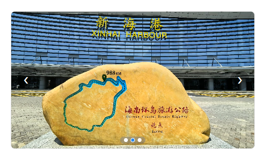
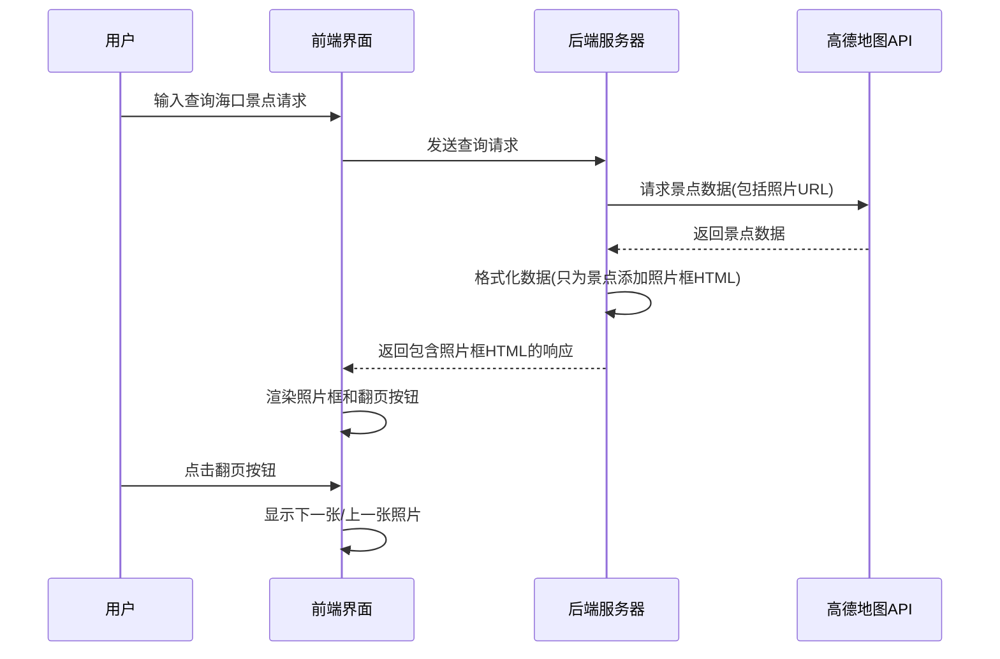

# 海口旅游助手 - 景点照片展示功能实现方案

## 概述
本文档描述了海口旅游助手中景点照片展示功能的实现方案。该功能通过在聊天界面中展示景点相关照片，为用户提供直观的景点信息，提升用户体验。

## 实现架构
景点照片展示功能的实现分为后端处理和前端渲染两个部分：

### 1. 后端处理 (app.py)
- **数据获取**：通过高德地图MCP工具的POI搜索接口获取景点信息，包括基本信息和照片URL列表。
- **数据处理**：在 `format_poi_data` 函数中提取每个景点的 `photos` 字段。
- **格式化**：为每个景点生成包含照片框和翻页按钮的 HTML 结构，最多处理 3 张照片。翻页按钮仅在照片数量大于1张时显示。
- **数据传输**：将照片框和翻页按钮的 HTML 结构作为景点信息的一部分，包含在返回给前端的 Markdown 格式文本中。

### 2. 前端渲染 (index.html)
- **Markdown渲染**：使用 `marked.js` 库渲染助手返回的 Markdown 格式内容。
- **照片框展示**：将后端返回的照片框 HTML 结构转换为 HTML 元素。
- **用户交互**：用户可看到包含照片框和翻页按钮的景点信息，点击翻页按钮查看多张照片。照片框底部显示圆点指示器，标明照片数量和当前显示照片。
- **动态初始化**：使用 `MutationObserver` 监听聊天窗口内容变化，确保动态加载内容后初始化照片容器和圆点指示器。
- **样式设置**：照片展示容器设置为 16:9 比例，照片框完全填充容器，照片使用 `object-fit: cover;` 和 `object-position: center;` 确保以中心为轴裁剪并填满容器。

## 展示图


## 显示流程

### 显示景点照片的时序图


## 示例

推荐海口的景点：

**回答**：

海口好玩的地方可不少😃 给你推荐这些景点：

- **假日海滩旅游区**，位于海口市秀英区滨海大道126号。这里阳光、沙滩、海浪🌊 一应俱全，能让你尽情享受海滨风光。
  【相框1】
- **西秀海滩公园**，在海口市秀英区海秀街道滨海大道163号。是个休闲放松的好去处，适合漫步赏景。
  【相框2】
- **西海岸带状公园**，地处海口市秀英区滨海大道与长彤路交叉口西500米。沿着海岸线延伸，景色超美。
  【相框3】

## 核心代码

### 后端核心代码 (app.py)
```python
# 在 format_poi_data 函数中
# 注意：仅当 poi['id'] 存在时才生成相片框，确保 data-poi-index 是唯一的
if poi.get('photos') and poi['photos'] and ('风景名胜' in poi.get('type', '') or '景点' in poi.get('type', '')):
    photos = poi['photos'][:3]  # 最多显示3张图片
    result += "- **照片**:\n"
    # 仅当 poi['id'] 存在时才生成相片框
    if poi.get('id'):
        poi_id = poi['id']
        result += f'<div class="poi-photo-container" data-poi-index="{poi_id}">\n'
        
        # 添加翻页按钮 - `<` 放在左侧，`>` 放在右侧，只有照片数量大于1时显示
        if len(photos) > 1:
            result += '  <button class="poi-photo-nav poi-photo-nav-prev" onclick="changePhoto(-1, \"{}\")" style="left: 10px;">&#10094;</button>\n'.format(poi_id)
        
        # 照片框架
        result += '  <div class="poi-photo-frame">\n'
        for j, photo in enumerate(photos):
            display_style = "block" if j == 0 else "none"  # 默认显示第一张
            result += f'    \n'
        result += '  </div>\n'
        
        if len(photos) > 1:
            result += '  <button class="poi-photo-nav poi-photo-nav-next" onclick="changePhoto(1, \"{}\")" style="right: 10px;">&#10095;</button>\n'.format(poi_id)
        
        result += '</div>\n'
    else:
        result += "(暂无唯一标识，无法显示照片框)\n"
```

**注意**：当前后端代码中 `data-poi-index` 值设置为景点数据的唯一标识 `poi['id']`，确保每次回复中返回的相片框都有唯一的索引。如果 `poi['id']` 不存在，则不生成相片框，以避免索引重复导致翻页按钮失效。

### 前端核心代码 (index.html)
```javascript
// 使用 marked.js 渲染 Markdown 内容
const renderedContent = marked.parse(markdownText);
messageDiv.innerHTML = renderedContent;

// 翻页功能
window.changePhoto = function(direction, poiIndex) {
    const container = document.querySelector(`.poi-photo-container[data-poi-index="${poiIndex}"]`);
    const photos = container.querySelectorAll('.poi-photo');
    let currentIndex = 0;
    for (let i = 0; i < photos.length; i++) {
        if (photos[i].style.display === 'block') {
            currentIndex = i;
            break;
        }
    }
    photos[currentIndex].style.display = 'none';
    currentIndex = (currentIndex + direction + photos.length) % photos.length;
    photos[currentIndex].style.display = 'block';
    // 更新圆点指示器
    updateDots(container, currentIndex);
};

// 更新圆点指示器
function updateDots(container, currentIndex) {
    const dots = container.querySelectorAll('.poi-photo-dot');
    dots.forEach((dot, idx) => {
        if (idx === currentIndex) {
            dot.classList.add('active');
        } else {
            dot.classList.remove('active');
        }
    });
}

// 初始化圆点指示器
window.initializePhotoContainers = function() {
    console.log('Initializing photo containers - Start');
    const containers = document.querySelectorAll('.poi-photo-container');
    console.log('Found containers:', containers.length);
    containers.forEach(container => {
        // 检查是否已经初始化过
        if (container.classList.contains('initialized')) {
            console.log('Container already initialized, skipping:', container.dataset.poiIndex);
            return;
        }
        const photos = container.querySelectorAll('.poi-photo');
        console.log('Container', container.dataset.poiIndex, 'has photos:', photos.length);
        if (photos.length > 1) {
            console.log('Creating dots for container', container.dataset.poiIndex);
            const dotsContainer = document.createElement('div');
            dotsContainer.className = 'poi-photo-dots';
            for (let i = 0; i < photos.length; i++) {
                const dot = document.createElement('div');
                dot.className = 'poi-photo-dot';
                if (i === 0) dot.classList.add('active');
                dot.onclick = () => {
                    const currentPhotos = container.querySelectorAll('.poi-photo');
                    currentPhotos.forEach((photo, idx) => {
                        photo.style.display = idx === i ? 'block' : 'none';
                    });
                    updateDots(container, i);
                };
                dotsContainer.appendChild(dot);
            }
            container.appendChild(dotsContainer);
            console.log('Dots added to container', container.dataset.poiIndex);
            // 标记为已初始化
            container.classList.add('initialized');
            console.log('Container marked as initialized:', container.dataset.poiIndex);
        } else {
            console.log('Not enough photos to create dots for container', container.dataset.poiIndex);
        }
    });
    console.log('Initializing photo containers - End');
};

// 在页面加载完成后初始化照片容器
document.addEventListener('DOMContentLoaded', initializePhotoContainers);

// 使用MutationObserver替代DOMSubtreeModified，确保在聊天消息添加后也初始化照片容器
const chatWindow = document.getElementById('chat-window');
const observer = new MutationObserver(function(mutations) {
    const newContainers = document.querySelectorAll('.poi-photo-container:not(.initialized)');
    if (newContainers.length > 0) {
        console.log('MutationObserver: Chat window updated, found new containers:', newContainers.length);
        initializePhotoContainers();
    } else {
        console.log('MutationObserver: Chat window updated, no new containers found');
    }
});
observer.observe(chatWindow, { childList: true, subtree: true });
```

### 照片展示CSS样式
```css
/* 照片展示容器 */
.poi-photo-container {
    position: relative;
    width: 100%;
    max-width: 500px;
    margin: 0;
    border: 1px solid #ddd;
    border-radius: 8px;
    overflow: hidden;
    aspect-ratio: 16 / 9;
    height: auto;
}

/* 照片框 */
.poi-photo-frame {
    position: absolute;
    top: 0;
    left: 0;
    width: 100%;
    height: 100%;
    overflow: hidden;
}

.poi-photo-frame img {
    position: absolute;
    top: 0;
    left: 0;
    width: 100%;
    height: 100%;
    object-fit: cover;
    object-position: center;
    display: none;
}

.poi-photo-frame img:first-child {
    display: block; /* 默认显示第一张照片 */
}

/* 翻页按钮 */
.poi-photo-nav {
    position: absolute;
    top: 50%;
    transform: translateY(-50%);
    background-color: rgba(0,0,0,0.3);
    color: white;
    border: none;
    font-size: 18px;
    padding: 10px;
    cursor: pointer;
    border-radius: 50%;
    width: 40px;
    height: 40px;
    display: flex;
    align-items: center;
    justify-content: center;
    transition: background-color 0.3s;
    z-index: 10;
}

.poi-photo-nav:hover {
    background-color: rgba(0,0,0,0.5);
}

.poi-photo-nav-prev {
    left: 10px;
}

.poi-photo-nav-next {
    right: 10px;
}

/* 照片数量指示圆点 */
.poi-photo-dots {
    position: absolute;
    bottom: 10px;
    left: 50%;
    transform: translateX(-50%);
    display: flex;
    gap: 6px;
    z-index: 30; /* 确保圆点在照片上方 */
    background-color: rgba(128, 128, 128, 0.5);
    padding: 3px 8px;
    border-radius: 12px;
}

.poi-photo-dot {
    width: 8px;
    height: 8px;
    border-radius: 50%;
    background-color: #fff;
    cursor: pointer;
    transition: background-color 0.3s, transform 0.3s;
    border: 1px solid #fff;
}

.poi-photo-dot.active {
    background-color: #2b89ec;
    transform: scale(1.1);
}
```

## 用户体验
用户在与旅游助手交互时，当助手返回包含景点信息的内容时，可以直接在消息中看到类似如下的内容：

```
### 海口骑楼老街
- **类型**: 风景名胜
- **地址**: 海南省海口市龙华区中山路67号
- **照片**: 
<div class="poi-photo-container">
  <button class="poi-photo-nav poi-photo-nav-prev" onclick="changePhoto(-1, 0)">&#10094;</button>
  <div class="poi-photo-frame">
    
  </div>
  <button class="poi-photo-nav poi-photo-nav-next" onclick="changePhoto(1, 0)">&#10095;</button>
</div>
```

每个景点都有一个照片框，用户可以通过左右的翻页按钮查看该景点的多张照片。照片框具有响应式设计，能够在不同设备上良好显示。

## 照片尺寸处理
需要注意的是，由于不同来源的照片尺寸可能不一致，当前实现会保持照片的原始比例显示。在后续优化中，我们可以考虑以下几种方法来提供更统一的视觉体验：

1. **CSS 样式调整**：使用 CSS 的 `object-fit` 属性来确保照片在固定尺寸的容器内保持比例，同时填满或适应容器。当前实现中已经使用了 `object-fit: cover`，这会裁剪掉超出容器的部分照片内容，保持比例。

2. **固定宽高比**：为照片框设置固定的宽高比（当前为 16:9），有助于统一视觉效果。代码如下：
   ```css
   .poi-photo-container {
       aspect-ratio: 16 / 9;
       width: 100%;
       max-width: 500px;
   }
   ```

3. **自适应尺寸调整**：在前端添加 JavaScript 代码，在照片加载完成后检查其原始尺寸，然后根据需要调整容器的大小或照片的显示方式。例如，如果照片是纵向的，可以调整容器比例以更好地适应。

4. **后端图片处理**：如果可能，在后端对图片进行预处理，统一调整到指定尺寸或比例后再传输给前端。这需要额外的图片处理库支持，如 Python 的 Pillow 库。

5. **显示原始尺寸信息**：作为备选方案，可以在照片下方显示原始尺寸信息，让用户了解照片的实际比例。


