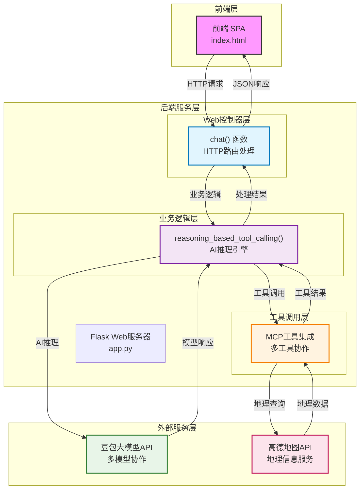
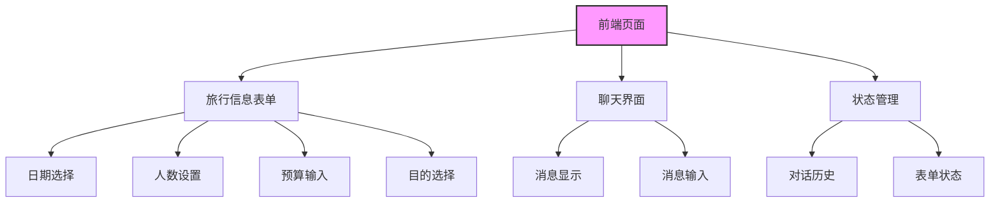
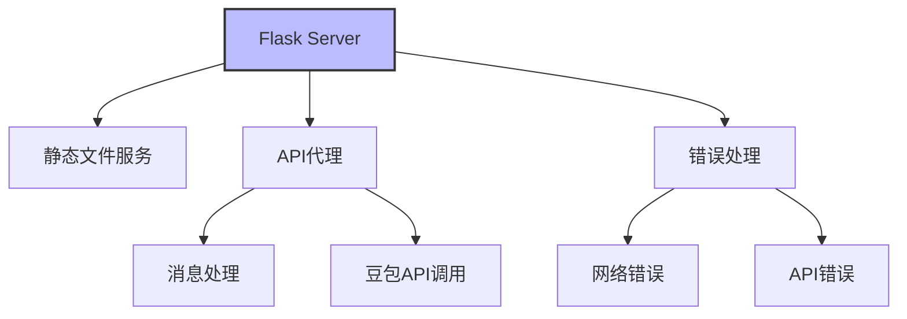
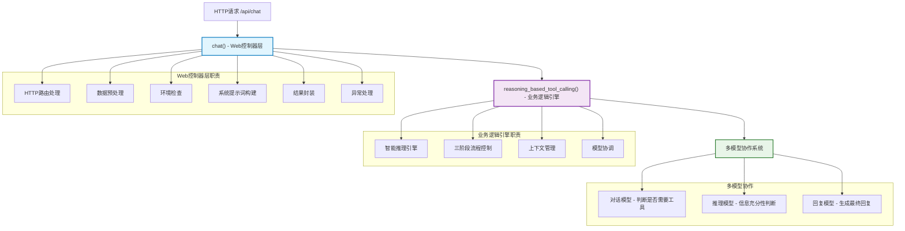
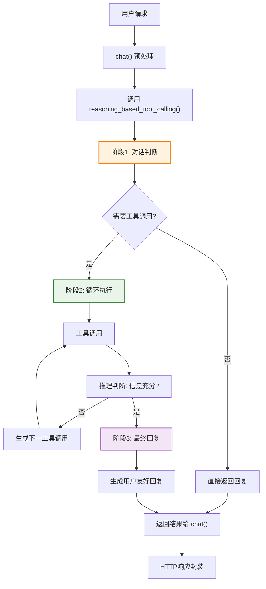
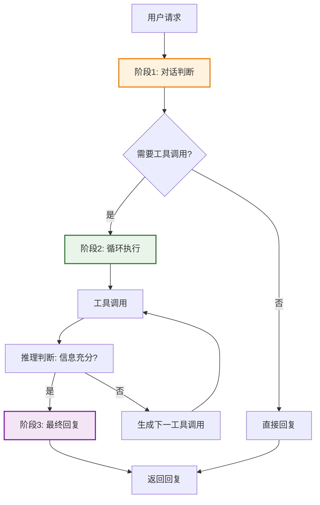
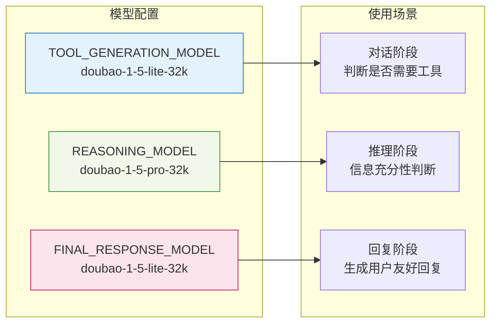
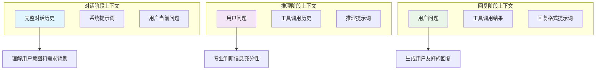
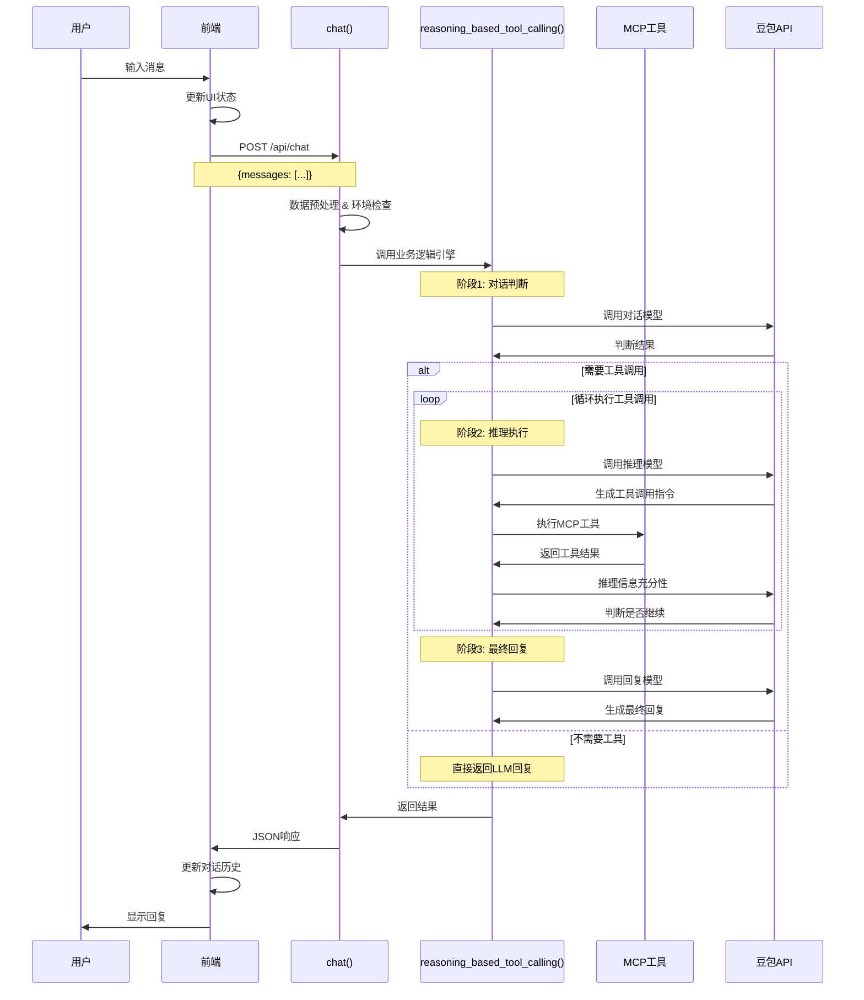
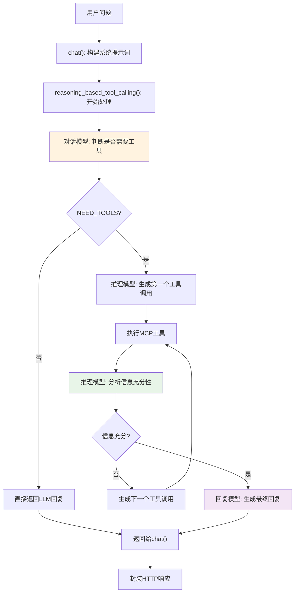

# 海口旅游智能助手 - 应用架构设计

## 1. 总体架构

## 2. 组件说明

### 2.1 前端（Static Web Page）

> **注意**：为简化开发和快速验证原型，所有前端代码（HTML、CSS和JavaScript）都集中在单个`index.html`文件中，不进行文件分离。

### 2.2 后端（Flask Server）

### 2.3 核心业务逻辑架构

#### 2.3.1 分层设计

海口旅游助手的后端采用**分层架构**，实现了Web层与业务逻辑层的清晰分离：

#### 2.3.2 函数关系与职责分工

**`chat()` 函数 - Web控制器层**
- **位置**: Flask路由 `/api/chat` 的入口点
- **核心职责**: 
  - HTTP请求处理和响应封装
  - 系统环境检查和配置
  - 动态系统提示词构建
  - 顶层异常处理和错误响应

**`reasoning_based_tool_calling()` 函数 - 业务逻辑引擎**
- **位置**: 核心AI推理逻辑实现
- **核心职责**:
  - 基于LLM的智能推理判断
  - 多工具调用的循环控制
  - 上下文窗口优化管理
  - 多模型协作调度

#### 2.3.3 三阶段工作流程

**完整版流程图**：

**简化版流程图**：

#### 2.3.4 模型分工策略

#### 2.3.5 上下文分离设计

**设计理念**: 不同阶段使用不同的上下文窗口，实现职责分离和Token优化

#### 2.3.6 设计模式应用

**1. 策略模式**: 根据不同阶段选择不同的处理策略
**2. 模板方法模式**: 定义固定的算法骨架，具体步骤由AI模型决定
**3. 责任链模式**: 工具调用形成处理链，每次推理决定下一步行动

## 3. 数据流

### 3.1 整体数据流

### 3.2 核心业务逻辑数据流

## 4. 架构特点与设计原则

### 4.1 核心设计理念

#### **LLM优先架构**
- 让AI模型做决策，而不是硬编码规则
- 信任LLM的判断能力，最大化AI的自主性
- 用提示词引导行为，而不是用代码强制执行路径

#### **关注点分离**
- **Web层**(`chat()`): 专注HTTP处理、数据格式、错误处理
- **业务层**(`reasoning_based_tool_calling()`): 专注AI推理逻辑、工具调用、智能判断
- **模型层**: 专业化模型分工，各司其职

#### **上下文窗口优化**
- 不同阶段使用不同的上下文，避免Token浪费
- 智能压缩机制，保留最重要信息
- 渐进式信息累积，支持复杂推理链

### 4.2 架构优势

1. **可维护性**: 清晰的职责边界，便于调试和优化
2. **可扩展性**: 独立优化各层实现，灵活应对不同需求  
3. **可测试性**: Web层和业务层解耦，核心算法可独立测试
4. **成本优化**: 上下文分离策略，大幅降低Token使用量
5. **智能化**: 基于推理的多工具调用，自适应用户需求

### 4.3 简化设计说明

为快速验证原型，在某些方面做出简化：
1. 不包含用户系统和身份认证
2. 不持久化存储对话历史  
3. 不包含分布式部署考虑
4. API密钥直接从环境变量读取
5. 前端代码集中在单个`index.html`文件中

**注意**: 虽然在部署和存储方面有所简化，但核心的AI推理架构是完整和产品级的，体现了现代LLM应用的最佳实践。

