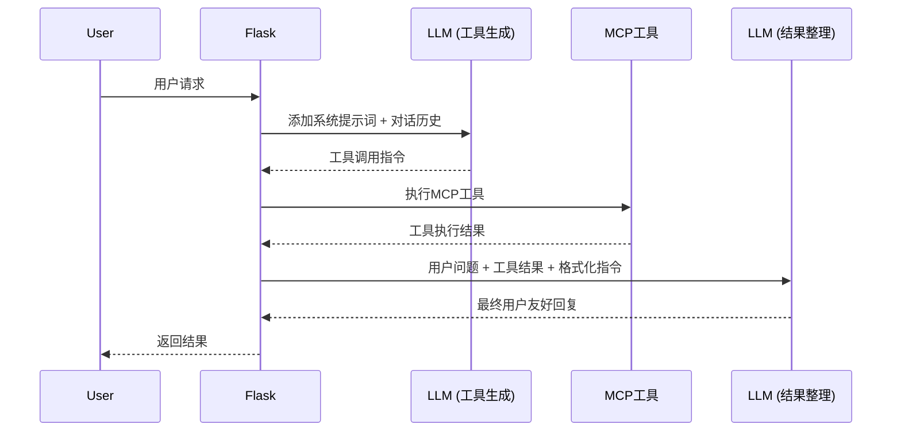
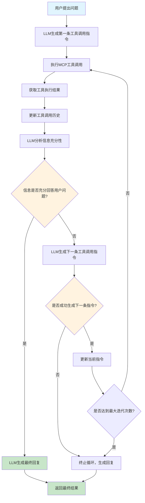
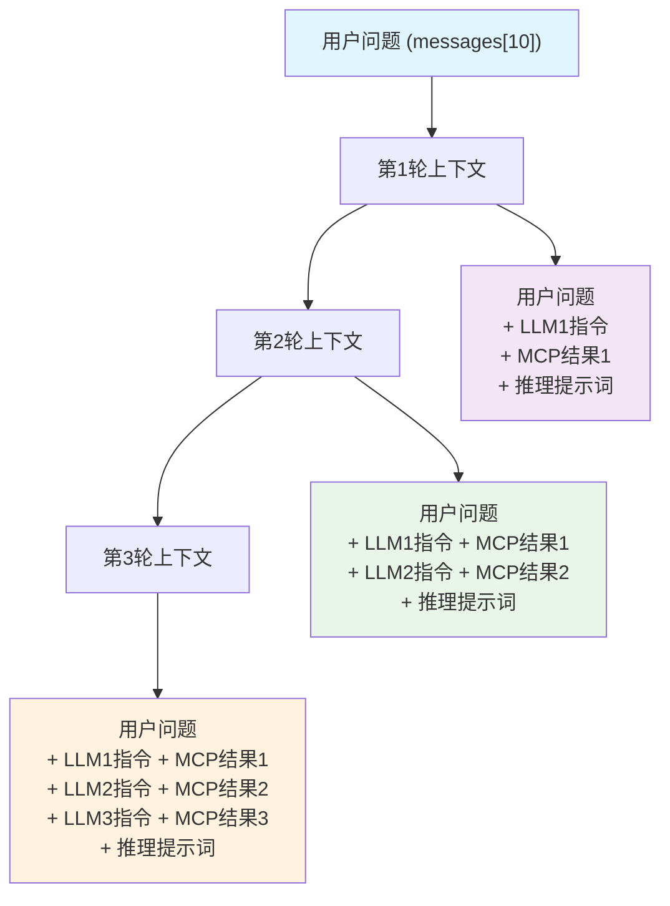
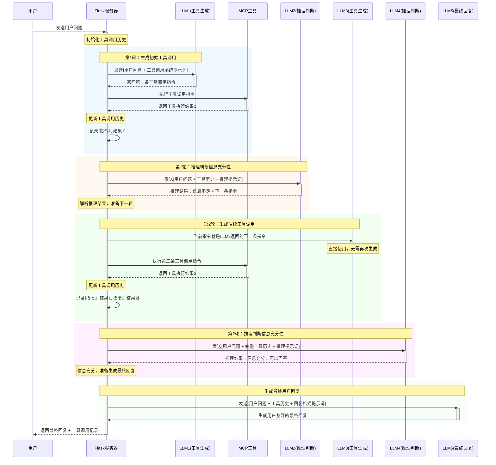

# Function Calling 工作流程设计与实现

## 1. 概述

Function Calling（函数调用）是让大语言模型（LLM）能够结构化调用预定义工具的机制。本文档详细分析了海口旅游项目中Function Calling的设计思路、实现方案和最佳实践。

### 1.1 项目工具体系

本项目支持4种核心工具：
- **获取天气信息**：查询指定城市的天气状况
- **搜索兴趣点**：根据关键词搜索地点位置信息
- **附近搜索**：在指定位置附近搜索设施
- **目的地距离**：计算两个地点间的距离

### 1.2 函数调用格式

采用自定义格式：
```json
<|FunctionCallBegin|>
[{
    "name": "工具名称",
    "parameters": {
        "参数1": "值1",
        "参数2": "值2"
    }
}]
<|FunctionCallEnd|>
```

## 2. 多工具调用场景分析

### 2.1 场景分类

#### 场景一：独立工具调用
工具之间无依赖关系，可任意顺序执行。

**示例**：查询"五公祠和海南省博物馆的位置"
- 两个POI搜索互不依赖
- 可以并行或串行执行
- 执行顺序不影响结果

#### 场景二：依赖工具调用  
第二个工具的参数依赖第一个工具的结果。

**示例**：查询"万绿园附近的酒店"
1. 第一步：搜索万绿园获取坐标
2. 第二步：使用坐标搜索附近酒店

### 2.2 豆包大模型的Function Calling能力

**实际验证结果**：通过充分测试发现，豆包大模型**完全支持Function Calling功能**，包括：

**✅ 支持的功能**：
- **并行调用**：一次请求可同时调用多个独立工具（如同时查询天气、股价、计算等）
- **串行调用**：支持基于前一工具结果进行后续工具调用的依赖链
- **智能推理**：能准确判断何时调用工具，以及调用哪些工具
- **参数提取**：能从自然语言中准确提取结构化参数


### 2.3 测试验证

#### 2.3.1 测试概述

通过深入的技术测试，完全推翻了之前关于豆包大模型Function Calling能力的错误认知。实际测试结果表明，**豆包大模型完全支持Function Calling功能，包括并行调用和串行调用**。

#### 2.3.2 并行调用测试成功

**测试场景**：一次请求同时调用多个独立工具
```python
# 测试用例：同时查询天气、股价、数学计算
user_input = "查询北京天气、苹果股价，并计算2+3*4的结果"

# 豆包模型成功识别并同时调用三个工具：
# 1. 天气查询工具
# 2. 股价查询工具  
# 3. 数学计算工具
```

**测试结果**：
- ✅ **API连接成功**：状态码200，正常响应
- ✅ **智能工具识别**：模型准确识别需要调用的三个不同工具
- ✅ **并行执行能力**：一次请求同时处理多个工具调用
- ✅ **结果整合能力**：返回综合回复："北京的天气是晴朗，温度25°C，湿度60%。苹果公司（股票代码AAPL）的实时股价是$150.25。数学表达式2 + 3 * 4的计算结果是14。"

#### 2.3.3 串行调用测试成功

**测试场景**：基于前一工具结果决定下一工具调用的复杂业务流程
```python
# 测试用例：用户订单管理工作流
user_input = "查找用户张三的订单信息并更新第一个订单状态为已发货"

# 豆包模型智能执行5轮调用链：
# 1. search_user → 查找用户张三
# 2. get_user_orders → 获取张三的订单列表  
# 3. get_order_details → 查看第一个订单详情
# 4. update_order_status → 更新订单状态为已发货
# 5. 生成最终总结
```

**测试结果**：
- ✅ **多轮调用成功**：完成5轮连续工具调用
- ✅ **智能推理能力**：每一步都能根据前面的结果智能决定下一步操作
- ✅ **依赖关系处理**：完美处理工具间的数据依赖关系
- ✅ **业务流程完整**：成功演示复杂的用户订单管理工作流


## 3. 当前实现分析

### 3.1 基本流程



### 3.2 关键特点

1. **智能工具选择**：豆包模型能够根据用户问题智能选择合适的工具进行调用
2. **多轮推理支持**：在本项目中实现了基于推理判断的多工具调用方案
3. **最终回复优化**：负责最终回复的LLM只接收3条相关消息
4. **严格格式控制**：通过system prompt控制工具调用的格式和时机

### 3.3 消息处理顺序

最终回复LLM的消息顺序（关键设计）：
1. 用户原始询问（确保理解需求）
2. 工具调用结果（提供数据支撑）  
3. 格式化指令（指导回复风格）

## 4. 设计哲学：LLM优先架构

### 4.1 核心理念

**🧠 LLM即智能助理**
- 把大模型当成具备人类智能的助理
- 让LLM自主思考和推理如何调用工具
- 信任LLM的判断能力，减少硬编码约束

**🎯 最大化LLM能力**
- 避免过多的规则和分支判断
- 让LLM自己决定工具调用的时机和参数
- 用提示词引导，而不是用代码强制

**🏗️ 保持架构简洁**
- 核心逻辑清晰：**询问 → 推理 → 执行 → 再推理**
- 避免过多的分支和嵌套
- 易于理解、调试和扩展

### 4.2 架构对比

| 特性 | 传统硬编码方案 | LLM优先方案 |
|------|--------------|------------|
| 终止判断 | 固定规则检测 | LLM智能推理 |
| 工具选择 | 预定义逻辑树 | LLM自主判断 |
| 参数处理 | 硬编码解析 | LLM理解填充 |
| 错误处理 | 分支判断 | LLM自适应 |
| 扩展性 | 需修改代码 | 调整提示词 |
| 维护性 | 复杂分支逻辑 | 简洁推理链 |

## 5. 实现方案：基于推理判断的多工具调用

### 5.1 核心思路

**基本流程**：
1. 用户提问 → LLM生成第一条工具调用指令
2. **循环执行**：
   - 执行MCP工具获取结果
   - LLM分析：**是否有足够信息回答用户问题**
   - 如果充分：生成最终回复，结束循环
   - 如果不足：生成下一条工具调用指令，继续循环

**上下文管理**：
- 累积完整的工具调用历史
- 每轮LLM都能看到：用户问题 + 所有工具调用历史

### 5.2 算法描述

#### 5.2.1 伪代码表示

```python
def reasoning_based_tool_calling(user_question):
    """基于推理判断的工具调用算法"""
    
    # 初始化
    tool_call_history = []
    max_iterations = 5
    iteration = 0
    
    # 步骤1：生成第一条工具调用指令
    current_instruction = LLM.generate_tool_instruction(user_question)
    
    # 步骤2：循环执行工具调用和推理判断
    while iteration < max_iterations:
        iteration += 1
        
        # 2.1 执行MCP工具调用
        tool_result = MCP.execute_tool(current_instruction)
        
        # 2.2 更新工具调用历史
        tool_call_history.append({
            "instruction": current_instruction,
            "result": tool_result
        })
        
        # 2.3 构建推理上下文
        reasoning_context = build_context(user_question, tool_call_history)
        
        # 2.4 LLM推理判断
        reasoning_result = LLM.analyze_sufficiency(reasoning_context)
        
        # 2.5 根据推理结果决定下一步
        if reasoning_result.is_sufficient:
            # 3.1 信息充分，生成最终回复
            final_answer = LLM.generate_final_response(
                user_question, tool_call_history
            )
            return final_answer, tool_call_history
        else:
            # 3.2 信息不足，生成下一条指令
            next_instruction = reasoning_result.next_instruction
            if next_instruction:
                current_instruction = next_instruction
            else:
                # 无法生成下一条指令，终止循环
                break
    
    # 达到最大迭代次数，强制生成回复
    final_answer = LLM.generate_final_response(user_question, tool_call_history)
    return final_answer, tool_call_history

def build_context(user_question, tool_call_history):
    """构建推理上下文"""
    context = [user_question]
    for record in tool_call_history:
        context.append(record["instruction"])
        context.append(record["result"])
    context.append(reasoning_prompt)
    return context
```

#### 5.2.2 流程图表示



#### 5.2.3 关键决策点

**决策点1：信息充分性判断**
```python
# LLM需要回答的核心问题
def analyze_sufficiency(context):
    prompt = """
    基于当前获得的工具调用结果，判断是否有足够信息完整回答用户问题。
    
    判断标准：
    - 用户问题的所有关键信息点是否都已获取？
    - 是否还有明显缺失的数据？
    - 当前信息是否足以给出满意的回答？
    
    返回格式：
    SUFFICIENT: true/false
    REASON: [判断理由]
    NEXT_INSTRUCTION: [如果不充分，生成下一条指令]
    """
    return LLM.analyze(context + [prompt])
```

**决策点2：下一条指令生成**
```python
# LLM生成下一条指令的逻辑
def generate_next_instruction(user_question, tool_call_history):
    prompt = f"""
    用户问题：{user_question}
    已执行的工具调用：{tool_call_history}
    
    分析还需要什么信息来完整回答用户问题，生成下一条工具调用指令。
    
    注意：
    - 避免重复调用相同工具和参数
    - 确保新指令能获取缺失的关键信息
    - 遵循工具调用格式规范
    """
    return LLM.generate_instruction(prompt)
```

#### 5.2.4 算法特点

**🔄 自适应循环**
- 简单问题：1轮工具调用即可完成
- 复杂问题：多轮工具调用逐步收集信息
- 自动根据信息充分性决定何时结束

**🧠 推理驱动**
- 每轮都由LLM进行智能推理判断
- 不依赖硬编码的规则和条件
- 充分发挥大模型的理解和推理能力

**📈 渐进式收集**
- 逐步累积工具调用历史
- 每轮都基于完整上下文进行决策
- 支持复杂的依赖关系处理

#### 5.2.5 上下文窗口设计

上下文窗口的设计是算法的核心组成部分，确保每个LLM调用都能获得完整且相关的信息来做出正确的推理判断。

**基本原则**：
- 以用户问题为起点，累积所有工具调用历史
- 每轮调用都能看到完整的工具调用链路
- 保持信息的连续性和完整性

**上下文构建策略**：

```python
def build_context_for_llm_call(user_question, tool_call_history, call_type):
    """
    为不同类型的LLM调用构建上下文
    
    Args:
        user_question: 用户的原始问题 (如 messages[10])
        tool_call_history: 工具调用历史记录
        call_type: 调用类型 ("reasoning" 或 "final_response")
    """
    context = [user_question]  # 始终以用户问题开头
    
    # 添加所有工具调用历史
    for record in tool_call_history:
        context.append(record["llm_instruction"])    # LLM生成的指令
        context.append(record["mcp_result"])         # MCP工具返回信息
    
    # 根据调用类型添加相应的系统提示词
    if call_type == "reasoning":
        context.append(reasoning_system_prompt)      # 工具调用的system prompt
    elif call_type == "final_response":
        context.append(final_response_system_prompt) # 最终回复的system prompt
    
    return context
```

**具体示例演进**：

假设用户问题保存在 `messages[10]`

**第1轮工具调用 - 发给LLM2的上下文**：
```python
LLM2_context = [
    messages[10],                    # 用户问题
    LLM1_generated_instruction,      # LLM1生成的指令
    MCP_tool_result_1,              # MCP工具返回信息1
    reasoning_system_prompt         # 工具调用的system prompt
]
```

**第2轮工具调用 - 发给LLM3的上下文**：
```python
LLM3_context = [
    messages[10],                    # 用户问题  
    LLM1_generated_instruction,      # LLM1生成的指令
    MCP_tool_result_1,              # MCP工具返回信息1
    LLM2_generated_instruction,      # LLM2生成的指令
    MCP_tool_result_2,              # MCP工具返回信息2
    reasoning_system_prompt         # 工具调用的system prompt
]
```

**第3轮工具调用 - 发给LLM4的上下文**：
```python
LLM4_context = [
    messages[10],                    # 用户问题
    LLM1_generated_instruction,      # LLM1生成的指令  
    MCP_tool_result_1,              # MCP工具返回信息1
    LLM2_generated_instruction,      # LLM2生成的指令
    MCP_tool_result_2,              # MCP工具返回信息2
    LLM3_generated_instruction,      # LLM3生成的指令
    MCP_tool_result_3,              # MCP工具返回信息3
    reasoning_system_prompt         # 工具调用的system prompt
]
```

**上下文结构可视化**：



**关键设计决策**：

1. **始终保持用户问题**：确保每个LLM调用都清楚用户的原始需求
2. **完整的工具调用链**：让LLM能够理解之前所有的操作和结果
3. **交替的指令-结果模式**：LLM指令 → MCP结果 → LLM指令 → MCP结果...
4. **适当的系统提示词**：根据调用目的（推理判断 vs 最终回复）使用不同提示词

**上下文管理优化**：

```python
class ContextManager:
    def __init__(self, max_context_length=8000):
        self.max_context_length = max_context_length
        
    def optimize_context(self, context):
        """智能压缩上下文，保留最重要的信息"""
        if self.estimate_tokens(context) <= self.max_context_length:
            return context
        
        # 保留策略：用户问题 + 最近N轮工具调用 + 系统提示词
        user_question = context[0]
        system_prompt = context[-1]
        
        # 计算可用空间
        reserved_tokens = self.estimate_tokens([user_question, system_prompt])
        available_tokens = self.max_context_length - reserved_tokens
        
        # 从最新的工具调用开始保留
        tool_history = context[1:-1]
        optimized_history = self.select_recent_history(tool_history, available_tokens)
        
        return [user_question] + optimized_history + [system_prompt]
    
    def estimate_tokens(self, messages):
        """粗略估算token数量"""
        return sum(len(str(msg)) // 4 for msg in messages)
```

这种上下文设计确保了：
- **信息连续性**：每轮都能看到完整的工具调用历史
- **推理准确性**：LLM基于完整信息做出判断
- **依赖关系处理**：后续工具调用能利用前面的结果
- **可扩展性**：支持任意轮数的工具调用链

#### 5.2.6 时序图

以下时序图展示了基于推理判断的多工具调用方案的完整执行流程：



**时序图关键特点说明**：

1. **推理驱动的循环结构**
   - 每轮都包含"工具执行"和"推理判断"两个阶段
   - LLM负责判断信息是否充分，而不是硬编码规则

2. **上下文累积机制**
   - 每轮推理都能看到完整的工具调用历史
   - 上下文逐步丰富：用户问题 → +工具1 → +工具2 → ...

3. **智能终止判断**
   - 通过LLM的推理能力判断何时停止
   - 避免了固定轮数或硬编码的终止条件

4. **角色分工清晰**
   - **LLM1, LLM3**: 专门生成工具调用指令
   - **LLM2, LLM4**: 专门进行推理判断和决策
   - **LLM5**: 专门生成用户友好的最终回复

**与传统方案的对比**：

| 特性 | 传统方案 | 新方案（推理驱动） |
|------|---------|------------------|
| 工具调用次数 | 固定1次 | 动态1-N次 |
| 终止判断 | 硬编码检测 | LLM推理判断 |
| 上下文管理 | 最后3条消息 | 完整工具调用历史 |
| 依赖处理 | 不支持 | 自然支持 |
| 扩展性 | 需修改代码 | 调整提示词即可 |

### 5.3 实际执行示例

**场景一：依赖工具调用 - "万绿园附近的酒店"**

这个案例展示了算法如何处理具有依赖关系的工具调用，其中第二个工具需要第一个工具的结果作为参数。

```
第1轮：
用户问题: "万绿园附近的酒店"
LLM1: 生成工具调用指令 → 搜索兴趣点("万绿园")
MCP: 返回万绿园的位置信息（包含经纬度坐标）
LLM2推理: "已获得万绿园位置，但用户询问的是附近酒店，还需要搜索酒店信息"
→ 生成下一条指令：附近搜索(location="110.313766,20.033727", keywords="酒店")

第2轮：
上下文[用户问题 + 万绿园搜索完整记录]
LLM3: 生成工具调用指令 → 附近搜索(使用万绿园坐标搜索酒店)
MCP: 返回万绿园附近的酒店列表
LLM4推理: "已获得万绿园位置和附近酒店信息，可以完整回答用户问题"
→ 结束循环，生成最终回复
```

**详细的上下文演进过程**：

```python
# 第1轮上下文 (发给LLM2进行推理判断)
LLM2_context = [
    "万绿园附近的酒店",                        # 用户问题
    "搜索兴趣点(keywords='万绿园')",          # LLM1生成的指令
    "万绿园位置信息: 海口市龙华区滨海大道, 坐标: 110.313766,20.033727...", # MCP返回结果1
    reasoning_system_prompt                    # 推理系统提示词
]

# LLM2推理结果
LLM2_reasoning = {
    "sufficient": False,
    "reason": "已获得万绿园的位置坐标，但用户询问的是附近的酒店，还需要使用该位置搜索酒店",
    "next_instruction": "附近搜索(location='110.313766,20.033727', keywords='酒店', radius=1000)"
}

# 第2轮上下文 (发给LLM4进行推理判断)
LLM4_context = [
    "万绿园附近的酒店",                        # 用户问题
    "搜索兴趣点(keywords='万绿园')",          # LLM1生成的指令
    "万绿园位置信息: 海口市龙华区滨海大道, 坐标: 110.313766,20.033727...", # MCP返回结果1
    "附近搜索(location='110.313766,20.033727', keywords='酒店')", # LLM3生成的指令
    "万绿园附近酒店列表: 1.海口香格里拉大酒店 2.海口万丽酒店 3.海口喜来登酒店...", # MCP返回结果2
    reasoning_system_prompt                    # 推理系统提示词
]

# LLM4推理结果
LLM4_reasoning = {
    "sufficient": True,
    "reason": "已获得万绿园的准确位置和附近酒店的详细信息，可以完整回答用户关于万绿园附近酒店的问题"
}
```

**算法的智能表现**：

1. **依赖关系识别**：LLM理解"附近"意味着需要先获取目标地点的位置
2. **参数提取能力**：能从第一个工具结果中准确提取坐标用于第二个工具
3. **功能完整性判断**：知道仅有位置信息不足，还需要具体的酒店信息
4. **上下文利用**：第二轮能够正确使用第一轮获得的坐标参数

**场景二：独立工具调用 - "五公祠和海南省博物馆的位置"**

这个案例展示了算法如何处理两个彼此无关但都必需的工具调用。

```
第1轮：
用户问题: "查看五公祠和海南省博物馆的位置"
LLM1: 生成工具调用指令 → 搜索兴趣点("五公祠")
MCP: 返回五公祠的位置信息
LLM2推理: "已获得五公祠位置，但用户还询问了海南省博物馆，信息不充分"
→ 生成下一条指令：搜索兴趣点("海南省博物馆")

第2轮：
上下文[用户问题 + 五公祠搜索完整记录] 
LLM3: 生成工具调用指令 → 搜索兴趣点("海南省博物馆")
MCP: 返回海南省博物馆的位置信息
LLM4推理: "已获得用户询问的两个地点的完整位置信息，可以回答用户问题"
→ 结束循环，生成最终回复
```

**详细的上下文演进过程**：

```python
# 第1轮上下文 (发给LLM2进行推理判断)
LLM2_context = [
    "查看五公祠和海南省博物馆的位置",           # 用户问题
    "搜索兴趣点(keywords='五公祠')",          # LLM1生成的指令
    "五公祠位置信息: 海口市秀英区...",         # MCP返回结果1
    reasoning_system_prompt                  # 推理系统提示词
]

# LLM2推理结果
LLM2_reasoning = {
    "sufficient": False,
    "reason": "已获得五公祠位置，但用户还询问了海南省博物馆的位置，信息不完整",
    "next_instruction": "搜索兴趣点(keywords='海南省博物馆')"
}

# 第2轮上下文 (发给LLM4进行推理判断)  
LLM4_context = [
    "查看五公祠和海南省博物馆的位置",           # 用户问题
    "搜索兴趣点(keywords='五公祠')",          # LLM1生成的指令
    "五公祠位置信息: 海口市秀英区...",         # MCP返回结果1
    "搜索兴趣点(keywords='海南省博物馆')",     # LLM3生成的指令
    "海南省博物馆位置信息: 海口市琼山区...",   # MCP返回结果2
    reasoning_system_prompt                  # 推理系统提示词
]

# LLM4推理结果
LLM4_reasoning = {
    "sufficient": True,
    "reason": "已获得用户询问的两个地点的完整位置信息，可以全面回答用户问题"
}
```

**关键特点对比**：

| 特性 | 场景一（依赖调用） | 场景二（独立调用） |
|------|------------------|------------------|
| 工具依赖关系 | 第2个工具需要第1个工具的结果 | 两个工具完全独立 |
| 参数来源 | 第2个工具的location参数来自第1个工具 | 两个工具的参数都来自用户问题 |
| LLM推理焦点 | "是否有足够信息搜索附近设施" | "是否回答了用户提到的所有地点" |
| 终止判断 | 基于功能完整性（位置+设施） | 基于信息完整性（所有地点） |
| 上下文利用 | 需要从前面结果中提取参数 | 主要用于避免遗漏和重复 |

**算法的智能表现**：

1. **需求理解**：LLM能够识别用户询问了"两个地点"，而不是只关注第一个
2. **完整性判断**：即使获得了五公祠的信息，也能判断出还缺少海南省博物馆的信息
3. **避免重复**：第2轮不会重复搜索五公祠，而是直接搜索海南省博物馆
4. **自然终止**：获得两个地点信息后，能正确判断信息已充分

这个案例完美展示了算法的**自适应能力**：
- 对于依赖调用：基于数据依赖关系进行推理
- 对于独立调用：基于信息完整性进行推理
- 两种情况都由同一套推理逻辑处理，无需硬编码规则

### 5.4 方案优势

**✅ 核心优势**
1. **推理驱动**：每轮都让LLM判断信息充分性，更智能
2. **上下文完整**：保持完整的工具调用历史，便于复杂推理
3. **自然终止**：基于信息充分性判断，而非硬编码规则
4. **适应性强**：简单任务1轮，复杂任务多轮，自然适应
5. **调试友好**：完整的上下文便于理解决策过程

**⚠️ 需要注意**
1. **上下文膨胀**：随着工具调用增加，上下文会快速增长
2. **推理成本**：每轮都需要LLM进行复杂的充分性判断
3. **循环风险**：可能陷入重复调用相同工具的循环

### 5.5 优化策略

#### 上下文管理
```python
def manage_context_intelligently(tool_call_history, max_tokens=8000):
    """智能管理上下文大小"""
    if estimate_tokens(tool_call_history) <= max_tokens:
        return tool_call_history
    
    # 保留最重要的工具调用结果（最近3轮）
    return tool_call_history[-6:]  # 每轮2条消息（指令+结果）
```

#### 循环检测
```python
def detect_tool_call_loop(tool_call_history):
    """检测工具调用循环"""
    if len(tool_call_history) < 4:
        return False
    
    # 检查最近的工具调用是否重复
    recent_signatures = [extract_tool_signature(msg["content"]) 
                        for msg in tool_call_history[-4:] 
                        if msg["role"] == "assistant"]
    
    return len(recent_signatures) != len(set(recent_signatures))
```

## 6. 实施建议

### 6.1 实现优先级

**Phase 1：基础实现**
- 实现核心的推理循环逻辑
- 基础的上下文管理
- 简单的充分性判断

**Phase 2：智能优化**
- 循环检测和避免
- 智能上下文压缩
- 更精确的推理提示词

**Phase 3：高级特性**
- 动态调整推理策略
- 工具调用效果评估
- 自适应终止判断

### 6.2 技术要点

1. **提示词工程**：推理判断的提示词需要仔细设计和调优
2. **错误处理**：需要处理推理判断失败的情况
3. **性能监控**：记录工具调用链的执行效率

### 6.3 成功标准

- 能正确处理"万绿园附近的酒店"等依赖工具调用
- 能高效处理"五公祠和海南省博物馆"等独立工具调用
- 具有良好的错误恢复能力
- 保持简洁的代码架构

## 7. 结论

**推荐采用基于推理判断的方案**，原因：

1. **符合LLM优先的设计哲学**：充分发挥大模型的智能
2. **架构简洁优雅**：避免复杂的硬编码逻辑
3. **适应性强**：能处理各种复杂度的任务
4. **可扩展性好**：通过调整提示词即可优化

这个方案体现了对AI Agent架构的深刻理解，是现代LLM应用的最佳实践。

## 8. 实施步骤详解

基于现有`app.py`代码，以下是实现多工具调用方案的详细步骤：

### 📋 Step 1: 核心架构重构

#### 1.1 主函数重构
**改动文件**: `WebPage-Flask/app.py`
**改动位置**: `/api/chat` 路由的 `chat()` 函数

**现有结构**:
```python
def chat():
    # 1. 构建系统提示词
    # 2. 第一次LLM调用
    # 3. 检查工具调用
    # 4. 执行单次工具调用
    # 5. 第二次LLM调用生成最终回复
```

**改动为**:
```python
def chat():
    # 1. 构建系统提示词
    # 2. 初始化工具调用历史
    # 3. 推理驱动的循环调用
    # 4. 生成最终回复
```

#### 1.2 新增核心算法函数
**新增函数**: `reasoning_based_tool_calling()`
- 实现文档中的推理循环算法
- 替代现有的单次工具调用逻辑

### 📋 Step 2: 推理判断机制实现

#### 2.1 新增推理判断函数
**新增函数**: `analyze_information_sufficiency()`
```python
def analyze_information_sufficiency(user_question, tool_call_history):
    """LLM分析信息充分性并决定下一步行动"""
    # 构建推理上下文
    # 调用LLM判断信息是否充分
    # 返回判断结果和下一条指令
```

#### 2.2 推理提示词设计
**新增常量**: `REASONING_SYSTEM_PROMPT`
```python
REASONING_SYSTEM_PROMPT = """
基于当前获得的工具调用结果，判断是否有足够信息完整回答用户问题。

判断标准：
- 用户问题的所有关键信息点是否都已获取？
- 是否还有明显缺失的数据？
- 当前信息是否足以给出满意的回答？

返回格式：
SUFFICIENT: true/false
REASON: [判断理由]
NEXT_INSTRUCTION: [如果不充分，生成下一条指令]
"""
```

### 📋 Step 3: 上下文管理重构

#### 3.1 上下文构建函数
**新增函数**: `build_context_for_llm_call()`
```python
def build_context_for_llm_call(user_question, tool_call_history, call_type):
    """为不同类型的LLM调用构建完整上下文"""
    # user_question: 用户原始问题
    # tool_call_history: 完整工具调用历史
    # call_type: "reasoning" 或 "final_response"
```

#### 3.2 工具调用历史管理
**新增数据结构**: 
```python
tool_call_history = [
    {
        "instruction": "LLM生成的指令",
        "result": "MCP工具返回结果",
        "timestamp": "时间戳",
        "iteration": "轮次"
    }
]
```

#### 3.3 上下文优化策略
**新增函数**: `optimize_context_length()`
```python
def optimize_context_length(context, max_tokens=8000):
    """智能压缩上下文，保留最重要信息"""
    # 保留用户问题 + 最近N轮工具调用 + 系统提示词
```

### 📋 Step 4: 循环控制机制

#### 4.1 循环检测
**新增函数**: `detect_tool_call_loop()`
```python
def detect_tool_call_loop(tool_call_history):
    """检测工具调用循环，避免无限重复"""
    # 检查最近的工具调用是否重复
    # 返回是否存在循环
```

#### 4.2 迭代控制
**新增配置**: 
```python
MAX_TOOL_ITERATIONS = 5  # 最大工具调用轮数
LOOP_DETECTION_WINDOW = 4  # 循环检测窗口大小
```

### 📋 Step 5: 工具调用解析增强

#### 5.1 增强工具调用解析
**修改函数**: `parse_tool_calls()`
```python
def parse_tool_calls(llm_reply):
    """增强的工具调用解析，支持更严格的验证"""
    # 现有的正则解析
    # 新增参数验证
    # 新增循环检测
```

#### 5.2 推理结果解析
**新增函数**: `parse_reasoning_result()`
```python
def parse_reasoning_result(llm_reply):
    """解析LLM的推理判断结果"""
    # 解析 SUFFICIENT: true/false
    # 解析 REASON: [判断理由]
    # 解析 NEXT_INSTRUCTION: [下一条指令]
```

### 📋 Step 6: 系统提示词升级

#### 6.1 工具调用提示词
**修改**: 现有的 `system_message`
- 保持现有的工具使用说明
- 移除"严禁再输出工具调用指令"的限制
- 增加推理判断的指导

#### 6.2 推理判断提示词
**新增**: `REASONING_SYSTEM_PROMPT`
- 信息充分性判断标准
- 返回格式规范
- 下一条指令生成指导

#### 6.3 最终回复提示词
**修改**: `FINAL_RESPONSE_SYSTEM_PROMPT`
- 保持现有的格式化要求
- 增加对多轮工具调用结果的综合处理

### 📋 Step 7: 错误处理增强

#### 7.1 推理失败处理
**新增处理**:
```python
def handle_reasoning_failure(tool_call_history):
    """处理推理判断失败的情况"""
    # 强制终止循环
    # 基于现有信息生成回复
```

#### 7.2 循环检测处理
**新增处理**:
```python
def handle_tool_call_loop(tool_call_history):
    """处理检测到工具调用循环的情况"""
    # 记录警告日志
    # 终止循环
    # 生成提示信息
```

### 📋 Step 8: 日志和监控增强

#### 8.1 工具调用链日志
**增强日志**:
```python
def log_tool_call_chain(tool_call_history, final_result):
    """记录完整的工具调用链和最终结果"""
    # 每轮工具调用的详细信息
    # 推理判断的结果
    # 执行时间统计
```

#### 8.2 性能监控
**新增监控**:
```python
def monitor_performance(start_time, iterations, token_usage):
    """监控多轮工具调用的性能指标"""
    # 总执行时间
    # 工具调用轮数
    # Token使用量
```

### 📋 Step 9: 配置和常量

#### 9.1 新增配置常量
```python
# 多工具调用配置
MAX_TOOL_ITERATIONS = 5
MAX_CONTEXT_LENGTH = 8000
LOOP_DETECTION_WINDOW = 4
REASONING_TIMEOUT = 30

# 模型配置
REASONING_MODEL = "doubao-1-5-pro-32k-250115"  # 用于推理判断
TOOL_GENERATION_MODEL = "doubao-1-5-lite-32k-250115"  # 用于工具生成
FINAL_RESPONSE_MODEL = "doubao-1-5-lite-32k-250115"  # 用于最终回复
```

#### 9.2 提示词模板
```python
# 推理判断提示词模板
REASONING_PROMPT_TEMPLATE = """..."""

# 工具生成提示词模板  
TOOL_GENERATION_PROMPT_TEMPLATE = """..."""

# 最终回复提示词模板
FINAL_RESPONSE_PROMPT_TEMPLATE = """..."""
```

### 📋 Step 10: 测试和验证

#### 10.1 单元测试
**新增测试**:
- `test_reasoning_based_tool_calling()`: 测试核心算法
- `test_context_management()`: 测试上下文管理
- `test_loop_detection()`: 测试循环检测

#### 10.2 集成测试
**新增测试场景**:
- 依赖工具调用："万绿园附近的酒店"
- 独立工具调用："五公祠和海南省博物馆的位置"
- 复杂场景：多步骤行程规划

#### 10.3 性能测试
**测试指标**:
- 平均执行时间
- Token使用量
- 成功率统计

### 🔧 实施优先级

#### Phase 1: 核心功能 (1-2周)
- **高优先级**: Step 1, 2, 3
- 实现基本的推理循环和上下文管理
- 支持简单的多工具调用场景

#### Phase 2: 优化增强 (1周)
- **中优先级**: Step 4, 5, 6
- 添加循环检测和错误处理
- 优化提示词和解析逻辑

#### Phase 3: 监控完善 (0.5周)
- **低优先级**: Step 7, 8, 9
- 完善日志监控和性能优化
- 添加配置管理

#### Phase 4: 测试验证 (1周)
- **必要步骤**: Step 10
- 全面测试和性能调优
- 文档完善

### 📝 关键技术决策

1. **保持向下兼容**: 现有的单工具调用逻辑作为fallback机制
2. **渐进式升级**: 可以通过配置开关控制是否启用多工具调用
3. **模型选择策略**: 推理判断使用pro模型，工具生成使用lite模型
4. **上下文管理**: 智能压缩策略，平衡信息完整性和token成本
5. **错误恢复**: 多重fallback机制，确保系统稳定性

### 🎯 改动对比总结

| 组件 | 现有实现 | 改动后实现 |
|------|---------|-----------|
| 主循环 | 单次执行 | 推理驱动的循环执行 |
| 上下文管理 | 最后3条消息 | 完整工具调用历史累积 |
| 终止判断 | 硬编码禁止 | LLM推理信息充分性 |
| 工具调用 | 固定1轮 | 动态1-N轮 |
| 依赖处理 | 不支持 | 自然支持 |
| 循环检测 | 无 | 智能循环检测 |
| 扩展性 | 需修改代码 | 调整提示词即可 |

这个改动方案完全基于推理驱动架构，将现有的单工具调用系统升级为支持复杂多工具依赖调用的智能系统，同时保持架构的简洁性和可维护性。

## 9. Message与工具调用上下文窗口关系分析

### 9.1 概述

在海口旅游项目的Function Calling系统中，message历史和工具调用时的上下文窗口设计是整个架构的核心。理解它们之间的关系对于优化系统性能和调试问题至关重要。

### 9.2 前端Message历史管理

**重要澄清**：用户确认"工具生成就是聊天阶段"，这是系统的核心设计：
- **对话阶段 = 聊天阶段**：这是与用户直接交互的阶段，使用完整对话历史来理解用户意图
- **统一接口**：`/api/chat` 接口智能分发，决定是"纯聊天"还是"工具增强"的回复路径
- **智能决策**：基于对话历史判断用户问题是否需要调用工具来获取实时信息

### 9.3 前端Message历史管理

#### 9.3.1 前端对话历史结构
```javascript
// 前端维护的完整对话历史
let messageHistory = [
    { role: "system", content: "旅游规划助手系统提示词" },
    { role: "assistant", content: "您好！请提供您的旅行信息..." },
    { role: "user", content: "我的旅行信息如下：..." },
    { role: "assistant", content: "以下是为您规划的行程..." },
    { role: "user", content: "搜索海口的景点" },
    { role: "assistant", content: "海口好玩的景点有很多..." },
    { role: "user", content: "华彩·海口湾广场附近500米以内的停车场" }  // 当前问题
];
```

#### 9.3.2 前端消息传递机制
```javascript
// 前端发送完整对话历史到后端
async function sendToBackend(messages) {
    const response = await fetch('/api/chat', {
        method: 'POST',
        headers: { 'Content-Type': 'application/json' },
        body: JSON.stringify({ messages }),  // 完整历史
    });
}
```

### 9.4 后端上下文窗口分离设计

#### 9.4.1 三种不同的上下文窗口

海口旅游项目采用了**上下文分离**的设计理念，针对不同的LLM调用阶段构建不同的上下文窗口。其中**对话阶段**是唯一需要完整消息历史的阶段，因为它需要理解用户的真实意图和对话背景：

| 阶段 | 模型 | 上下文内容 | 历史对话 | 工具调用历史 | 主要目的 |
|------|------|-----------|----------|-------------|----------|
| **对话阶段** | doubao-1-5-lite-32k | 完整前端消息历史 + 主系统提示词 | ✅ 包含 | ❌ 无 | 理解用户意图和需求背景 |
| **推理判断** | doubao-1-5-pro-32k | 当前问题 + 工具调用历史 + 推理提示词 | ❌ 不包含 | ✅ 包含 | 专业判断信息充分性 |
| **最终回复** | doubao-1-5-lite-32k | 当前问题 + 工具调用历史 + 回复提示词 | ❌ 不包含 | ✅ 包含 | 生成用户友好回复 |

#### 9.4.2 对话阶段上下文
```python
# /api/chat 路由处理
messages = data.get('messages', [])  # 接收完整前端历史

# 插入系统提示词到最前面
system_message = {"role": "system", "content": "详细的工具调用系统提示词..."}
messages.insert(0, system_message)

# 发送给对话模型（负责理解用户意图和生成工具调用）
initial_messages = messages  # 包含完整历史对话
logging.info(f"[CONTEXT_TO_TOOL_GENERATION] 发送给对话模型的上下文: {initial_messages}")
```

**上下文特点**：
- **最全面**：包含用户完整的对话历史，这是理解用户真实意图的关键
- **信息丰富**：有助于理解用户的旅行背景、历史需求和当前问题的上下文
- **Token最多**：通常是三个阶段中消耗Token最多的，但这是必要的投入
- **决策关键**：决定是直接回答用户还是需要调用工具获取更多信息

#### 9.4.3 推理判断阶段上下文
```python
def build_context_for_llm_call(user_question, tool_call_history, call_type="reasoning"):
    context = [user_question]  # 仅以用户问题开头
    
    # 添加所有工具调用历史
    for record in tool_call_history:
        context.append({
            "role": "assistant", 
            "content": record["instruction"]  # 工具调用指令
        })
        context.append({
            "role": "system", 
            "content": f"MCP工具返回信息：\n{record['result']}"  # 工具返回结果
        })
    
    # 添加推理系统提示词
    context.append({"role": "system", "content": REASONING_SYSTEM_PROMPT})
    return context
```

**上下文特点**：
- **聚焦当前**：只包含当前用户问题，避免历史对话干扰
- **工具导向**：专注于工具调用历史和结果分析
- **推理专用**：使用专门的推理判断提示词

#### 9.4.4 最终回复阶段上下文
```python
def build_context_for_llm_call(user_question, tool_call_history, call_type="final_response"):
    context = [user_question]  # 用户问题
    
    # 添加工具调用历史
    for record in tool_call_history:
        context.append({"role": "assistant", "content": record["instruction"]})
        context.append({"role": "system", "content": f"MCP工具返回信息：\n{record['result']}"})
    
    # 添加最终回复系统提示词  
    context.append({"role": "system", "content": FINAL_RESPONSE_SYSTEM_PROMPT})
    return context
```

**上下文特点**：
- **格式化导向**：专注于将工具结果转化为用户友好的回复
- **结果综合**：需要综合多个工具调用的结果
- **风格控制**：使用专门的回复格式提示词

### 9.5 上下文演进过程分析

以"华彩·海口湾广场附近500米以内的停车场"查询为例：

#### 9.5.1 对话阶段上下文
```
使用模型: doubao-1-5-lite-32k-250115
总消息数: 14条
总字符数: 9,541字符
预估token数: 2,379tokens

消息构成:
1. system (5,951字符) - 主系统提示词【占比62.4%】
2. system (58字符) - 旅游规划助手提示词
3-13. 历史对话记录 (3,512字符) - 之前的旅行规划、景点搜索等对话
14. user (20字符) - 当前问题："华彩·海口湾广场附近500米以内的停车场"
```

#### 9.5.2 第1轮推理判断阶段上下文
```
使用模型: doubao-1-5-pro-32k-250115
总消息数: 4条
总字符数: 8,177字符
预估token数: 2,044tokens

消息构成:
1. user (20字符) - 当前问题
2. assistant (73字符) - 第1次工具调用指令
3. system (7,488字符) - 第1次工具返回结果【占比91.6%】
4. system (596字符) - 推理系统提示词
```

#### 9.5.3 第2轮推理判断阶段上下文
```
使用模型: doubao-1-5-pro-32k-250115
总消息数: 6条
总字符数: 9,648字符
预估token数: 2,411tokens

消息构成:
1. user (20字符) - 当前问题
2. assistant (73字符) - 第1次工具调用指令
3. system (7,488字符) - 第1次工具返回结果
4. assistant (104字符) - 第2次工具调用指令
5. system (1,367字符) - 第2次工具返回结果
6. system (596字符) - 推理系统提示词
```

### 9.6 设计理念和职责分离

#### 9.6.1 核心设计理念

**🎯 职责分离原则**
- **对话模型**：需要完整对话历史来理解上下文和用户意图，决定是否需要工具调用
- **推理/回复模型**：只需要当前问题和工具结果，避免历史对话干扰专业判断

**📊 信息焦点差异**
- **历史对话**：用于理解用户意图和需求背景
- **工具调用历史**：用于推理信息充分性和生成最终回复

**💰 Token 优化策略**
- **对话阶段**：承载完整上下文，Token消耗最大，但必要（用于理解用户真实意图）
- **推理/回复阶段**：精简上下文，聚焦当前任务，控制成本

#### 9.6.2 上下文分离的优势

| 优势 | 说明 | 实际效果 |
|------|------|----------|
| **精准推理** | 推理模型不被历史对话干扰 | 更准确的信息充分性判断 |
| **成本控制** | 避免在每个阶段都传递完整历史 | 大幅降低Token使用量 |
| **角色专一** | 每个模型专注于自己的任务 | 提高各阶段的执行质量 |
| **可维护性** | 清晰的职责边界 | 便于调试和优化 |
| **扩展性** | 独立优化各阶段的提示词 | 灵活应对不同需求 |

### 9.7 上下文优化机制

#### 9.7.1 智能上下文压缩
```python
def optimize_context_length(context, max_tokens=MAX_CONTEXT_LENGTH):
    """智能压缩上下文，保留最重要信息"""
    estimated_tokens = sum(len(str(msg.get("content", ""))) // 4 for msg in context)
    
    if estimated_tokens <= max_tokens:
        return context
    
    # 保留策略：用户问题 + 最近N轮工具调用 + 系统提示词
    user_question = context[0]
    system_prompt = context[-1]
    middle_content = context[1:-1]
    
    # 保留最近6条消息（约3轮工具调用）
    optimized_middle = middle_content[-6:] if len(middle_content) > 6 else middle_content
    
    return [user_question] + optimized_middle + [system_prompt]
```

#### 9.7.2 上下文管理最佳实践

**🔄 渐进式累积**
- 每轮工具调用后累积上下文
- 保持工具调用链的完整性
- 支持复杂的依赖关系处理

**⚡ 性能优化**
- 估算Token数量，及时压缩
- 保留最关键的信息
- 平衡信息完整性和成本

**🛡️ 错误防护**
- 检测上下文过长情况
- 提供fallback压缩策略
- 确保系统稳定运行

### 9.8 实际应用示例对比

#### 9.8.1 简单查询："海口的天气"
```
对话阶段: 
- 历史对话 + 当前问题 → 理解用户想查天气，生成天气查询工具调用
- Token使用: ~2000

推理判断阶段:
- 当前问题 + 天气工具结果 → 信息充分，结束
- Token使用: ~500

最终回复阶段:
- 当前问题 + 天气工具结果 → 生成友好回复
- Token使用: ~500

总Token使用: ~3000
```

#### 9.8.2 复杂查询："万绿园附近的酒店"
```
对话阶段:
- 历史对话 + 当前问题 → 理解需要先搜索万绿园，生成第一个工具调用
- Token使用: ~2000

第1轮推理判断:
- 当前问题 + 万绿园位置信息 → 信息不足，需要搜索附近酒店
- Token使用: ~800

第2轮推理判断:
- 当前问题 + 万绿园位置 + 附近酒店信息 → 信息充分，结束
- Token使用: ~1200

最终回复阶段:
- 当前问题 + 完整工具调用历史 → 生成综合回复
- Token使用: ~1000

总Token使用: ~5000
```

### 9.9 调试和监控要点

#### 9.9.1 关键监控指标
```python
def format_context_for_debug(messages, max_content_length=800):
    """生成上下文调试信息"""
    return {
        "total_messages": len(messages),
        "total_characters": sum(len(str(msg.get("content", ""))) for msg in messages),
        "estimated_total_tokens": sum(len(str(msg.get("content", ""))) // 4 for msg in messages),
        "messages": [
            {
                "index": i + 1,
                "role": msg.get("role", "unknown"),
                "content_length": len(str(msg.get("content", ""))),
                "estimated_tokens": len(str(msg.get("content", ""))) // 4,
                "content": truncate_content(msg.get("content", ""), max_content_length)
            }
            for i, msg in enumerate(messages)
        ]
    }
```

#### 9.9.2 常见问题诊断

**🔍 上下文过长问题**
- 监控每阶段的Token使用量
- 检查是否触发上下文压缩
- 分析历史对话的冗余度

**🔄 推理循环问题**
- 跟踪工具调用历史的演进
- 检查推理判断的逻辑
- 监控是否存在重复调用

**🎯 精度下降问题**
- 对比不同阶段的上下文质量
- 分析信息丢失的环节
- 优化上下文压缩策略

### 9.10 总结

Message与工具调用上下文窗口的关系体现了海口旅游项目的核心设计智慧：

1. **智能分离**：不同阶段使用不同的上下文，各司其职
2. **渐进累积**：工具调用历史逐步丰富，支持复杂推理
3. **成本优化**：避免不必要的信息传递，控制Token成本
4. **质量保证**：确保每个阶段都有足够且相关的信息

这种设计既保证了系统的智能性和准确性，又实现了良好的性能和可维护性，是现代LLM应用架构的最佳实践典范。


