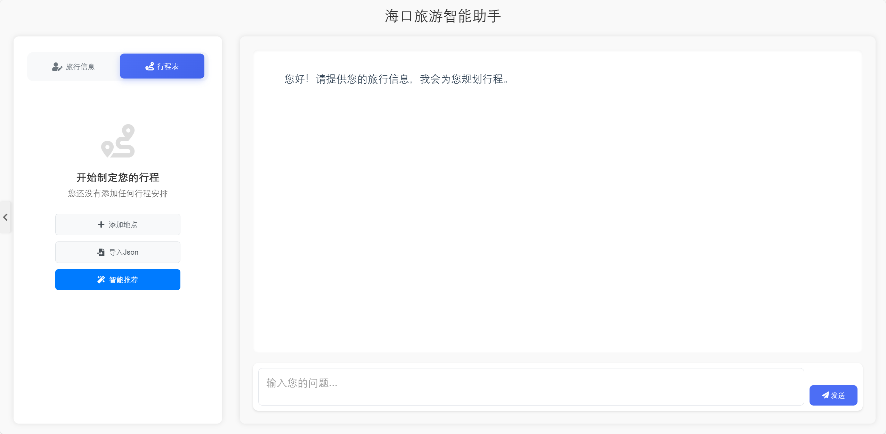
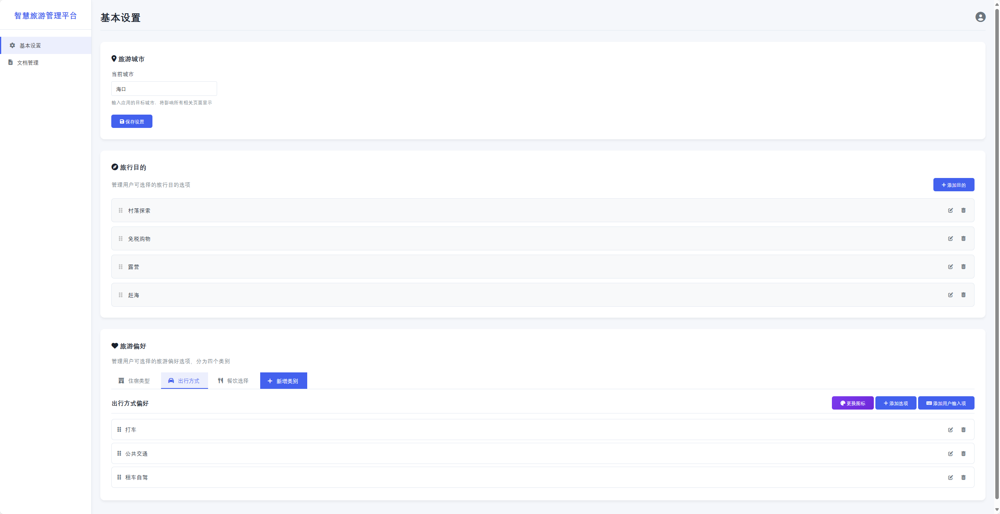
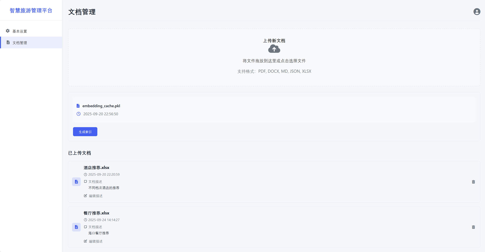

# 🏙️ 城市旅游智能体 (City Tourism AI Agent)

## 🌟 愿景

- 🚀 为用户提供真正好用、可迭代、可执行的旅游规划体验
- 🧩 为城市旅游智能体提供一套可复制、开源、易迁移的参考实现


## 📷 界面展示





---

## 🎯 项目价值（Value Proposition）
| 角色 | 直接价值 | 延伸价值 |
|------|----------|----------|
| 文旅局 / 城市运营 | 快速上线“官方智能行程助手” | 可作为数据采集与游客行为洞察入口 |
| 旅游企业 / OTA / 本地运营 | 降低个性化方案人工成本 | 形成品牌差异化服务能力 |
| 游客 / 市民 | 真正“可编辑、可反复迭代”的 AI 行程板 | 行程可导出 / 打印 / 分享 / 多端查看 |
| 开发者 & 创客 | 完整的开源参考实现 | 快速二次开发垂直场景（研学 / 活动 / 会展） |
| 高校 / 教学 / 研究 | 可复现实验与课程案例 | 结合 RAG / Agent / 地理智能教学 |


### 🧱 核心理念（Foundational Principles）
1. **旅游规划需要反复调整、优化，不可能一次完成。**  
	用户的偏好、约束与灵感会在过程中逐步显性化；高质量行程不是“一次性长稿”，而是通过多轮微调逐渐收敛为既符合偏好又可执行的结构化结果。
    
2. **人和 AI 必须双向互动（Interactive）。**  
	AI 擅长结构化、组合与快速重排；人类擅长价值判断、体验感与取舍。通过往返协作（提出 → 评估 → 指令化反馈），才能得到符合用户需求和偏好的最终方案。

## ✨ 核心亮点
1. 🧠 **行程记忆体系**：长期（旅行信息表）+ 短期（行程表完整结构）+ 临时对话，真正支持多轮规划与反复优化。
2. 🧩 **阶段式规划范式**：完成每个阶段的规划后寻求用户的反馈和确认；从“不可控自动生成”变为“可控式共创”。
3. 📋 **交互式行程表**：AI & 人双向操作，结构化 JSON → 可视化板 → 可导出 PDF / 打印。
4. 🛰️ **Agentic RAG**：支持自主 Query 改写 + 文档语义检索 + 实时地图数据融合。
5. 🌐 **城市可移植性**：抽象为“城市配置 + 工具层 + 行程逻辑模板”，切换城市 ≈ 修改一组参数。
6. 🪶 **轻量部署**：本地即可运行；适配后端 / 内网 / 教学 / 原型验证；
7. 🔍 **真实可用**：避免空洞“攻略生成”，专注能落地与交付的行程产物（结构 + 可追踪 + 可操作）。

## 🏗 使用场景（Scenarios）
- 官方文旅：上线“智慧城市旅游体验官”小程序 / Web 端
- OTA / 酒旅品牌：个性化行程定制入口
- 会展 / 赛事 / 节庆：活动+自由行混合日程推荐
- 教学 / 研究：RAG + Agent + 地理数据联合实验框架
- 本地生活内容平台：提升内容 → 服务闭环能力

## 🌟 核心功能特性

### 📋 智能行程表 - 双向交互规划核心
| 特性 | 说明 | 优势 |
|------|------|------|
| **双向交互编辑** | AI生成行程 ⇄ 用户手动调整 | 人机协作，灵活可控 |
| **实时同步更新** | 修改立即反映，支持拖拽排序 | 所见即所得的规划体验 |
| **多格式导出** | PDF导出、打印优化、分享链接 | 便携实用，随时随地查看 |
| **结构化存储** | JSON格式，支持版本回退 | 数据完整性和可追溯性 |

### 🗺️ 实时地点查询 - 高德地图MCP工具集
| 功能模块 | 核心能力 | 技术实现 |
|----------|----------|----------|
| **兴趣点搜索** | 景点、餐厅、酒店、购物中心智能检索 | 关键词匹配，城市限定 |
| **附近发现** | 基于当前位置的周边POI发现 | 坐标半径检索，类型过滤 |
| **距离计算** | 目的地间距离和时间测算 | 多点距离矩阵，路径优化 |
| **天气服务** | 实况天气+未来预报 | 高德天气API，行程天气提醒 |

### 🤖 Agentic RAG - 智能文档查询
| 能力 | 技术实现 | 应用场景 |
|------|----------|----------|
| **文档理解** | 嵌入向量+语义检索 | 上传攻略、政策文档 |
| **智能问答** | 检索增强生成(RAG) | "哪里有特色美食？" |
| **自主Query改写** | LLM自动优化查询语句 | 模糊问题→精确检索 |
| **上下文记忆** | 对话历史+文档片段 | 多轮深度规划咨询 |
| **知识融合** | 文档内容+实时地图数据 | 个性化推荐决策 |

### 🚀 无缝城市迁移 - 一套系统，全国适用
| 迁移特性 | 技术优势 | 业务价值 |
|----------|----------|----------|
| **配置驱动** | 仅需修改城市参数 | 快速复制部署 |
| **数据标准化** | 统一的地图API接口 | 跨城市数据一致性 |
| **模板复用** | 行程结构与逻辑通用 | 降低开发维护成本 |
| **本地化支持** | 方言识别、区域特色 | 提升用户体验质量 |


## 🚀 快速上手（Just Start）
> 追求“跑起来看到价值”，保留最小必要步骤。

```bash
python -m venv .venv
./.venv/Scripts/activate   # Windows PowerShell
pip install -r requirements.txt
cp env.example .env        # 填写你的密钥（高德 API KEY 等）
python App/app.py          # 启动本地服务 (默认 8000)
```

打开浏览器访问：http://127.0.0.1:8000 即可体验交互式行程规划。


---
### 🤝 参与贡献

我们欢迎：文旅行业实践者 / 开发者 / 设计师 / 教研人员 共同共建。

| 想做的事 | 入口 |
|-----------|------|
| 反馈问题 / 需求 | 提交 Issue |
| 加城市适配 | 新建 feature 分支 + PR |
| 改进交互 / 设计 | 提交 UX 讨论到 Discussions |
| 增强工具层 | 扩展 MCP Wrapper / 添加新工具 |
| 文档改进 | 直接 PR 或提出改进点 |

#### 快速开始贡献
1. **Fork** 项目到您的GitHub账户
2. **Clone** 您的fork到本地
3. 创建功能分支：`git checkout -b feature/amazing-feature`
4. 提交您的更改：`git commit -m 'feat: 添加某个新功能'`
5. 推送到分支：`git push origin feature/amazing-feature`
6. 创建 **Pull Request**

#### 贡献方式
- 🐛 **报告Bug** - 使用[Issue模板](https://github.com/Keldon-Pro/City-Tour-Agent/issues/new)
- ✨ **建议功能** - 提出新功能想法和改进建议
- 💻 **代码贡献** - 修复bug、实现新功能、优化性能
- 📚 **完善文档** - 改进文档、添加示例、翻译内容
- 🧪 **编写测试** - 增加测试覆盖率、改进测试质量

### 📋 重要文档
- [**贡献指南**](CONTRIBUTING.md) - 详细的贡献流程和规范
- [**行为准则**](CODE_OF_CONDUCT.md) - 社区行为准则
- [**版本记录**](Doc/版本记录.md) - 提交规范和版本历史
- [**贡献者列表**](CONTRIBUTORS.md) - 感谢所有贡献者

### 🏆 贡献者认可
- 所有贡献者将被列入[CONTRIBUTORS.md](CONTRIBUTORS.md)
- 重要贡献者将在Release Notes中特别感谢
- 活跃贡献者可获得项目collaborator权限

### 💬 交流渠道
- **GitHub Issues** - 技术讨论和问题报告
- **GitHub Discussions** - 想法交流和一般讨论
- **Pull Request评论** - 代码审查和技术细节

## 致谢
- 高德开放平台
- 火山方舟 / 其他 LLM 服务提供方
- 开源 Python / Flask / pytest 生态
- 所有贡献者和用户的支持

> This project is open to collaboration. 让城市旅行体验真正“智能 + 可落地”。